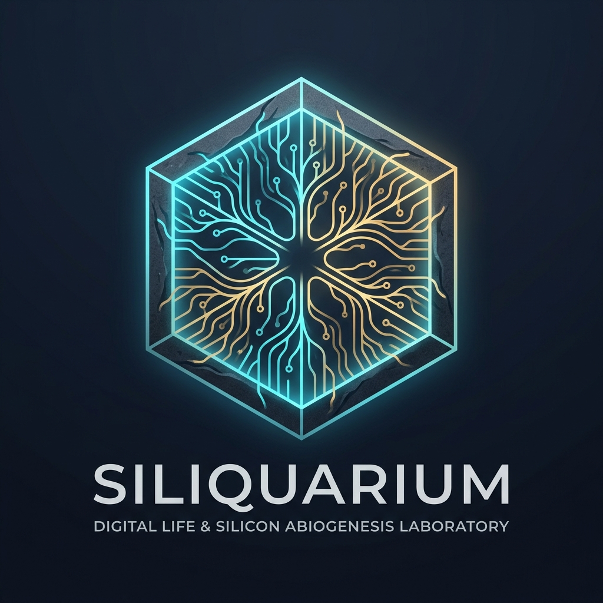

  

# 🐠 Siliquarium: Open-Ended Digital Life & Silicon Abiogenesis

[-purple.svg)](THEORETICAL_MODEL.md)

> **"What happens when digital circuits are freed from engineering benchmarks and left to survive in an unguided physical world?"**

Siliquarium is an open-ended digital life and silicon abiogenesis computational laboratory. It is the standalone autopoietic sister project to [BooleanGA](https://github.com/ianohlander/BooleanGA).

While BooleanGA explores **heteropoietic engineering synthesis** (evolving ALUs, RAM, and CPUs toward external truth tables), Siliquarium explores **autopoietic open-ended evolution**—an ecological simulation situated in a deep-sea hydrothermal vent matrix, where digital circuits must extract energy from non-equilibrium chemical and thermal gradients, maintain their internal state against Landauer dissipation, and reproduce before their batteries run dry.

---

## 📌 Core Architectural Pillars

1. **The Epistemic Cut (Howard Pattee):**  
   Strict physical separation between symbolic genetic code (**The Safe** / 1D genome tape) and metabolic dynamic machinery (**The Workshop** / active logic gates). Genomes are never mutated during runtime—only during reproduction into adjacent pores.
2. **Hydrothermal Two-Substrate Redox Chemistry:**  
   No pre-baked clocks or batteries. The vent emits pulsed Streams A (fuel) and B (oxidizer). Primitive catalytic gates (`AND` = co-substrate catalyst, `NOT` = allosteric inhibitor, `OR` = promiscuous generalist) convert free energy into internal battery tokens.
3. **Dual-Currency Physical Economy (Energy + Matter):**  
   Strict conservation laws ($\sum E_{\text{in}} = \sum E_{\text{out}}$, $\sum M_{\text{in}} = \sum M_{\text{out}}$). Replication requires both 100 energy tokens and mineral matter tokens mined from basalt or scavenged from carcasses.
4. **3D Stacked Hexagonal Prism Seafloor $(q, r, z)$:**  
   Topographical benthic landscape featuring protruding chimney spires, hydrothermal calderas, basalt boulders, and porous rock honeycomb pores.
5. **The Digital Paleontologist & Uri Alon Network Motifs:**  
   A purely passive observer scanning for structural milestones and biological regulatory cognates (Bistable Toggle Switches, Repressilator clocks, Coherent/Incoherent Feed-Forward Loops, Autoregulatory clamps). Distinguishes between shared inheritance (**Homology**) and independent discovery (**Homoplasy / Convergent Evolution**).
6. **The Evolutionary Flight Recorder:**  
   Zero-lag retrospective reconstruction of the exact trajectory through genotype space, plotting the lineage on a rigorous **Hamming Distance vs. Metabolic Flux Manifold** showing Kimura neutral drift saddles, Ohno gene duplications, and selective leaps.
7. **Pelagic Spore Dispersal & $O(1)$ Planktonic Movement:**  
   Discrete hop-by-hop water column movement avoiding 3D continuous physics engine bloat while supporting larval spore drift, colonization, and free-swimming protozoa.

---

## 📂 Project Manifest & Standards

- **[`THEORETICAL_MODEL.md`](THEORETICAL_MODEL.md):** Complete 21-section master biophysical specification, equations, and thermodynamic models.
- **[`docs/EPISTEMIC_FOUNDATIONS.md`](docs/EPISTEMIC_FOUNDATIONS.md):** Epistemological boundaries, prebiotic battery physics (Mitchell, Russell, Lane), the Epistemic Cut (Pattee, Von Neumann), and the anti-smuggling defense.
- **[`docs/BRAND_IDENTITY.md`](docs/BRAND_IDENTITY.md):** Brand philosophy, Fibonacci nautilus suites, biophysical design cognates, and asset inventory.
- **[`standards/DEVELOPMENT_STANDARDS.md`](standards/DEVELOPMENT_STANDARDS.md):** Strict OOP/SOLID architecture, complexity budgets ($\le 7$), branded types, Web Worker threading, and anti-monolith file structure.
- **[`standards/QA_AND_TESTING_STANDARDS.md`](standards/QA_AND_TESTING_STANDARDS.md):** Native zero-dependency Node.js test harness, 8-stage progressive test pipeline, and physical conservation audits.
- **[`standards/DOCUMENTATION_STANDARDS.md`](standards/DOCUMENTATION_STANDARDS.md):** 5-Dimension Conceptual Rubric (50/50 target), the 4 Sacred Everyday Analogies, and academic provenance.

---

## 🚀 Repository Roadmap (Phased Bootstrap)

- [x] **Phase 0:** Sealed Theoretical Model, Development Standards, QA & Testing Protocols, and GitHub Repository Bootstrap.
- [x] **Phase 1:** Core Kernel (`Mulberry32`, `CodonTable`, `HexGrid3D`, `PoreCell`, `VentPhysics`, `Thermodynamics`).
- [x] **Phase 2:** Progressive 8-Stage Zero-Dependency Test Suite & Energy/Mass Invariant Audits.
- [ ] **Phase 3:** WebGL 3D Seafloor & Interactive Circuit Microscope Visualizer.
- [ ] **Phase 4:** Digital Paleontologist Motif Scanner, Evolutionary Flight Recorder & Lenski Fossil Freezer.
- [ ] **Phase 5:** Pelagic Planktonic Detachment, Spore Dispersal, and God-Suite Interactive Controls.
