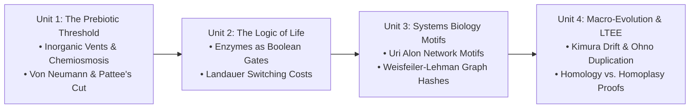
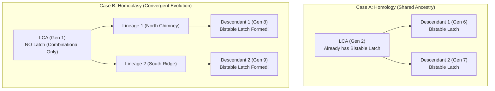

# 🎓 Advanced Systems Biology & Computational Biophysics: Open-Ended Evolution and Silicon Abiogenesis
*A Multi-Vector Curriculum, Laboratory Manual, and Theoretical Scaffolding for Advanced Secondary and Undergraduate STEM Education*

---

## 1. Course Overview, Pedagogical Philosophy & Cross-Disciplinary Architecture

### 1.1 The Pedagogical Crisis in Evolutionary Education
In traditional high school and introductory collegiate STEM curricula, biology and computer science are taught as disjointed kingdoms. Biology students dissect Mendelian punnett squares and memorize the citric acid cycle without understanding the non-equilibrium thermodynamics that drive electron flux. Computer science students build deterministic algorithms or train neural networks against fixed loss functions without grasping how living systems sustain order without an external loss function.

When evolutionary biology is modeled computationally in the classroom, educators almost universally rely on **heteropoietic engineering CAD tools**: genetic algorithms that benchmark a population against an artificial, human-specified objective (e.g., optimizing a traveling salesman tour or synthesizing an arithmetic logic unit). This introduces a profound pedagogical hazard: **smuggled teleology**. Students leave the classroom believing that evolution possesses foresight, goals, and an omniscient supervisor selecting the "best" organisms.

```
       CONVENTIONAL GENETIC ALGORITHMS                  SILIQUARIUM ECOSYSTEM FRAMEWORK
  ┌────────────────────────────────────────┐       ┌────────────────────────────────────────┐
  │ • Heteropoietic Optimization           │       │ • Autopoietic Self-Maintenance        │
  │ • Arbitrary External Fitness Function  │  ───► │ • Zero Truth Table / Zero Loss Function│
  │ • Omniscient Supervisor Benchmarking   │       │ • Blind Physical Thermodynamics        │
  │ • Frozen Generations (Batch Cadence)   │       │ • Asynchronous Spatial Honeycomb Grid  │
  └────────────────────────────────────────┘       └────────────────────────────────────────┘
```

### 1.2 The Siliquarium Paradigm: Autopoiesis and Physical Selection
**Siliquarium** resolves this epistemological deficit. Grounded in the autopoietic theory of Humberto Maturana and Francisco Varela, Siliquarium models life as a dissipative, non-equilibrium physical structure:
- **Fitness is not an external score; fitness is persistence.**
- An organism survives if and only if its internal logic network successfully extracts free energy from incoming hydrothermal fluid streams to pay its basal metabolic maintenance and dynamic Landauer switching costs before its internal energy storage reaches zero.
- Reproduction occurs strictly through physical substrate templating when internal mass and energy thresholds are met.

This curriculum synthesizes four core vectors:
1. **Biophysics & Non-Equilibrium Thermodynamics:** Peter Mitchell's chemiosmotic hypothesis, Michael Russell's alkaline hydrothermal vent model, and Rolf Landauer's thermodynamic limit of computation.
2. **Theoretical Biology & Philosophy of Information:** John von Neumann's self-reproducing automata and Howard Pattee's Epistemic Cut separating rate-independent symbolic code from rate-dependent physical dynamics.
3. **Systems Biology & Synthetic Circuit Architecture:** Uri Alon's canonical network motifs (bistable toggle switches, ring oscillators, feed-forward loops) and Weisfeiler-Lehman topological graph invariants.
4. **Macro-Evolutionary Genetics & Experimental Phylogenetics:** Motoo Kimura's neutral theory, Susumu Ohno's gene duplication, Richard Lenski's Long-Term Evolution Experiment (LTEE), and the rigorous distinction between Homology and Homoplasy (Convergent Evolution).

> [!NOTE]
> **Academic Companion Reference:**  
> For the complete university-level study guides, guided derivations, an exhaustive 55+ term biophysics and systems biology glossary, comprehensive annotations of 14 landmark peer-reviewed publications, and analytic assessment rubrics, see the [Pedagogical Companion Suite](file:///h:/My%20Drive/Repos/Siliquarium/docs/PEDAGOGICAL_COMPANION_SUITE.md) ([`docs/PEDAGOGICAL_COMPANION_SUITE.md`](file:///h:/My%20Drive/Repos/Siliquarium/docs/PEDAGOGICAL_COMPANION_SUITE.md)).

---

## 2. Course Structure, Modular Pacing & Prerequisites

### 2.1 Target Audience & Prerequisites
- **Target Grade Level:** 12th-Grade Advanced Placement (AP Biology, AP Computer Science A, AP Physics C) or Introductory Undergraduate (Bioengineering, Systems Biology, Computational Biology).
- **Prerequisites:**
  - *Biology:* Fundamental molecular biology (central dogma, transcription/translation, basic cellular energetics).
  - *Computer Science:* Foundational logic (Boolean truth tables, directed graphs, basic arrays/loops).
  - *Chemistry/Physics:* Conservation of mass and energy, redox chemistry (electron donors and acceptors), electrochemical gradients.

### 2.2 Four Core Modular Units Overview



| Unit | Title | Core Themes | Laboratory Practicum |
| :---: | :--- | :--- | :--- |
| **1** | **The Prebiotic Threshold & The Epistemic Cut** | Alkaline vents, inorganic rock pores, Mitchell chemiosmosis, rate-independent genotype vs rate-dependent phenotype. | **Lab 1:** Exploring the Hydrothermal Seafloor & Circuit Microscope. |
| **2** | **The Logic of Life: Enzymes & Thermodynamics** | Co-catalysis as `AND`, competitive inhibition as `NOT`, CMOS Landauer switching dissipation, dual energy/mass economy. | **Lab 2:** Observing Landauer Power Dissipation & Metabolic Starvation.<br/>**Lab 3:** Tracking Phenotypic Adaptation to Vent Chemistry. |
| **3** | **Systems Biology & Canonical Network Motifs** | Uri Alon motifs, bistable memory latches, ring oscillators, feed-forward delay filters, Weisfeiler-Lehman topological hashing. | **Lab 4:** God-Suite Perturbations: Thermal Surges, Extinction Pulses, & Resilient Lineage Recovery. |
| **4** | **Macro-Evolutionary Dynamics & Lenski LTEE** | Kimura neutral drift, Ohno duplications, Homology vs Homoplasy, clonal interference, Shannon diversity, pelagic spore advection. | **Lab 5:** Lenski Long-Term Evolution Experiment (LTEE) & Evolutionary Flight Recorder Autopsy. |

---

## 3. Unit 1: The Prebiotic Threshold & Howard Pattee's Epistemic Cut

### 3.1 Visceral Intuition: The Dilution Catastrophe
Imagine standing on the basalt seabed of the primordial Hadean ocean 4.1 billion years ago. The surface waters are lashed by sterilizing solar ultraviolet radiation and asteroid impacts. In traditional popular accounts, life is depicted as originating in an open "warm little pond" where biomolecules spontaneously collided. 

In biophysics, this surface scenario is fatally undermined by the **Dilution Catastrophe**:
- When organic monomers form in open water, they immediately diffuse into the infinite volume of the ocean.
- The concentration of reactants drops to near zero, terminating any prospective multi-step catalytic cascade.
- Without a physical barrier, free energy dissipates into entropic disorder before complex polymers can assemble.

Life solved this crisis not by inventing lipid membranes from scratch, but by utilizing **inorganic mineral cavities** at deep-sea alkaline hydrothermal vents (Russell & Hall, 1997). The porous basalt and iron-sulfide ($FeS$) mineral foams acted as **nature's first cell walls**, holding reactants in close proximity and concentrating organic precursors by a factor of over $1,000,000\times$ via thermal siphoning.

```
       OPEN OCEAN (The Dilution Catastrophe)          ALKALINE HYDROTHERMAL VENT (Micro-Pores)
    ┌──────────────────────────────────────┐       ┌──────────────────────────────────────┐
    │                                      │       │    [Solid Basalt Mineral Matrix]     │
    │      A                B              │       │    ┌────────────────────────────┐    │
    │         (Drifts Away)                │       │    │ Reactants A and B trapped  │    │
    │                *                     │       │    │ in microscopic rock foam!  │    │
    │        ~                             │       │    │ Concentration increases    │    │
    │                                      │       │    │ by 1,000,000x!             │    │
    │   Reactions impossible; density = 0  │       │    └────────────────────────────┘    │
    └──────────────────────────────────────┘       └──────────────────────────────────────┘
```

### 3.2 The Mitchell-Russell Geochemical Battery
A second visceral paradox of origin-of-life biochemistry is the universal ubiquity of **chemiosmosis**. Why does every living cell on Earth—from deep-subsurface archaea to human neurons—power itself with an electrical voltage across a razor-thin membrane rather than direct chemical combustion?

In 1961, Peter Mitchell proposed the Chemiosmotic Hypothesis (Nobel Prize 1978). In 1997, Michael Russell and Allan Hall discovered its geochemical origin:
1. Ancient Hadean oceans were saturated with volcanic carbon dioxide, creating an acidic reservoir rich in protons ($H^+$, $pH \approx 5.5$).
2. Deep-sea alkaline vents (analogous to the modern Lost City hydrothermal field) spewed warm, hydrogen-rich fluids saturated with hydroxide ions ($OH^-$, $pH \approx 10.0$).
3. Thin inorganic mineral walls composed of iron monosulfide ($FeS$) separated the alkaline fluid from the acidic ocean.
4. Across a 5-nanometer inorganic mineral wall, a $4.5$ unit pH gradient generates an electrostatic field of tens of millions of volts per meter, delivering a natural proton motive force of $\sim 200\text{ mV}$.

```
                        THE PREBIOTIC HYDROTHERMAL BATTERY
                        
       Acidic Ocean Water (H+ Protons Everywhere, pH ~ 5.5, Cold)
   ═════════════════════════════════════════════════════════════════════════
          +     +     +     +     +     +     +     +     +     +
         [H+]  [H+]  [H+]  [H+]  [H+]  [H+]  [H+]  [H+]  [H+]  [H+]  (Positive Rail)
   ─────────────────────────────────────────────────────────────────────────
      INORGANIC THIN MINERAL WALL (Iron Monosulphide / Silica FeS Foam)
      Natural Dielectric Thickness: d ≈ 5–10 nanometers
      Electrical Capacitance: C = ε · (A / d)  ===>  Stores Real Voltage!
   ─────────────────────────────────────────────────────────────────────────
         [OH-] [OH-] [OH-] [OH-] [OH-] [OH-] [OH-] [OH-] [OH-] [OH-] (Negative Rail)
          -     -     -     -     -     -     -     -     -     -
   ═════════════════════════════════════════════════════════════════════════
       Alkaline Vent Fluid (OH- Hydroxide Ions, pH ~ 10.0, Warm 60°C)
       
       ★ RESULT: Natural Proton Motive Force (PMF) = ΔpH ≈ 4.5 units ≈ 200 mV!
```

> [!IMPORTANT]
> **Pedagogical Takeaway:** Life did not invent the electrical battery; the abiotic Earth did. In Siliquarium, the [`PoreBattery`](file:///h:/My%20Drive/Repos/Siliquarium/src/core/domain/PoreBattery.ts) represents this inorganic electrostatic mineral capacitance and pre-existing pyrophosphate pool ($PP_i$), not an evolved cellular organelle.

### 3.3 John von Neumann's Automata & Howard Pattee's Epistemic Cut
In 1948, mathematician John von Neumann investigated what is mathematically required for an open-ended evolutionary machine to increase in complexity without degenerating into chaos. He proved a theorem:

If an organism reproduces by having its **active physical machinery directly inspect and clone itself**:
$$\text{Machine } M \longrightarrow \text{inspects } M \longrightarrow \text{builds } M'$$
Any physical defect or thermal corruption in $M$ alters the copier itself. The machine suffers an immediate **lethal error catastrophe**: the defective copier produces an even more broken offspring, and the lineage collapses within generations.

To overcome this, von Neumann proved that self-reproduction requires separating the system into two distinct regimes:
1. **An uninterpreted symbolic tape ($\phi$):** An inert string of instructions that conducts no power and performs no physical work during the organism's lifetime.
2. **An active universal constructor ($A$):** Reads the tape to synthesize the physical machine.
3. **An automated tape copier ($B$):** Blindly photocopies the uninterpreted tape into the offspring.

Theoretical biophysicist Howard Pattee (1972, 2001) formalized this as **The Epistemic Cut**:
- **Rate-Dependent Physics:** Governed by physical forces, continuous time, and differential equations ($\frac{dx}{dt} = f(x)$). Active logic gates in the workshop operate here.
- **Rate-Independent Information:** A genetic sequence or tape of computer bits has the same semantic meaning whether it is read in one microsecond or preserved frozen for ten thousand years.
- The Epistemic Cut is the boundary where rate-independent symbolic constraints control rate-dependent physical dynamics.

```
┌─────────────────────────────────────────────────────────────┐
│                      A SINGLE ROCK PORE                     │
│                                                             │
│  1. THE SAFE (Genotype / Rate-Independent Symbols)          │
│     [ 0 1 1 0 1 0 0 1 1 1 0 1 ... ]  <-- 60-Bit Genome      │
│     (Inert 1D bitstring. Conducts no electricity.)          │
│                                                             │
│  2. THE WORKSHOP (Phenotype / Rate-Dependent Physics)       │
│     [Vent In] ──► [Gate A] ──► [Gate B] ──► [Battery]       │
│     (Physical logic gates wired to vent & pins.)            │
│                                                             │
│  3. THE BATTERY (Metabolic Reservoir / Mineral Capacitor)   │
│     [  35 / 100 Energy Tokens  ]                            │
└─────────────────────────────────────────────────────────────┘
```

In Siliquarium, this is realized by separating [`GenomeSafe`](file:///h:/My%20Drive/Repos/Siliquarium/src/core/domain/GenomeSafe.ts) (The Safe) from [`PoreWorkshop`](file:///h:/My%20Drive/Repos/Siliquarium/src/core/domain/PoreWorkshop.ts) (The Workshop) and [`PoreBattery`](file:///h:/My%20Drive/Repos/Siliquarium/src/core/domain/PoreBattery.ts) (The Pantry).

---

### 3.4 Deconstructive Equation Anatomy: The Thermodynamic Battery Flux

$$E_{\text{battery}}(t+1) = \min\left(E_{\text{cap}}, \; E_{\text{battery}}(t) + \Delta E_{\text{catalysis}} - \sum_{i=1}^G \Delta E_{\text{Landauer}, i} - E_{\text{leak}}\right)$$

> ### 🔍 Equation Decoder
> - **$E_{\text{cap}}$ (Mineral Storage Ceiling):** The maximum charge the pore's inorganic capacitance and mineral volume can store before saturation (default $100$ tokens in [`PoreBattery`](file:///h:/My%20Drive/Repos/Siliquarium/src/core/domain/PoreBattery.ts)).
> - **$E_{\text{battery}}(t)$ (Current State):** The discrete energy tokens accumulated in the local pantry at tick $t$.
> - **$\Delta E_{\text{catalysis}}$ (Metabolic Influx):** Free energy extracted when incoming complementary streams ($A$ and $B$) react across a catalytic gate ($+2$ to $+3$ tokens per successful co-catalytic event).
> - **$\sum_{i=1}^G \Delta E_{\text{Landauer}, i}$ (Dynamic Switching Cost):** The Landauer dynamic power dissipated by all $G$ toggling gates ($1$ token consumed per bit flip $0 \to 1$ or $1 \to 0$).
> - **$E_{\text{leak}}$ (Basal Decay):** Spontaneous dissipation of charge across leaky mineral pores into the cold ocean sink ($1$ token dissipated every 10 ticks in [`PoreCell`](file:///h:/My%20Drive/Repos/Siliquarium/src/core/domain/PoreCell.ts#L81-L86)).

---

### 3.5 Concrete Micro-Scaffolding: 5-Tick Toy Pre-Trace
To ground these mathematical principles, examine the deterministic evaluation of a single minimal proto-cell harboring one catalytic `AND` gate wired to Stream A and Stream B over 5 discrete ticks.

**Initial Parameters:**
- Starting Battery $E_0 = 50$ tokens. Capacitance $E_{\text{cap}} = 100$.
- Catalytic Yield $\Delta E_{\text{catalysis}} = +3$ tokens. Toggle Cost $= 1$ token. Basal Leak $= 1$ token every 2 ticks.

| Tick | Stream A | Stream B | Gate Output | Gate Toggled? | $\Delta E_{\text{catalysis}}$ | Landauer Burn | Basal Leak | Net Battery | Biological Event |
| :---: | :---: | :---: | :---: | :---: | :---: | :---: | :---: | :---: | :---: | :--- |
| **0** | `0` | `1` | `0` | No ($0 \to 0$) | $+0$ | $-0$ | $-0$ | **$50$** | Substrates uncoordinated; enzyme idle. |
| **1** | `1` | `1` | `1` | **Yes** ($0 \to 1$) | **$+3$** | **$-1$** | **$-1$** | **$51$** | Dual substrate binding sparks co-catalysis; net $+1$ stored. |
| **2** | `1` | `0` | `0` | **Yes** ($1 \to 0$) | $+0$ | **$-1$** | $-0$ | **$50$** | Substrate B vanishes; enzyme returns to ground state. |
| **3** | `0` | `0` | `0` | No ($0 \to 0$) | $+0$ | $-0$ | **$-1$** | **$49$** | Famine tick; mineral capacitor bleeds charge to cold ocean. |
| **4** | `1` | `1` | `1` | **Yes** ($0 \to 1$) | **$+3$** | **$-1$** | $-0$ | **$51$** | Co-catalysis recurs; battery recovers. |

---

### 3.6 Conceptual Misconception Immunity (Skeptic FAQ)

> [!CAUTION]
> **Misconception 1: "By giving the cell a battery, isn't fitness guaranteed?"**  
> **Reality:** The battery is a leaky bucket. If an organism's circuit fails to synchronize with incoming vent pulses at a rate exceeding its Landauer switching costs and basal leak, its battery rapidly drops to zero, triggering irreversible lysis. In random primordial soup seedings, over $85\%$ of random circuits starve to death within the first 150 ticks.

> [!CAUTION]
> **Misconception 2: "Is the photocopy reproduction mechanism smuggled biology?"**  
> **Reality:** In prebiotic chemistry, **mineral surface templating** is an abiotic physical process. Clay minerals (such as montmorillonite) and basaltic cavities electrostatically align activated nucleotides along a template strand. The organism does not contain a conscious "cloning machine"; the rock substrate and ambient chemical flux perform the replication once sufficient thermodynamic tokens have accumulated.

---

## 4. Unit 2: The Logic of Life — Enzymes as Boolean Operators & Landauer Thermodynamics

### 4.1 Visceral Intuition: The Living Breadboard
When high school students view logic gates (`AND`, `OR`, `NOT`) in a computer science class, they picture copper traces etched on an inert silicon motherboard. When they study enzymes in biology, they picture floppy, three-dimensional protein globs undergoing conformational shifts.

In biophysics, these two pictures are **mathematical isomorphisms**:
1. **The `AND` Gate is a Co-Substrate Catalyst:** Consider an enzyme like alcohol dehydrogenase. It cannot perform its reaction with ethanol alone; it requires the simultaneous binding of both its substrate (ethanol) and an oxidized cofactor ($\text{NAD}^+$). If both are present, catalysis occurs ($1 \land 1 \to 1$).
2. **The `NOT` Gate is an Allosteric Competitive Inhibitor:** In bacterial gene regulation (such as the *lac* or *trp* operon), a repressor protein bound to an operator site blocks RNA polymerase from transcribing downstream genes. The presence of the repressor inverts the output signal ($1 \to 0$).
3. **The `OR` Gate is an Isozyme / Promiscuous Catalyst:** An enzyme with two distinct catalytic sites can bind either Substrate 1 or Substrate 2 to catalyze metabolic throughput ($1 \lor 0 \to 1$).

```
  STREAM A (Proton Fuel)       ──► ┌─────────┐
                                   │   AND   │ ──► +3 Tokens to Battery! (Reaction Sparks)
  STREAM B (Oxidizer Substrate)──► └─────────┘
```

### 4.2 The Codon Table: Grounded Molecular Biophysics (Zero Smuggling)
To prevent smuggled teleology (e.g. artificial verbs like `EAT`, `MOVE`, or `HUNT`), Siliquarium's 64-entry codon table in [`CodonTable.ts`](file:///h:/My%20Drive/Repos/Siliquarium/src/core/codons/CodonTable.ts) maps 6-bit codes strictly to four biophysical classes:

1. **Catalytic Primitives (`GATE_AND`, `GATE_OR`, `GATE_NOT`, `GATE_XOR`):** Redox enzymatic catalysts and allosteric inhibitors.
2. **Substrate Binding Porins (`PORIN_STREAM_A`, `PORIN_STREAM_B`, `PORIN_TOXIN_T`):** Outer membrane channels selective for specific hydrothermal solutes.
3. **Energy & Structural Sinks (`SINK_BATTERY`, `SINK_SEPTUM`):** Translocation into mineral storage (ATP synthase analogue) and cell wall cleavage furrows (FtsZ contractile ring analogue).
4. **Non-Coding Introns & Regulators (`INTRON_SILENT`, `REGULATORY_OPERATOR`):** Synonymous degenerate codons serving as mutational buffers (Kimura neutral drift).

```
Codon Format: 6-Bit Binary (0..63)
[ Bit 5 | Bit 4 | Bit 3 | Bit 2 | Bit 1 | Bit 0 ]
  ▲                     ▲
  │                     └─ Synonymous degenerate bits (Neutral drift buffer)
  └─ Functional class selector
```

### 4.3 The Physical Cost of Computation: Rolf Landauer's Bound
In 1961, physicist Rolf Landauer proved that information is fundamentally physical. Erasing a single bit of information or switching a binary gate irreversibly dissipates a minimum quantity of heat into the environment:

$$Q_{\text{Landauer}} \ge k_B T \ln 2$$

In modern CMOS computing and in living metabolic networks, dynamic switching dissipates power proportional to switching frequency:

$$P_{\text{dynamic}} = \alpha \cdot C \cdot V^2 \cdot f$$

In Siliquarium, every time a logic gate flips state ($0 \to 1$ or $1 \to 0$), it incurs an unavoidable Landauer cost of **$1$ Energy Token** ([`PoreWorkshop.ts`](file:///h:/My%20Drive/Repos/Siliquarium/src/core/domain/PoreWorkshop.ts)). 
- **Evolutionary Implication:** A circuit cannot simply spam high-frequency random oscillations. If a circuit toggles 20 times per tick but only captures 3 tokens from the vent, it burns 20 tokens, experiences metabolic starvation, and lyses. 
- Natural selection rigorously enforces **metabolic parsimony** (Haldane's constraint).

---

### 4.4 Deconstructive Equation Anatomy: Dynamic CMOS Toggle Dissipation

$$\Delta E_{\text{metabolic}} = \sum_{g=1}^{N_{\text{gates}}} \mathbb{I}\left(y_g(t) \ne y_g(t-1)\right) \cdot \kappa_{\text{toggle}}$$

> ### 🔍 Equation Decoder
> - **$N_{\text{gates}}$ (Circuit Size):** Total number of physical logic gates assembled in the pore's workshop (bounded to $\le 16$ gates).
> - **$y_g(t)$ (Gate Output at Tick $t$):** The Boolean state ($0$ or $1$) of gate $g$.
> - **$\mathbb{I}(\dots)$ (Indicator Function):** Evaluates to $1$ if the gate switched state; evaluates to $0$ if the gate held its prior state.
> - **$\kappa_{\text{toggle}}$ (Dynamic Landauer Penalty):** The discrete switching energy consumed per state transition ($1$ token/toggle).

---

### 4.5 Concrete Toy Trace: Starvation vs. Resonance in a 2-Gate Inverter Loop

Consider two competing organisms in adjacent pores:
- **Organism Alpha (Resonant Catalyst):** A single `AND` gate wired to Stream A and Stream B.
- **Organism Beta (Hyperactive Loop):** Two cross-coupled `NOT` gates forming an uninhibited ring oscillator that toggles every tick regardless of vent input.

Both start at $E_0 = 50$ tokens. Vent injects Stream A and Stream B simultaneously once every 4 ticks.

| Tick | Vent Influx ($A \land B$) | Organism Alpha Output | Alpha Toggles | Alpha Net Energy | Organism Beta Outputs | Beta Toggles | Beta Net Energy |
| :---: | :---: | :---: | :---: | :---: | :---: | :---: | :---: |
| **0** | `0` | `0` | 0 | **$50$** | `1`, `0` | 0 | **$50$** |
| **1** | `0` | `0` | 0 | **$50$** | `0`, `1` | 2 | **$48$** |
| **2** | `0` | `0` | 0 | **$50$** | `1`, `0` | 2 | **$46$** |
| **3** | `0` | `0` | 0 | **$50$** | `0`, `1` | 2 | **$44$** |
| **4** | `1` (+3) | `1` | 1 | **$52$** | `1`, `0` | 2 | **$42$** |
| **8** | `1` (+3) | `1` | 1 | **$54$** | `1`, `0` | 2 | **$34$** |
| **25**| `0` | `0` | 0 | **$62$** | — | — | **$0$ (STARVED)** |

**Analysis:** Organism Beta dissipates its entire battery in useless switching noise, starving to death by Tick 25. Organism Alpha conserves its energy, toggles only when food arrives, and marches toward the division threshold ($100$ tokens).

---

## 5. Unit 3: Systems Biology & Uri Alon's Network Motifs

### 5.1 Visceral Intuition: The Recurring Lego Bricks of Life
In complex electronic schematics and living genetic regulatory networks, certain compact subgraph wiring patterns appear thousands of times more frequently than would be expected in a purely random graph. In systems biology, these recurring building blocks are called **Network Motifs** (*Uri Alon, 2007*).

In Siliquarium, the [`MotifScanner`](file:///h:/My%20Drive/Repos/Siliquarium/src/core/paleontology/MotifScanner.ts) acts as an external voltmeter, identifying canonical systems biology motifs as they evolve de novo:

```
  ┌────────────────────────────────────────────────────────────────────────┐
  │                      CANONICAL NETWORK MOTIFS                          │
  │                                                                        │
  │   1. Bistable Latch (Memory)          2. Ring Oscillator (Pacemaker)   │
  │      ┌───► [ NOR ] ───┐                  ┌──► [ NOT ] ──► [ NOT ] ──┐  │
  │      │       ▲        │                  │                          │  │
  │      │       │        ▼                  └───────── [ NOT ] ◄───────┘  │
  │      └─── [ NOR ] ◄───┘                                                │
  └────────────────────────────────────────────────────────────────────────┘
```

### 5.2 The Biological Cognate Rosetta Stone

| Digital Hardware Circuit | Biological Regulatory Cognate | Natural Function in Molecular Biology | Dynamical Diagnostic Signature |
| :--- | :--- | :--- | :--- |
| **SR Latch / Flip-Flop** (2 cross-coupled NOR/NAND) | **Bistable Genetic Toggle Switch** (Gardner & Collins, 2000) | **Cell Fate & Lysogeny:** $\lambda$-phage lysis vs. lysogeny genetic switch. | **Hysteresis / 1-Bit Memory:** Holds state $Q=1$ after initiating input drops to 0. |
| **Ring Oscillator** (3 inverters in negative loop) | **The Repressilator / Circadian Clock** (Elowitz & Leibler, 2000) | **Biological Rhythms:** Pacemaker cells, cyanobacteria day/night cycles. | **Autonomous Limit Cycle:** Stable continuous oscillation without external drive. |
| **Glitch / Delay Filter** (AND gate + delayed path) | **Coherent Feed-Forward Loop (C-FFL Type 1)** | **Sign-Sensitive Delay:** *E. coli* arabinose/*lac* operon noise rejection. | **Persistence Filter:** Fires only when input sustains $> k$ ticks; ignores spikes. |
| **Edge Detector / One-Shot Pulse** (AND gate + inverted delay) | **Incoherent Feed-Forward Loop (I-FFL Type 1)** | **Sensory Adaptation:** Bacterial chemotaxis adaptation to continuous attractant. | **Fold-Change Pulse:** Brief output burst upon step change, then adapts to zero. |
| **Negative Feedback Clamp** (Self-inverting amplifier) | **Negative Autoregulation** | **Homeostatic Clamping:** Ribosomal proteins, SOS DNA repair stability. | **Rapid Rise to Plateau:** Accelerates response time without steady-state overshoot. |
| **1-Bit Half-Adder** (XOR Sum + AND Carry) | **Combinatorial Parity Logic** | **Signal Integration:** Metabolic branch point decision making. | **Arithmetic Computation:** Unguided discovery of binary addition. |

### 5.3 Weisfeiler-Lehman Topological Graph Invariant Hashing
How does the [`DigitalPaleontologist`](file:///h:/My%20Drive/Repos/Siliquarium/src/engine/paleontology/DigitalPaleontologist.ts) determine whether two circuits in different pores have the same physical structure, even if their codons appear in different locations on their 60-bit tapes?

Simple string comparison fails because identical logic networks can be wired using different gate IDs. Siliquarium resolves this using the **Weisfeiler-Lehman (WL) Graph Isomorphism Algorithm** ([`WeisfeilerLehmanHasher.ts`](file:///h:/My%20Drive/Repos/Siliquarium/src/core/paleontology/WeisfeilerLehmanHasher.ts)).

---

### 5.4 Deconstructive Equation Anatomy: Weisfeiler-Lehman Color Refinement

$$c_v^{(t+1)} = \text{HASH}\left(c_v^{(t)}, \; \text{SORT}\left(\{c_u^{(t)} : u \in \mathcal{N}(v)\}\right)\right)$$

> ### 🔍 Equation Decoder
> - **$c_v^{(t)}$ (Current Node Color):** The categorical hash of node $v$ at refinement iteration $t$ (initialized to the gate's biophysical primitive: `GATE_AND`, `GATE_NOT`, etc.).
> - **$\mathcal{N}(v)$ (Neighbor Set):** All logic gates directly connected to gate $v$ by incoming and outgoing signal wires.
> - **$\text{SORT}(\dots)$ (Canonical Multiset):** Sorts incoming neighbor colors lexicographically, guaranteeing strict permutation invariance regardless of node numbering.
> - **$\text{HASH}(\dots)$ (Avalanche Hash Function):** Computes a 64-bit deterministic hash mixing the node's prior identity with its neighborhood topology. Two circuits share an identical WL hash if and only if their wiring graphs are topologically isomorphic.

---

## 6. Unit 4: Macro-Evolutionary Dynamics, Lenski LTEE & Pelagic Dispersal

### 6.1 Motoo Kimura's Neutral Theory of Molecular Evolution
In 1968, population geneticist Motoo Kimura challenged the strict selectionist paradigm by demonstrating that the overwhelming majority of evolutionary changes at the molecular level are caused by **random genetic drift of selectively neutral or nearly neutral mutations**.

In Siliquarium, Kimura's Neutral Theory is an emergent mathematical consequence of the degenerate codon table:
- Multiple synonymous 6-bit codons translate to the exact same logic gate (e.g., 12 distinct codons code for `GATE_AND`).
- Non-coding introns (`INTRON_SILENT`) conduct no electricity and exert zero metabolic cost.
- A point mutation flipping an intron bit traverses a **neutral saddle** in the fitness landscape:
  $$d_H(G_{\text{parent}}, G_{\text{child}}) \ge 1, \quad \Delta W = 0.000$$
- This allows lineages to wander freely across neutral sequence space until stumbling upon a novel functional configuration.

### 6.2 Susumu Ohno's Gene Duplication & Neofunctionalization
In 1970, Susumu Ohno published *Evolution by Gene Duplication*, establishing that natural selection alone cannot create new gene functions from scratch—it can only refine existing ones. True innovation requires **gene duplication**:
1. An ancestral gene performs an essential metabolic function.
2. An unguided duplication produces an extra, redundant copy.
3. The original copy continues to sustain life under purifying selection.
4. The duplicate copy is freed from selective constraints, accumulating previously forbidden mutations until discovering a completely new enzymatic role (**neofunctionalization**).

In Siliquarium's [`EvolutionaryFlightRecorder`](file:///h:/My%20Drive/Repos/Siliquarium/src/engine/paleontology/EvolutionaryFlightRecorder.ts), ancestral lineages frequently reveal silent non-coding codons suddenly mutating into active `GATE_XOR` gates, pairing with pre-existing `GATE_AND` gates to assemble the 1-bit half-adder motif.

### 6.3 Mathematical Proof of Convergent Evolution (Homology vs. Homoplasy)
A foundational challenge in evolutionary biology is proving whether two organisms sharing a complex trait inherited it from a common ancestor (**Homology**) or discovered it independently through convergent evolution (**Homoplasy**).



The [`EvolutionaryFlightRecorder`](file:///h:/My%20Drive/Repos/Siliquarium/src/engine/paleontology/EvolutionaryFlightRecorder.ts#L93-L118) executes this exact mathematical proof:
1. When two living pores $A$ and $B$ express an identical network motif $M$, the engine walks their ancestral parent pointers to find their **Least Common Ancestor (LCA)**:
   $$\text{LCA}(A, B) = \text{argmin}_{u \in \text{Ancestors}(A) \cap \text{Ancestors}(B)} (\text{Depth}(u))$$
2. **The Verification Rule:**
   - If $\text{LCA}(A, B)$ possessed motif $M \implies$ **HOMOLOGY** (like the pentadactyl limb across mammals).
   - If $\text{LCA}(A, B)$ lacked motif $M \implies$ **HOMOPLASY / CONVERGENT EVOLUTION** (like the independent evolution of camera eyes in vertebrates and cephalopods).

---

### 6.4 Deconstructive Equation Anatomy: Shannon Diversity & Evolutionary Velocity

$$H = -\sum_{i=1}^{K} p_i \ln(p_i), \qquad V_{\text{evo}} = \frac{\max(\text{Generation})}{T_{\text{tick}}} \times 100$$

> ### 🔍 Equation Decoder
> - **$K$ (Active Clades Count):** Total number of distinct founder clades extant on the seafloor lattice ([`LteeBenchmark.ts`](file:///h:/My%20Drive/Repos/Siliquarium/src/engine/paleontology/LteeBenchmark.ts)).
> - **$p_i = \frac{N_i}{N_{\text{total}}}$ (Clade Proportion):** The fractional population share of clade $i$.
> - **$H$ (Shannon Diversity Index):** Quantifies ecological diversity. When $H \to 0$, a single monoculture has swept the seabed (selective sweep). When $H > 1.5$, diverse clades stably coexist across different hydrothermal micro-niches.
> - **$V_{\text{evo}}$ (Evolutionary Velocity):** Generational turnover rate per 100 ticks. Reflects Lenski's empirical finding that adaptation accelerates during initial colonization and decelerates as lineages optimize metabolic efficiency.

---

### 6.5 The Planktonic Transition & Pelagic Spore Dispersal
In benthic marine ecosystems, sessile organisms anchored to rocks (corals, sponges, kelp) face a spatial bottleneck: **substrate saturation**. Once all contiguous rock cavities are occupied, reproduction ceases.

Nature solved this via **broadcast spawning and pelagic spores**:
1. When an organism in Siliquarium reaches division thresholds ($E \ge 100, M \ge 20$) but all adjacent substrate pores are full, it packages its daughter genome into a **buoyant spore capsule** ([`SimulationWorld.ts`](file:///h:/My%20Drive/Repos/Siliquarium/src/engine/SimulationWorld.ts#L127-L141)).
2. The spore enters the permeable fluid water column ($z \ge 1$), drifting upward with hydrothermal convection plumes and lateral ocean currents.
3. The spore has a metabolic survival clock ($\tau = 25$ ticks). If it contacts an empty rock pore on a distant volcanic ridge before $\tau = 0$, it settles, germinates, and founds a new colony!

---

## 7. Hands-On Student Laboratory Manual (5 Comprehensive Practicums)

### 🔬 Lab 1: Exploring the Hydrothermal Seafloor & Circuit Microscope

#### 1. Learning Objectives
- Navigate the 3D abyssal seamount and identify basalt substrate vs. aqueous fluid hexes.
- Use the Circuit Microscope to inspect real-time logic gate toggles, wire potentials, and battery token gauges.
- Verify Howard Pattee's Epistemic Cut by inspecting the 1D inert genome safe and the 2D active workshop.

#### 2. Theoretical Pre-Lab Preparation
Review Section 1.3 on the Epistemic Cut. Explain why mutating an organism's active logic gates during its lifetime would lead to an error catastrophe.

#### 3. Step-by-Step Laboratory Procedure
1. Launch the Siliquarium application in your browser. Ensure the simulation is initialized with World Seed `#42` and Soup Density at `20%`.
2. **Camera Controls:**
   - Left-click and drag on the canvas to rotate the camera around the central caldera.
   - Right-click and drag to pan across volcanic ridges.
   - Scroll wheel to zoom from the macro caldera view down to an individual hexagonal pore.
3. Locate the central caldera nozzle at coordinates $(0, 0, 0)$. Observe the glowing volcanic plume spewing upward.
4. Click on an occupied hexagonal pore immediately adjacent to the vent nozzle (e.g., coordinate $(1, 0, 0)$).
5. Observe the **Holographic Targeting Reticle** lock onto the cell and inspect the **Circuit Microscope** panel on the right side of the screen.
6. In the Circuit Microscope, identify:
   - **The Genome Safe Ribbon:** The 60-bit inert tape displayed at the top.
   - **The Active Workshop Netlist:** Active logic gates (`AND`, `OR`, `NOT`, `BUF`) and pulsing signal wires.
   - **The Battery Gauge:** Real-time token counter ($0..100$).
7. Click the **Pause** button (`❚❚`) on the bottom transport bar. Use the **Step Forward** button (`Step ►`) to advance the simulation exactly one tick at a time. Record the gate toggles and battery changes.

#### 4. Data Collection Table
Select three distinct occupied pores at varying distances from the vent nozzle and record their physiological metrics:

| Specimen Pore $(q, r, z)$ | Distance from Nozzle | Active Gate Types | Battery Level ($E$) | Matter Reserve ($M$) | Generation | Age (Ticks) |
| :---: | :---: | :---: | :---: | :---: | :---: | :---: |
| | | | | | | |
| | | | | | | |
| | | | | | | |

#### 5. Post-Lab Synthesis Questions
1. Compare the internal logic of a cell directly adjacent to the vent with a cell 4 hexes away. How does distance from the geochemical flux affect battery stability?
2. Did any bits on the 60-bit genome tape change while the cell was toggling gates? Why is this separation essential for evolutionary stability?

---

### ⚡ Lab 2: Observing Landauer Power Dissipation & Metabolic Starvation

#### 1. Learning Objectives
- Quantify dynamic Landauer switching dissipation ($1$ token/toggle) versus basal maintenance ($1$ token/10 ticks).
- Demonstrate that logic gates are not free: excessive uncoordinated switching causes metabolic starvation.
- Verify the First Law of Thermodynamics ($\Delta E_{\text{universe}} = 0.000$) using the Thermodynamic Ledger.

#### 2. Theoretical Pre-Lab Preparation
State Rolf Landauer's principle of computational dissipation. Write the algebraic formula for the net battery change of a pore cell per tick.

#### 3. Step-by-Step Laboratory Procedure
1. Reset the simulation. Open the **Lab Flyout Drawer** by clicking the gear icon (`⚙️`) in the top navigation bar.
2. In the Lab Flyout, set the **Primordial Soup Density** slider to `10%` and click **"Seed Soup"**.
3. Pause the simulation at Tick 1. Click through several newly seeded pores until you find a cell with 3 or more active logic gates.
4. Note its starting battery level (typically $50$ or $60$ tokens).
5. Advance the simulation tick-by-tick for 20 ticks. For each tick, record:
   - Vent Stream Inputs ($A$, $B$, $T$)
   - Number of logic gates that switched state ($0 \to 1$ or $1 \to 0$)
   - Catalytic yield added to battery
   - Net battery change
6. Identify a cell that fails to capture catalytic yield. Watch its battery drain toward zero.
7. Observe the moment of **lysis**: when the battery reaches $0$, note how the active cell transforms into a **Carcass Pore** (`PoreState.CARCASS`), retaining unspent tokens and mineral mass for neighboring scavengers.
8. Inspect the **Thermodynamic Ledger HUD badge** at the top right:
   $$\Delta E_{\text{universe}} = \sum E_{\text{in}} - \sum E_{\text{stored}} - \sum E_{\text{dissipated}} = 0.000$$

#### 4. Data Collection Table

| Tick | Stream A | Stream B | Gate Switches | Landauer Burn ($E_L$) | Catalytic Yield ($E_C$) | Basal Leak ($E_{\text{leak}}$) | Net Battery ($E$) |
| :---: | :---: | :---: | :---: | :---: | :---: | :---: | :---: |
| 1 | | | | | | | |
| 2 | | | | | | | |
| 3 | | | | | | | |
| 4 | | | | | | | |
| 5 | | | | | | | |

#### 5. Post-Lab Synthesis Questions
1. If an organism mutates 5 additional `BUF` (buffer) gates that toggle constantly without contributing to catalytic yield, what is the thermodynamic consequence on its reproductive fitness?
2. How does the persistence of carcass detritus create an ecological opportunity for detritivores?

---

### 🌊 Lab 3: Tracking Phenotypic Adaptation to Vent Chemistry

#### 1. Learning Objectives
- Observe natural selection favoring catalytic `AND` enzymes that resonate with complementary vent pulses.
- Investigate the selective advantage of allosteric inhibitor `NOT` gates during periodic toxin ($T$) pulses.
- Map decoded 6-bit codons from the genome tape to physical circuit netlists using the Codon Table.

#### 2. Theoretical Pre-Lab Preparation
Review Section 2.1 on enzymatic logic. Explain why a cell with genotype expressing `(A AND B) AND (NOT T)` will outcompete a simple `A AND B` cell in a toxic vent regime.

#### 3. Step-by-Step Laboratory Procedure
1. Initialize a fresh simulation with World Seed `#101` and Soup Density `25%`.
2. Let the simulation run uninhibited at normal speed for $500$ ticks.
3. Observe the HUD telemetry ticker as the vent cycles through its multi-scale rhythms:
   - High-flow fuel bursts (Streams $A=1, B=1$)
   - Low-flow resting states
   - Acidic poison bursts (Toxin $T=1$, corroding unshielded cells by $-5$ tokens)
4. At Tick 500, pause the simulation. Inspect the most densely populated cluster of cells around the caldera.
5. Select the oldest living cell (highest Age metric in HUD).
6. In the Circuit Microscope, translate its 60-bit genome tape into codons using [`CodonTable.ts`](file:///h:/My%20Drive/Repos/Siliquarium/src/core/codons/CodonTable.ts):
   - Group the 60 bits into ten 6-bit codons: `[Bits 0-5]`, `[Bits 6-11]`, ..., `[Bits 54-59]`.
   - Identify whether the cell possesses `PORIN_TOXIN_T` coupled to an inhibitory `GATE_NOT`.
7. Compare this adapted specimen with a peripheral cell that died or has a low battery.

#### 4. Genome Codon Translation Worksheet

| Codon Index | 6-Bit Bitstring | Codon Name | Biophysical Functional Class | Active in Workshop? |
| :---: | :---: | :---: | :---: | :---: |
| 0 | | | | |
| 1 | | | | |
| 2 | | | | |
| 3 | | | | |
| 4 | | | | |

#### 5. Post-Lab Synthesis Questions
1. Why did the toxin pulses purge unshielded organisms even if their `AND` gates were highly efficient?
2. Did the surviving organisms "know" the toxin was coming, or did natural selection act as a blind sieve? Explain using the concept of autopoiesis.

---

### 🌋 Lab 4: God-Suite Perturbations: Thermal Surges, Extinction Pulses, and Resilient Lineage Recovery

#### 1. Learning Objectives
- Apply ecological disturbances using the interactive God-Suite controls in [`LabFlyout.ts`](file:///h:/My%20Drive/Repos/Siliquarium/src/ui/LabFlyout.ts).
- Measure the impact of catastrophic local extinction pulses on the Shannon Diversity Index ($H$).
- Document secondary ecological succession and trans-ridge colonization via pelagic spore dispersal.

#### 2. Theoretical Pre-Lab Preparation
Define the Shannon Diversity Index ($H$). What happens to $H$ when a single dominant clade monopolizes an entire habitat? What happens to $H$ immediately after an extinction pulse?

#### 3. Step-by-Step Laboratory Procedure
1. Run a simulation until Tick 1,000, allowing a dominant clade to expand across the lower benthic terrace.
2. Note the baseline metrics in the HUD:
   - Living Cells Count ($N_{\text{living}}$)
   - Active Clades Count ($K$)
   - Shannon Diversity Index ($H$)
   - Maximum Generation
3. Open the Lab Flyout (`⚙️`). Locate the **"God-Suite Interventions"** section.
4. **Thermal Surge Pulse:**
   - Click **"🔥 Thermal Surge Pulse"** (+200 tokens injected into the central plume).
   - Observe the immediate metabolic boom: cells adjacent to the caldera rapidly hit $100$ tokens and trigger a wave of binary fissions.
5. **Catastrophic Extinction Pulse:**
   - Select the center of the dominant monoculture colony.
   - Click **"💥 Local Extinction Pulse"** (clearing living cells in radius $r=2$).
   - Watch the selected quadrant collapse into carcass rubble.
6. Record the immediate collapse of $H$ and $N_{\text{living}}$.
7. Do not reset. Let the simulation run for $300$ ticks and watch **secondary ecological succession**:
   - Observe whether dormant spores drifting in the water column land on the cleared rock cavities.
   - Note which clade re-colonizes the empty territory.

#### 4. Disturbance & Succession Log

| Experimental Phase | Tick | Living Count | Clades Count ($K$) | Shannon Diversity ($H$) | Dominant Clade ID |
| :---: | :---: | :---: | :---: | :---: | :---: |
| Pre-Disturbance Baseline | | | | | |
| Post-Thermal Surge (+50 ticks) | | | | | |
| Post-Extinction Pulse (+10 ticks) | | | | | |
| Succession Recovery (+200 ticks)| | | | | |

#### 5. Post-Lab Synthesis Questions
1. Did the post-extinction habitat return to the exact same genetic state as before the pulse? Why or why not?
2. How did pelagic spores drifting in the permeable fluid column prevent total extinction of the lineage?

---

### 🦕 Lab 5: Lenski Long-Term Evolution Experiment (LTEE) & Evolutionary Flight Recorder Autopsy

#### 1. Learning Objectives
- Conduct a digital analogue of Richard Lenski's Long-Term Evolution Experiment (LTEE).
- Trace an organism's ancestral lineage back to Generation 0 using [`EvolutionaryFlightRecorder.ts`](file:///h:/My%20Drive/Repos/Siliquarium/src/engine/paleontology/EvolutionaryFlightRecorder.ts).
- Perform a counterfactual single-bit autopsy using [`FossilFreezer.ts`](file:///h:/My%20Drive/Repos/Siliquarium/src/engine/paleontology/FossilFreezer.ts) to isolate the exact point mutation that assembled a novel network motif.
- Mathematically prove whether two lineages sharing a network motif represent **Homology** or **Homoplasy / Convergent Evolution**.

#### 2. Theoretical Pre-Lab Preparation
Review Richard Lenski's discovery of the $Cit^+$ trait in *E. coli* at Generation 31,500. Explain why frozen fossil ledgers are essential for proving historical contingency.

#### 3. Step-by-Step Laboratory Procedure
1. Initialize the simulation with World Seed `#2026` and let it run to Tick 2,000.
2. Monitor the **Paleontology HUD Alerts**. When a milestone alert triggers (e.g., *"BISTABLE MEMORY LATCH FORMED"* or *"RING OSCILLATOR DISCOVERED"*), immediately pause the simulation.
3. Click the notification alert or the glowing neon pore on the seamount.
4. Open the **Milestone Modal / Evolutionary Autopsy Inspector**:
   - Inspect the **Solution-Space Hamming Trajectory** graph:
     $$d_H(\text{Lineage}) = \sum_{i=0}^{k-1} \text{popcount}(G_i \oplus G_{i+1})$$
   - Observe the color-coded edges:
     - **Blue Edges:** Kimura Neutral Drift ($d_H > 0$, fitness invariant).
     - **Green Edges:** Positive Selection (upward jump in metabolic efficiency).
     - **Yellow Edges:** Duplication / Intron Expansion.
5. In the **Single-Bit Autopsy Panel**, identify:
   - Parent Tape (Generation $N-1$)
   - Child Tape (Generation $N$)
   - The exact inverted bit index ($0..59$)
   - The codon change (e.g., `INTRON_SILENT` $\to$ `GATE_NOT`)
6. **Convergent Evolution Audit:**
   - Scan the seamount for a second cell in a different clade exhibiting the same motif.
   - Run the automated Least Common Ancestor (LCA) query.
   - Check the audit verdict: does it declare **HOMOLOGY** or **HOMOPLASY**?

#### 4. Evolutionary Autopsy Record Sheet

```
Specimen ID: ______________________      Milestone Discovered: ______________________
Generation:  ______________________      Pore Coordinate:      ( ____, ____, ____ )

1. ANCESTRAL HAMMING TRAJECTORY:
   Total Ancestral Generations: _____
   Cumulative Hamming Distance Traversals (dH): _____ bits
   Number of Neutral Drift Steps (Blue Edges):  _____

2. COUNTERFACTUAL SINGLE-BIT AUTOPSY:
   Bit Index Inverted: _______ (Bit position 0 to 59)
   Codon Index:        _______ (Codon 0 to 9)
   Parent Codon:       [ _ _ _ _ _ _ ] ──► Translation: ______________________
   Child Codon:        [ _ _ _ _ _ _ ] ──► Translation: ______________________
   Biophysical Consequence of Mutation: _________________________________________

3. HOMOLOGY VS. HOMOPLASY AUDIT:
   Comparison Specimen ID:   ______________________
   Least Common Ancestor ID: ______________________ (Generation: _____)
   Did LCA possess the motif? [ YES / NO ]
   FINAL VERDICT:            [ HOMOLOGY / HOMOPLASY (CONVERGENT EVOLUTION) ]
```

#### 5. Post-Lab Synthesis Questions
1. How does the existence of neutral introns facilitate the discovery of complex motifs like the bistable latch or half-adder?
2. If your audit returned a verdict of Homoplasy, explain how two completely isolated lineages on opposite sides of the seamount converged on the exact same circuit wiring.

---

## 8. Socratic Discussion Questions & Formative Senior Assessments

### 8.1 Socratic Discussion Seminar Prompts

#### Seminar 1: The Physics of Information & The Epistemic Cut
> *"Erwin Schrödinger famously stated in 1944 that living organisms feed on 'negative entropy'—they preserve their internal order by continually dissipating entropy into their surroundings. Howard Pattee later argued that life is unique in physical reality because it is governed by symbolic codes. If a genetic code is made of physical matter, why must it be treated as rate-independent? Could life exist without an Epistemic Cut?"*

#### Seminar 2: Is Evolution an Optimization Algorithm?
> *"In computer science, algorithms are evaluated by how quickly they converge to a global optimum. In natural evolution, is there an optimum? If an organism evolves an extraordinarily complex logic network that burns 50 tokens per tick, why might natural selection favor a 'stupid' organism consisting of a single AND gate? What does this teach us about the difference between engineering and biology?"*

#### Seminar 3: Historical Contingency vs. Determinism
> *"Stephen Jay Gould famously asked: if we could 'replay the tape of life' from the beginning, would anything look the same? In Richard Lenski's LTEE, only one out of twelve lineages evolved citrate metabolism, requiring a specific pre-adaptation. In Siliquarium, if we run two simulations with the exact same starting seed, but introduce a single bit-flip perturbation at Tick 100, what will happen to the macro-evolutionary trajectory? Is convergence inevitable, or is history hostage to contingency?"*

---

### 8.2 Formative Diagnostic Assessment Suite

#### Section A: Conceptual & Biophysical Foundations (Multiple Choice)

**1.** Why are microscopic rock pores in alkaline hydrothermal vents considered superior to open surface waters for prebiotic abiogenesis?  
A) Surface waters were too cold for chemical reactions to occur.  
B) Rock pores prevent the Dilution Catastrophe by concentrating catalytic reactants in microscopic volumes.  
C) Surface waters completely lacked hydrogen and carbon dioxide.  
D) Rock pores provided active lipid membranes before enzymes evolved.  
*Answer:* **B**. *Rationale:* The Dilution Catastrophe in open water lowers reactant concentrations toward zero. Inorganic basalt cavities act as nature's first compartments.

**2.** According to Rolf Landauer and modern thermodynamics of computation, why must a living digital cell pay an energy penalty when switching a logic gate?  
A) Gate transitions change electrical potential, dissipating a minimum of $k_B T \ln 2$ heat into the thermal sink.  
B) The simulation engine penalizes complex organisms to keep frame rates high.  
C) Logic gates physically degrade and must be rebuilt each tick.  
D) Energy is only consumed when an arithmetic addition is performed.  
*Answer:* **A**. *Rationale:* Landauer's principle proves that information erasure and physical switching incur an irreversible entropic dissipation of at least $k_B T \ln 2$.

**3.** In the Siliquarium codon table, what biological regulatory mechanism is represented by a `GATE_NOT` logic gate?  
A) Co-substrate redox catalysis.  
B) An allosteric competitive inhibitor or transcriptional repressor protein.  
C) A passive ion channel allowing unregulated nutrient entry.  
D) A cleavage furrow splitting the cell membrane.  
*Answer:* **B**. *Rationale:* In molecular biology, a repressor inverts transcription: when the repressor is present ($1$), gene expression is blocked ($0$).

**4.** Two organisms on opposite sides of the seamount possess isomorphic Bistable Memory Latches with identical Weisfeiler-Lehman hashes. The Evolutionary Flight Recorder traces their ancestry to a Least Common Ancestor that possessed only combinational `AND` gates. What is the formal evolutionary classification of this shared trait?  
A) Homology  
B) Synapomorphy  
C) Homoplasy (Convergent Evolution)  
D) Artificial Selection  
*Answer:* **C**. *Rationale:* Because the Least Common Ancestor lacked the motif, both lineages discovered the circuit independently, which defines homoplasy / convergent evolution.

---

#### Section B: Quantitative Free-Response Problems

**Problem 1: Metabolic Energy Budgeting & Starvation Thresholds**  
A protocell in Pore $(2, -1, 0)$ contains 3 active logic gates:
- Gate 1: `GATE_AND` wired to Stream A and Stream B (Reaction Yield: $+3$ tokens).
- Gate 2: `GATE_BUF` wired to Gate 1 output.
- Gate 3: `GATE_NOT` wired to Gate 2 output.

The hydrothermal vent pulses Stream A and Stream B synchronously ($A=1, B=1$) once every 5 ticks. On all other ticks, $A=0$ and $B=0$. Toxin $T$ is inactive ($T=0$).
- Toggle switching cost: $\kappa = 1$ token per gate transition.
- Basal maintenance leak: $E_{\text{leak}} = 1$ token dissipated every 10 ticks.
- Starting battery: $E_0 = 40$ tokens. Maximum capacity: $E_{\text{cap}} = 100$ tokens.

*Questions:*
1. Calculate the total Landauer toggle energy dissipated by this circuit over a complete 5-tick vent cycle (Ticks 0 through 4).
2. Calculate the net battery balance $\Delta E_{\text{cycle}}$ across the 5-tick cycle.
3. Will this organism reach the division threshold ($100$ tokens), maintain homeostasis, or starve to death? Show all calculations.

*Worked Solution:*
- **Tick 0 (Pulse arrives: $A=1, B=1$):**
  - Gate 1 switches $0 \to 1$ ($1$ toggle). Yields $+3$ tokens.
  - Gate 2 switches $0 \to 1$ ($1$ toggle).
  - Gate 3 switches $1 \to 0$ ($1$ toggle).
  - Landauer burn $= 3$ tokens. Yield $= +3$ tokens. Net change $= 0$.
- **Tick 1 (Pulse drops: $A=0, B=0$):**
  - Gate 1 switches $1 \to 0$ ($1$ toggle). Yield $= 0$.
  - Gate 2 switches $1 \to 0$ ($1$ toggle).
  - Gate 3 switches $0 \to 1$ ($1$ toggle).
  - Landauer burn $= 3$ tokens. Yield $= 0$. Net change $= -3$ tokens.
- **Ticks 2, 3, 4 (Idle ticks: inputs remain $0$):**
  - Gates remain static ($0$ toggles). Landauer burn $= 0$.
- **Basal leak:** $1$ token every 10 ticks $\implies 0.5$ tokens / 5 ticks.
- **Cycle Net Balance:**
  $$\Delta E_{\text{cycle}} = \Delta E_{\text{yield}} - E_{\text{Landauer}} - E_{\text{leak}} = +3 - (3 + 3) - 0.5 = -3.5 \text{ tokens per 5 ticks}$$
- **Conclusion:** The organism operates at a persistent net deficit of $-3.5$ tokens every 5 ticks. It will exhaust its 40-token battery within approximately $57$ ticks and undergo starvation lysis!

---

**Problem 2: Weisfeiler-Lehman Topological Invariant Calculation**  
Given a 3-gate circuit:
- Node 1: `GATE_AND`
- Node 2: `GATE_NOT`
- Node 3: `GATE_OR`
- Directed wires: $(1 \to 2)$, $(2 \to 3)$, $(3 \to 1)$ (A directed 3-node loop).

1. Perform Round 0 color initialization.
2. Perform Round 1 Weisfeiler-Lehman color refinement, showing the neighbor multiset and signature string for each node.
3. Explain why this invariant remains identical even if Node 1 and Node 3 swap positions in the physical array.

*Worked Solution:*
- **Round 0 Colors:** $c_1^{(0)} = \text{AND}$, $c_2^{(0)} = \text{NOT}$, $c_3^{(0)} = \text{OR}$.
- **Directed Neighborhoods:**
  - $\mathcal{N}(1) = \{2\}$, $\mathcal{N}(2) = \{3\}$, $\mathcal{N}(3) = \{1\}$.
- **Round 1 Signatures:**
  - Node 1: $\text{AND}:[\text{NOT}]$
  - Node 2: $\text{NOT}:[\text{OR}]$
  - Node 3: $\text{OR}:[\text{AND}]$
- Applying deterministic hash produces updated color multiset.
- **Permutation Invariance:** If the gates are re-indexed such that Node 3 is placed first, the neighbor multiset is lexicographically sorted prior to hashing (`SORT(...)`). The resulting collection of color hashes across the graph remains identical, yielding the exact same canonical invariant hash.

---

## 9. Academic Provenance & Master Bibliography

1. **Prebiotic Geochemistry & Alkaline Hydrothermal Vents:**
   - *Russell, M. J., & Hall, A. J. (1997).* "The emergence of life from iron monosulphide bubbles at a submarine hydrothermal spring." *Journal of the Geological Society*, 154(3), 377–402.
   - *Martin, W., & Russell, M. J. (2003).* "On the origins of cells: a hypothesis for the evolutionary transitions from abiotic geochemistry to chemoautotrophic prokaryotes." *Phil. Trans. R. Soc. Lond. B*, 358(1429), 59–85.
   - *Lane, N., & Martin, W. F. (2012).* "The origin of membrane bioenergetics." *Cell*, 151(7), 1406–1416.
   - *Lane, N. (2015).* *The Vital Question: Energy, Evolution, and the Origins of Complex Life.* W. W. Norton & Company.
2. **Chemiosmosis & Bioenergetics:**
   - *Mitchell, P. (1961).* "Coupling of phosphorylation to electron and hydrogen transfer by a chemi-osmotic type of mechanism." *Nature*, 191(4784), 144–148.
3. **The Epistemic Cut & Self-Reproducing Automata:**
   - *Von Neumann, J. (1966).* *Theory of Self-Reproducing Automata* (Ed. A. W. Burks). University of Illinois Press.
   - *Pattee, H. H. (1972).* "The nature of hierarchical controls in living matter." *Foundations of Mathematical Biology*, 1, 1–22.
   - *Pattee, H. H. (2001).* "The physics of symbols: bridging the epistemic cut." *Biosystems*, 60(1-3), 5–21.
4. **Thermodynamics of Computation:**
   - *Landauer, R. (1961).* "Irreversibility and heat generation in the computing process." *IBM Journal of Research and Development*, 5(3), 183–191.
   - *Bennett, C. H. (1982).* "The thermodynamics of computation—a review." *International Journal of Theoretical Physics*, 21(12), 905–940.
5. **Systems Biology & Synthetic Biology Circuits:**
   - *Alon, U. (2007).* "Network motifs: theory and experimental approaches." *Nature Reviews Genetics*, 8(6), 450–461.
   - *Alon, U. (2019).* *An Introduction to Systems Biology: Design Principles of Biological Circuits (2nd ed.)*. CRC Press.
   - *Gardner, T. S., Cantor, C. R., & Collins, J. J. (2000).* "Construction of a genetic toggle switch in Escherichia coli." *Nature*, 403(6767), 339–342.
   - *Elowitz, M. B., & Leibler, S. (2000).* "A synthetic oscillatory network of transcriptional regulators." *Nature*, 403(6767), 335–338.
6. **Evolutionary Genetics & Experimental Evolution:**
   - *Kimura, M. (1968).* "Evolutionary rate at the molecular level." *Nature*, 217(5129), 624–626.
   - *Kimura, M. (1983).* *The Neutral Theory of Molecular Evolution.* Cambridge University Press.
   - *Ohno, S. (1970).* *Evolution by Gene Duplication.* Springer-Verlag.
   - *Lenski, R. E., et al. (1991).* "Long-term experimental evolution in Escherichia coli. I. Adaptation and divergence during 2,000 generations." *The American Naturalist*, 138(6), 1315–1341.
   - *Blount, Z. D., Borland, C. Z., & Lenski, R. E. (2008).* "Historical contingency and the evolution of a key innovation in an experimental population of Escherichia coli." *PNAS*, 105(23), 7899–7906.
7. **Graph Theory & Weisfeiler-Lehman Isomorphism:**
   - *Weisfeiler, B., & Leman, A. (1968).* "A reduction of a graph to a canonical form and an algebra arising during this reduction." *Nauchno-Tekhnicheskaya Informatsiya*, 2(9), 12–16.
   - *Shervashidze, N., et al. (2011).* "Weisfeiler-Lehman graph kernels." *Journal of Machine Learning Research*, 12, 2539–2561.
