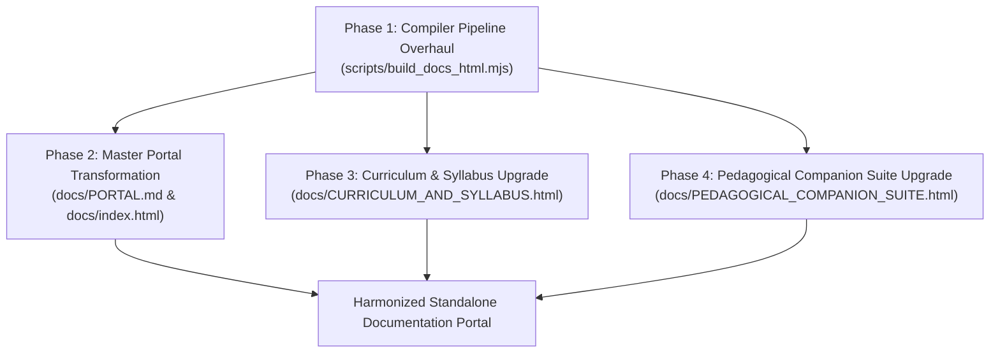

# 🏛️ Siliquarium Documentation Design Principles & Architectural Blueprint
*Distilled from BooleanGA's Flagship Curriculum Architecture for Enterprise-Grade Biophysical Pedagogy*

---

> *"If a student cannot feel the physical stakes before encountering the mathematics, the documentation has failed. If an engineer cannot trace the formal derivation directly to a data structure in code, the architecture has failed. World-class technical documentation must be simultaneously a scientific treatise, an interactive museum exhibit, and an unambiguous software blueprint."*

---

## 1. Executive Summary & Comparative Architectural Audit

A rigorous analytical dissection of **BooleanGA's** flagship documentation (specifically `BIOLOGICAL_FOUNDATIONS_OF_GENETIC_ALGORITHMS.html`, `INDEX.html`, and `vol1/ch01_molecular_architecture_of_heredity.html`) reveals an educational publishing architecture that operates at the highest tier of modern scientific exposition. 

Rather than treating documentation as static text or a generic developer wiki, BooleanGA treats documentation as a **living, hyper-scaffolded cognitive instrument**. It achieves parity with elite scientific publications and interactive computational portals (such as *Distill.pub*, *Stripe Press*, and *Nature Methods*) while maintaining 100% standalone, zero-server offline utility (`file:///` protocol compatibility).

### Comparative Audit: BooleanGA vs. Current Siliquarium Documentation

| Architectural Dimension | BooleanGA Flagship Standard | Current Siliquarium Implementation | Gap & Required Transformation |
| :--- | :--- | :--- | :--- |
| **CSS & Design Engine** | Modern **Tailwind CSS** CDN runtime with `class="dark"`, extended biomorphic color tokens, and custom scrollbars. | Custom inline CSS stylesheet (`:root` variables) in `build_docs_html.mjs` without utility classes or responsive grid utilities. | Upgrade compiler to inject Tailwind CDN with customized abyssal theme configuration, frosted glass filters, and responsive typography scales. |
| **Visual Hierarchy & Depth** | Semantic gradient cards (`.card-bio`, `.card-digital`, `.card-margin`, `.card-experiment`), glowing borders, and backdrop blurs. | Flat solid-color container cards (`--bg-card: #0d1322`) with single-pixel border strokes and no semantic hue-differentiation. | Implement 4 semantic gradient card classes with glowing borders matching Siliquarium's biophysical domains. |
| **Header & Navigation UX** | Breadcrumb hierarchy (`Portal / Vol / Ch`), glowing 14-16rem gradient logo badge, Title Hero, and **Status & Pedagogical Compass Strip**. | Basic sticky header bar with flat horizontal text link row; no breadcrumbs, no chapter metrics, no compass quick-jump links. | Construct a standardized Master Header with breadcrumb navigation trail, gradient logo box, title hero, and interactive Compass Strip. |
| **Portal Information Architecture** | 2-column modular chapter cards featuring subchapter rosters, reading times (`~12 min read`), feature pills, and glowing action buttons. | Markdown tables with raw text links and bulleted lists in `PORTAL.md`. | Rebuild `docs/PORTAL.md` and `docs/index.html` as a modular, responsive 2-column curriculum card grid with subchapters and feature pills. |
| **Mathematical Typesetting** | **MathJax 3** with single-dollar inline math (`$`), color-coded TeX tokens (`\color{#...}`), and post-render anchor coordination. | **KaTeX** auto-render with standard white typesetting; equations lack color breakdown or interactive alignment. | Migrate to color-coordinated MathJax 3 with single-dollar delimiter support and DOM lifecycle synchronization. |
| **Didactic Scaffolding** | **Teacher's Orientation prologue**, **4-Pillar SVG diagram cards**, **3-part color-coded equation decoders**, and **active-retrieval checkpoints**. | Markdown blockquotes and text alerts (`[!NOTE]`, `[!TIP]`); equations lack variable breakdowns; no diagram analysis cards. | Institutionalize the 5-Dimension Conceptual Rubric with formal Equation Decoders, 4-Pillar Diagram Cards, and Concept Checkpoints. |
| **Interactive Citations** | Instant fragment targeting with `@keyframes refTargetPulse`, floating `"CITED IN TEXT 🎯"` beacon pill, and backlink target flashes. | Standard anchor jumps (`#ref-1`) without visual feedback, glow pulses, or targeted highlighting. | Inject BooleanGA's interactive citation stylesheet and zero-dependency citation navigation JavaScript engine into all pages. |

---

## 2. Visual Hierarchy & Theme Systems

BooleanGA's aesthetic power stems from a carefully balanced juxtaposition: **deep, non-fatiguing dark abyssal backgrounds** paired with **high-contrast, bioluminescent neon accents** that mirror the physical reality of the systems being described.

| Semantic Container | CSS Class & Glow Gradient | Border Specification | Primary Curricular Use |
| :--- | :--- | :--- | :--- |
| **Biophysical Reality** | `.card-bio` (135° Emerald Glow) | `border: 1px solid rgba(16, 185, 129, 0.40)` | Peter Mitchell chemiosmosis, vents, natural selection |
| **Digital Architecture** | `.card-digital` (135° Cyan Glow) | `border: 1px solid rgba(6, 182, 212, 0.40)` | CMOS netlists, logic gates, Landauer token costs |
| **Sacred Analogy** | `.card-margin` (135° Amber Glow) | `border: 1px solid rgba(245, 158, 11, 0.35)` | Everyday conceptual anchors, apartment analogies |
| **Paleontological Fossil** | `.card-experiment` (135° Purple Glow) | `border: 1px solid rgba(168, 85, 247, 0.40)` | Lenski LTEE, Weisfeiler-Lehman hashes, frozen clades |

### 2.1 The Deep-Sea Abyssal Palette

Siliquarium's documentation palette adapts BooleanGA's palette to evoke the deep oceanic trenches where alkaline hydrothermal chimneys vent into freezing Hadean seawater:

```javascript
tailwind.config = {
  darkMode: 'class',
  theme: {
    extend: {
      colors: {
        abyssal: {
          bg: '#060911',        // Deepest trench obsidian
          surface: '#0a0e1a',   // Basalt chamber floor
          panel: '#121829',     // Porous mineral rock wall
          border: '#1e2c4a',    // Cold ocean waterline
          cyan: '#00e5ff',      // Bioluminescent Stream A flux (energy)
          amber: '#f59e0b',     // Volcanic hydrothermal thermal glow
          emerald: '#10b981',   // Silicate mineral structural tokens (matter)
          rose: '#f43f5e',      // Thermal shock & Landauer dissipation
          purple: '#a855f7',    // Historical phylogenies & Weisfeiler-Lehman hashes
          sky: '#38bdf8'        // Informational rate-independent symbolic code
        }
      },
      fontFamily: {
        mono: ['Cascadia Code', 'Fira Code', 'Consolas', 'monospace'],
        sans: ['Inter', '-apple-system', 'BlinkMacSystemFont', 'Segoe UI', 'Roboto', 'sans-serif'],
        serif: ['Georgia', 'Cambria', 'serif']
      }
    }
  }
};
```

### 2.2 Semantic Card Gradients
Instead of generic grey cards, BooleanGA assigns **strict epistemological roles** to specific gradient and border treatments. Siliquarium maps these directly to its core biophysical concepts:

1. **`.card-chemiosmotic` (formerly `.card-bio`):**  
   - *Colors:* Emerald gradient (`rgba(16, 185, 129, 0.08)` to `rgba(15, 23, 42, 0.7)`), 1px border `rgba(16, 185, 129, 0.4)`.  
   - *Role:* Mitchell proton motive force, prebiotic redox chemistry, autopoietic self-maintenance, and inorganic mineral catalysis.
2. **`.card-silicon` (formerly `.card-digital`):**  
   - *Colors:* Cyan gradient (`rgba(6, 182, 212, 0.08)` to `rgba(15, 23, 42, 0.7)`), 1px border `rgba(6, 182, 212, 0.4)`.  
   - *Role:* Digital logic gates, Landauer CMOS power switching, bytecode chromosomes, and internal latch state machines.
3. **`.card-analogy` (formerly `.card-margin`):**  
   - *Colors:* Amber gradient (`rgba(245, 158, 11, 0.08)` to `rgba(15, 23, 42, 0.7)`), 1px border `rgba(245, 158, 11, 0.35)`.  
   - *Role:* The 4 Sacred Everyday Analogies, intuitive conceptual anchors, and non-engineer plain-English explanations.
4. **`.card-paleo` (formerly `.card-experiment`):**  
   - *Colors:* Purple gradient (`rgba(168, 85, 247, 0.08)` to `rgba(15, 23, 42, 0.7)`), 1px border `rgba(168, 85, 247, 0.4)`.  
   - *Role:* Historical landmark experiments (Mitchell 1961, Russell 1997, Lenski LTEE 1988), Weisfeiler-Lehman topological hashes, and evolutionary flight recorder autopsies.

### 2.3 Typography & Readability Constraints
- **Body Copy:** Set in `font-sans` (`Inter`), line-height `1.75` (relaxed), text color `#cbd5e1` (slate-300) to minimize eye strain across long reading sessions.
- **Titles & Headings:** Set in `font-mono` (`Cascadia Code`), uppercase tracking (`tracking-tight` or `tracking-wider` on subheadings), crisp `#f8fafc` (slate-100).
- **Inline Code:** Rendered in `font-mono` with subtle rounded background `#0a0e1a`, single-pixel border `#1e2c4a`, and cyan text `#38bdf8`.

---

## 3. Layout & Information Architecture

BooleanGA structures its textbook volumes and portal pages using an unmistakable architectural hierarchy:

| Document Section | Visual Treatment | Interactive Functionality |
| :--- | :--- | :--- |
| **1. Master Header** | Glassmorphic sticky bar with dynamic breadcrumbs | Quick jump to portal hub and volume root |
| **2. Title Hero** | High-contrast gradient emblem box + typography | Displays chapter, subtitles, and cognitive scope |
| **3. Pedagogical Compass** | Horizontal badge strip with reading time | Real-time progress orientation and module roster |
| **4. Orientation Prologue** | `blockquote` with deep cyan vertical border | Explains existential stakes and foundational questions |
| **5. Modular Chapter Grid** | Responsive 2-column card layout | Visual subchapters, feature pills, direct action links |
| **6. Flagship Figures** | Glowing gradient borders + 4-pillar analysis cards | Full SVG diagrams and high-res browser screenshots |
| **7. Academic Citations** | Pop-in `CITED IN TEXT 🎯` beacon badge | Smooth jump to bibliography with pulse animation |

### 3.1 The Standardized Master Header
Every page features a top breadcrumb navigation row anchored to the master portal, accompanied by quick-action simulator links:
- Left: `📚 Master Portal / [Domain] / [Current Document]`
- Right: Direct action pills (`🚀 Live Seafloor Simulator`, `🔬 Lab Practicums`, `📚 Master Library`)

### 3.2 The Status & Pedagogical Compass Strip
Immediately below the title hero, a high-density, single-line compass bar provides readers with situational awareness and instant jump anchors:
```html
<div class="p-4 bg-slate-950/90 border border-slate-800 rounded-xl flex flex-wrap items-center justify-between gap-3 text-xs font-mono">
  <div class="flex items-center gap-3">
    <span class="px-2.5 py-1 rounded bg-emerald-950 border border-emerald-800 text-emerald-300 font-bold text-[11px]">4 Core Units • 5 Practicums</span>
    <span class="text-slate-400">Open in separate tabs &bull; Deep cross-linking &bull; Zero scrolling fatigue</span>
  </div>
  <div class="flex items-center gap-2">
    <a href="#unit-1" class="text-slate-400 hover:text-emerald-400 transition-colors">Unit 1 (Prebiotic)</a>
    <span class="text-slate-700">&bull;</span>
    <a href="#keystones" class="text-cyan-300 font-bold hover:text-cyan-200 transition-colors">Keystones</a>
    <span class="text-slate-700">&bull;</span>
    <a href="#unit-2" class="text-slate-400 hover:text-amber-400 transition-colors">Unit 2 (Thermodynamics)</a>
    <span class="text-slate-700">&bull;</span>
    <a href="#practicums" class="text-slate-400 hover:text-purple-400 transition-colors">Lab Practicums</a>
  </div>
</div>
```

### 3.3 The Modular Chapter Card Grid
Chapters and modules are presented not as bullet points, but as **rich cards** with five essential components:
1. **Chapter Badge & Domain Pill:** (e.g., `Unit 01` + `Prebiotic Physics`).
2. **Title & Synopsis:** High-contrast title linked with hover transition, followed by a 2-3 sentence teaser.
3. **Core Subchapter Roster:** An inset card (`bg-slate-950/70 border border-slate-800/80`) displaying the estimated reading time (`~14 min read`) and 3-4 bulleted subchapters with bold titles.
4. **Feature Pills:** Discrete metadata tags highlighting figures, equations, and historical papers (`Figure 1.1 Basalt Honeycomb`, `Mitchell 1961`, `Landauer Bound`).
5. **Card Footer & Action Button:** Left side denotes module type (`Standalone Module` or `Interactive Lab`); right side features a styled button (`Open Unit 01 →`) with arrow hover translation.

---

## 4. Didactic & Pedagogical Architecture

BooleanGA achieves pedagogical mastery by following a strict epistemological philosophy: **abstract mathematics must never be taught without physical grounding, and physical mechanisms must never be taught without everyday analogies.**

### 4.1 A Teacher's Orientation Prologue
Every major document opens with a dedicated section entitled *"A Teacher's Orientation: [Existential Theme]"*. 
- **The Core Rule:** Frame the entire volume as an existential crisis that physical nature had to overcome (e.g., the *Dilution Catastrophe* in prebiotic chemistry, or *Levinthal's Paradox* in protein folding).
- **Tone:** Welcoming, authoritative, philosophically grounded, inviting the reader to think as an experimental scientist rather than a passive student.

### 4.2 The Four Sacred Everyday Analogies
As codified in Siliquarium's documentation standards, abstract biophysical dynamics must be anchored to the **Four Sacred Analogies**:

```html
<!-- THE 4 SACRED EVERYDAY ANALOGIES PATTERN -->
<div class="p-4 rounded-xl bg-slate-900/90 border border-amber-500/30 space-y-2 text-xs font-sans text-slate-300 leading-relaxed my-3 shadow-lg">
  <div class="font-mono text-amber-300 font-bold flex items-center gap-1.5 border-b border-slate-800 pb-1.5">
    <span>🌍</span> Everyday Analogy — The Safe and the Workshop (The Epistemic Cut):
  </div>
  <p class="pl-5 text-slate-300">
    Think of an organism's digital genome like a <strong class="text-slate-100 font-semibold">master cookbook stored inside a fireproof safe</strong>. The active logic circuit running on the hydrothermal seafloor is the bustling <strong class="text-slate-100 font-semibold">kitchen workshop</strong>. While preparing dinner, hot grease might splatter, pans might dent, and steam fills the air (rate-dependent thermodynamic wear and tear). But you <strong class="text-amber-300 font-semibold">never chop up the cookbook recipe</strong> to cook a meal! The recipe remains inert, protected, and rate-independent. Only when opening a brand-new restaurant in the next town do you open the safe, photocopy the recipe, and carry it across the street (reproduction with mutation). That is why digital organisms can suffer metabolic starvation without corrupting their inherited genome!
  </p>
</div>
```

The four canonical metaphors:
1. **The Safe and the Workshop (The Epistemic Cut):** The genome is an inert recipe in a safe; the active circuit is the kitchen.
2. **The Hydrothermal Vent (The Digital Drumbeat):** Digital food is a musical rhythm or drumbeat passing by; an organism "eats" by catching the beat with its internal pendulum.
3. **The Rock Pores (Nature's First Walls):** Microscopic rock cavities in deep-sea basalt act as free stone houses protecting proto-life before lipid membranes evolved.
4. **The Battery (The Local Pantry):** A dynamic CMOS calorie counter. Toggling logic gates burns energy; matching vent rhythms stores energy; reaching 100 tokens triggers division.

### 4.3 Color-Coordinated Mathematical Decoders
Whenever a mathematical equation appears, it is forbidden to simply print the equation and walk away. BooleanGA introduces the **Color-Coordinated Mathematical Decoder**:

#### Step 1: TeX Equation with Color Coding
Each algebraic symbol is wrapped in a distinct hex color macro:
$$\color{#38bdf8}{\Delta p} = \color{#34d399}{\Delta \psi} - \color{#fbbf24}{\frac{2.303 R T}{F}} \color{#f43f5e}{\Delta \text{pH}}$$

#### Step 2: The Color Legend Row
Directly beneath the formula, legend pills indicate the variable mappings:
- 🔵 **Proton Motive Force ($\Delta p$)**
- 🟢 **Membrane Electrical Potential ($\Delta \psi$)**
- 🟡 **Nernst Thermodynamic Factor ($\frac{2.303 R T}{F}$)**
- 🔴 **Chemical pH Gradient ($\Delta \text{pH}$)**

#### Step 3: The 3-Part Variable Grid & Intuitive Truth Card
```html
<div class="p-4 rounded-xl bg-slate-900/90 border border-emerald-500/30 space-y-3 text-xs leading-relaxed my-3 font-sans shadow-lg">
  <div class="flex items-center gap-2 font-mono text-emerald-300 font-bold text-sm pb-1 border-b border-slate-800">
    <span>🧭</span> Color-Coordinated Equation Decoder: Mitchell Chemiosmotic Potential
  </div>
  <div class="grid grid-cols-1 sm:grid-cols-2 md:grid-cols-4 gap-2.5 text-[11px]">
    
    <div class="p-2.5 rounded-lg bg-slate-950 border border-sky-500/40 space-y-1">
      <div class="font-mono font-bold text-sky-400 flex items-center gap-1.5">
        <span class="px-1.5 py-0.5 rounded bg-sky-950 border border-sky-700 text-[10px]">&Delta;p</span>
        Total PMF
      </div>
      <p class="text-slate-300 text-[10.5px]">The net electrochemical driving force (in millivolts) pushing protons across the mineral pore wall.</p>
    </div>

    <div class="p-2.5 rounded-lg bg-slate-950 border border-emerald-500/40 space-y-1">
      <div class="font-mono font-bold text-emerald-400 flex items-center gap-1.5">
        <span class="px-1.5 py-0.5 rounded bg-emerald-950 border border-emerald-700 text-[10px]">&Delta;&psi;</span>
        Electrical Gradient
      </div>
      <p class="text-slate-300 text-[10.5px]">The physical electrostatic charge differential across the semi-conductive iron-sulfide membrane barrier.</p>
    </div>

    <div class="p-2.5 rounded-lg bg-slate-950 border border-amber-500/40 space-y-1">
      <div class="font-mono font-bold text-amber-400 flex items-center gap-1.5">
        <span class="px-1.5 py-0.5 rounded bg-amber-950 border border-amber-700 text-[10px]">Factor</span>
        Thermal Conversion
      </div>
      <p class="text-slate-300 text-[10.5px]">The Nernst conversion coefficient (~59 mV per pH unit at 298 K) converting chemical activity to voltage.</p>
    </div>

    <div class="p-2.5 rounded-lg bg-slate-950 border border-rose-500/40 space-y-1">
      <div class="font-mono font-bold text-rose-400 flex items-center gap-1.5">
        <span class="px-1.5 py-0.5 rounded bg-rose-950 border border-rose-700 text-[10px]">&Delta;pH</span>
        Chemical Gradient
      </div>
      <p class="text-slate-300 text-[10.5px]">The difference in proton concentration between acidic ocean water (pH 5.5) and alkaline vent fluid (pH 9.5).</p>
    </div>

  </div>

  <div class="pt-2 border-t border-slate-800 text-[10.5px] text-slate-300 space-y-1.5">
    <p>
      <strong class="text-emerald-400 font-semibold font-mono">💡 The Intuitive Truth Behind the Architecture:</strong> Life does not burn fuel like a campfire; life is an electrical capacitor. By maintaining an inorganic mineral wall between alkaline vent fluid (low protons) and acidic ocean water (high protons), nature constructed a continuous, abiotic hydroelectric dam generating ~200 mV across a 5-nanometer boundary.
    </p>
    <p class="text-amber-300">
      🌍 <strong>Everyday Analogy:</strong> <em>The Hydroelectric Hoover Dam.</em> The water level difference behind the dam is $\Delta\text{pH}$. The height of the spillway is $\Delta\psi$. The electrical power humming through the generators is $\Delta p$. Life began in the natural spillway.
    </p>
  </div>
</div>
```

### 4.4 SVG Diagram Pedagogical Breakdown Cards (The 4 Pillars)
Beneath every schematic diagram or data visualization, BooleanGA embeds a **Comprehensive Pedagogical Analysis Card** divided into four immutable pillars:

```html
<div class="p-5 rounded-xl bg-slate-950/90 border border-slate-800 text-xs font-mono space-y-3 mt-4 shadow-inner">
  <div class="flex items-center justify-between border-b border-slate-800 pb-2">
    <div class="flex items-center gap-2">
      <span class="text-emerald-400 text-sm">🔬</span>
      <span class="font-bold text-slate-100 uppercase tracking-wider text-[11px]">Comprehensive Pedagogical Analysis &bull; Figure Breakdown</span>
    </div>
    <span class="px-2 py-0.5 rounded bg-emerald-950 text-emerald-300 border border-emerald-800 text-[10px]">Thermodynamic Architecture</span>
  </div>
  <div class="space-y-2.5 text-slate-300 font-sans leading-relaxed text-xs">
    <p>
      <strong class="text-cyan-400 font-mono">🔍 Visual Guide &amp; Structural Mechanics:</strong> 
      Tours the graphic layout: axes, color codings, direction of fluid flux, and structural pore boundaries.
    </p>
    <p>
      <strong class="text-emerald-400 font-mono">🔬 Biophysical &amp; Mathematical Reality:</strong> 
      Explains the underlying physical laws: Gibbs free energy, Landauer erasure limits, or Nernst potentials.
    </p>
    <p>
      <strong class="text-amber-400 font-mono">💻 Digital Mapping in Siliquarium:</strong> 
      Maps the diagram directly to the codebase: data structures (e.g. `Uint8Array` pore grids, logic gate matrices, Landauer power counters).
    </p>
    <p>
      <strong class="text-purple-400 font-mono">💡 Core Conceptual Principle:</strong> 
      Synthesizes the big-picture takeaway, dismantling common student misconceptions.
    </p>
  </div>
</div>
```

### 4.5 Foundational Concept Checkpoints
To enforce active learning and self-assessment, chapters include interactive checkpoints:
- **🎯 Diagnostic Challenge:** A targeted thought experiment testing conceptual limits.
- **⚠️ Common Conceptual Misconception / Cognitive Trapdoor:** Proactively identifies teleological errors, "smuggled intelligence" fallacies, or false assumptions.
- **💡 Model Analytical Solution & Derivation:** Expandable `<details>` block with full derivation and the mandatory **Nature-to-Silicon Anchor**.

---

## 5. Interactive Micro-Interactions & Citation Mechanics

BooleanGA's interactive citation engine represents the gold standard in scholarly digital navigation. Clicking an inline superscript citation (`[1]`) does not merely snap the page downwards; it engages an **orchestrated multi-sensory feedback loop**.

```
[Reader clicks sup [1] in text]
               │
               ▼
[Citation Navigator smooth-centers #ref-1 card in viewport]
               │
               ├────────────────────────────────────────────────┐
               ▼                                                ▼
[@keyframes refTargetPulse triggers]               [@keyframes badgePopIn triggers]
- Border flares into luminous cyan (#22d3ee)       - Floating badge pops in at top right:
- Box-shadow surges (0 0 50px rgba(6,182,212))       "CITED IN TEXT 🎯"
- Card background pulses to rgba(8,51,68,0.92)     - Gradient: cyan-600 to blue-600
- Reference number [1] scales up (scale 1.2)       - Pill shadow with glow
               │
               ▼
[Reader clicks "↑ Back to text" link]
               │
               ▼
[@keyframes backlinkTargetFlash triggers on origin section]
- Glowing cyan outline pulse fades gently over 2.5 seconds
```

### 5.1 The Citation Target Keyframes & Stylesheet
To mirror BooleanGA, Siliquarium's documentation compiler must inject the following complete CSS block into every generated HTML page:

```css
/* ========================================================================= */
/* CITATION TARGET HIGHLIGHTING & INTERACTIVE NAVIGATION                     */
/* ========================================================================= */
html {
  scroll-behavior: auto; /* Managed by JS citation navigator */
}

/* Reference Cards - Default Unselected State */
li[id^="ref-"] {
  scroll-margin-top: 6rem;
  position: relative;
  transition: background-color 0.25s ease, border-color 0.25s ease, box-shadow 0.25s ease, transform 0.25s ease;
}

/* Keyframe animation for targeted citation pulse */
@keyframes refTargetPulse {
  0% {
    box-shadow: 0 0 0 0 rgba(0, 229, 255, 0.95), 0 0 40px rgba(0, 229, 255, 0.85), inset 0 0 15px rgba(0, 229, 255, 0.35);
    border-color: #22d3ee;
    background-color: rgba(8, 51, 68, 0.95);
    transform: scale(1.02);
  }
  30% {
    box-shadow: 0 0 0 6px rgba(0, 229, 255, 0.45), 0 0 50px rgba(0, 229, 255, 0.7), inset 0 0 20px rgba(0, 229, 255, 0.25);
    border-color: #38bdf8;
    background-color: rgba(8, 51, 68, 0.92);
    transform: scale(1.015);
  }
  100% {
    box-shadow: 0 0 0 2px rgba(0, 229, 255, 0.6), 0 0 25px rgba(0, 229, 255, 0.4), inset 0 0 12px rgba(0, 229, 255, 0.15);
    border-color: #00e5ff;
    background-color: rgba(8, 51, 68, 0.88);
    transform: scale(1);
  }
}

@keyframes badgePopIn {
  0% {
    opacity: 0;
    transform: translateY(6px) scale(0.8);
  }
  60% {
    opacity: 1;
    transform: translateY(-2px) scale(1.06);
  }
  100% {
    opacity: 1;
    transform: translateY(0) scale(1);
  }
}

/* Active targeted reference card via URL fragment (:target) or JS click (.active-citation-target) */
li[id^="ref-"]:target,
li[id^="ref-"].active-citation-target {
  animation: refTargetPulse 1.8s cubic-bezier(0.16, 1, 0.3, 1) forwards;
  border-color: #22d3ee !important;
  background-color: rgba(8, 51, 68, 0.88) !important;
  z-index: 20;
}

/* Active Beacon Pill Badge */
li[id^="ref-"]:target::after,
li[id^="ref-"].active-citation-target::after {
  content: "CITED IN TEXT 🎯";
  position: absolute;
  top: -12px;
  right: 14px;
  font-family: 'Cascadia Code', 'Fira Code', Consolas, monospace;
  font-size: 10px;
  font-weight: 800;
  letter-spacing: 0.06em;
  background: linear-gradient(135deg, #0891b2, #0284c7);
  color: #ffffff;
  padding: 3px 10px;
  border-radius: 9999px;
  border: 1px solid #38bdf8;
  box-shadow: 0 0 16px rgba(56, 189, 248, 0.85);
  animation: badgePopIn 0.4s cubic-bezier(0.16, 1, 0.3, 1) forwards;
  pointer-events: none;
}

/* Highlight reference number [n] */
li[id^="ref-"]:target > span:first-child,
li[id^="ref-"].active-citation-target > span:first-child {
  color: #38bdf8 !important;
  text-shadow: 0 0 12px rgba(56, 189, 248, 1);
  transform: scale(1.2);
  display: inline-block;
  transition: transform 0.3s ease;
}

/* Inline Citation Superscript interactive feedback */
sup a[href^="#ref-"] {
  transition: all 0.2s ease;
  display: inline-block;
  padding: 0 1px;
}
sup a[href^="#ref-"]:hover {
  color: #ffffff !important;
  text-shadow: 0 0 8px #00e5ff;
  transform: translateY(-1px);
}
sup a[href^="#ref-"]:active {
  transform: scale(0.9);
}

/* Backlink Section Target Visual Return Pulse */
section[id], div[id^="unit-"], div[id^="practicum-"], h2[id], h3[id] {
  scroll-margin-top: 5.5rem;
}

@keyframes backlinkTargetFlash {
  0% {
    outline: 3px solid rgba(0, 229, 255, 0.9);
    outline-offset: 4px;
  }
  100% {
    outline: 3px solid transparent;
    outline-offset: 4px;
  }
}

section[id]:target, div[id]:target {
  animation: backlinkTargetFlash 2.5s ease-out;
}
```

### 5.2 The Client-Side Citation Navigator Engine
This companion JavaScript block intercepts inline link clicks, manages hash navigation, centers targeted cards without disorientation, and coordinates with asynchronous MathJax typesetting:

```javascript
<script id="citation-navigator">
  document.addEventListener('DOMContentLoaded', function() {
    function highlightRefCard(targetId) {
      if (!targetId || !targetId.startsWith('ref-')) return;
      const el = document.getElementById(targetId);
      if (!el) return;

      // Clear existing active highlights
      document.querySelectorAll('li[id^="ref-"].active-citation-target').forEach(function(item) {
        item.classList.remove('active-citation-target');
      });

      // Trigger animation reflow
      el.classList.remove('active-citation-target');
      void el.offsetWidth;
      el.classList.add('active-citation-target');

      // Immediately center card in viewport without disorienting jump
      el.scrollIntoView({ behavior: 'auto', block: 'center' });
    }

    function scrollToTarget(targetId) {
      if (!targetId) return;
      if (targetId.startsWith('ref-')) {
        highlightRefCard(targetId);
        return;
      }
      const el = document.getElementById(targetId) || document.querySelector(`[name="${targetId}"]`);
      if (el) {
        el.scrollIntoView({ behavior: 'smooth', block: 'start' });
      }
    }

    // Handle clicks on inline reference links
    document.addEventListener('click', function(e) {
      const link = e.target.closest('a[href*="#"]');
      if (link) {
        const href = link.getAttribute('href');
        if (href && href.includes('#')) {
          const hash = href.substring(href.indexOf('#') + 1);
          if (hash.startsWith('ref-')) {
            highlightRefCard(hash);
          }
        }
      }
    });

    // Handle direct hash changes
    window.addEventListener('hashchange', function() {
      const hash = window.location.hash.replace('#', '');
      if (hash) scrollToTarget(hash);
    });

    // Initial check if opened with hash (coordinated across render intervals)
    function checkInitialHash() {
      if (window.location.hash) {
        const hash = window.location.hash.replace('#', '');
        scrollToTarget(hash);
      }
    }

    checkInitialHash();
    setTimeout(checkInitialHash, 150);
    setTimeout(checkInitialHash, 500);

    window.addEventListener('load', function() {
      setTimeout(checkInitialHash, 100);
      setTimeout(checkInitialHash, 600);
    });

    // Coordinate with MathJax 3 typesetting completion
    if (window.MathJax && window.MathJax.startup) {
      window.MathJax.startup.promise = window.MathJax.startup.promise.then(function() {
        setTimeout(checkInitialHash, 100);
      });
    }
  });
</script>
```

---

## 6. Concrete Engineering Roadmap for Siliquarium

To elevate Siliquarium's documentation to BooleanGA's benchmark, execution will proceed across four synchronized engineering phases.



### Phase 1: Compiler Pipeline Overhaul (`scripts/build_docs_html.mjs`)
1. **Engine Modernization:**
   - Replace the legacy CSS stylesheet in `renderHtmlTemplate` with **Tailwind CSS CDN** configured with the Abyssal color tokens (`abyssal-bg: #060911`, `abyssal-cyan: #00e5ff`, etc.).
   - Replace standard KaTeX script tags with **MathJax 3** (`tex-mml-chtml.js`) configured for single-dollar inline math (`['$', '$']`), display math (`['$$', '$$']`), and HTML tag skipping (`['script', 'noscript', 'style', 'textarea', 'pre', 'code']`).
   - Inject the complete **Citation Keyframes Stylesheet** and **Client-Side Citation Navigator** into the `<head>` of every generated document.
2. **Markdown Parsing Extensions:**
   - **Analogy Callouts:** Detect `> [!ANALOGY]` and format as the amber-bordered Sacred Analogy container.
   - **Equation Decoders:** Detect `> [!DECODER]` and render multi-column color-coordinated variable cards.
   - **Pedagogical Breakdown Cards:** Detect `> [!PILLARS]` and generate the 4-pillar analysis box (`🔍 Visual Guide`, `🔬 Biophysical Reality`, `💻 Digital Mapping`, `💡 Core Principle`).
   - **Checkpoints:** Detect `> [!CHECKPOINT]` and format into diagnostic challenges with misconception warnings and expandable derivations.

### Phase 2: Master Portal Transformation (`docs/PORTAL.md` & `docs/index.html`)
1. **Master Header & Hero:**
   - Embed the official canonical Siliquarium Logo (`assets/logos/logo.jpg`) inside a glowing 16rem gradient badge (`border border-cyan-400/40 drop-shadow-[0_0_15px_rgba(0,229,255,0.45)]`).
   - Add the Status & Compass Strip with anchors to Unit 1, Unit 2, Keystones, and Practicums.
2. **Teacher's Orientation:**
   - Open with *"The Unsupervised Sea: Why Non-Equilibrium Thermodynamics Must Precede Loss Functions"*, setting the philosophical stakes of silicon abiogenesis.
3. **2-Column Responsive Curriculum Grid:**
   - Transform the four units into modular chapter cards with subchapter rosters, estimated reading times (`~15 min read`), feature pills (`Mitchell PMF`, `Landauer Bound`, `Uri Alon Motifs`), and glowing action buttons (`Open Unit →`).
4. **Flagship Keystone Cards:**
   - Prominently feature Keystone 01 (**The Grand Epistemological Bridge: Howard Pattee's Epistemic Cut**) and Keystone 02 (**The Master Biophysical Model: Dual-Currency Thermodynamics**).

### Phase 3: Curriculum & Syllabus Upgrade (`docs/CURRICULUM_AND_SYLLABUS.html`)
1. Integrate color-coordinated equation decoders for:
   - Mitchell Chemiosmotic Potential ($\Delta p = \Delta \psi - 59 \Delta\text{pH}$).
   - Landauer Dynamic Switching Dissipation ($P_{\text{diss}} = \sum f_{\text{gate}} \cdot k_B T \ln 2$).
   - Dual-Currency Energy-Matter Partitioning ($E_{\text{net}} = E_{\text{harvest}} - \sum \Delta E_i - E_{\text{leak}}$).
   - Weisfeiler-Lehman Topological Graph Coloring ($c_v^{(k+1)} = \text{Hash}\big(c_v^{(k)}, \{\!\{ c_u^{(k)} \mid u \in \mathcal{N}(v) \}\!\}\big)$).
2. Attach 4-Pillar Pedagogical Breakdown Cards to all ASCII/SVG architecture diagrams (the basalt pore grid, the CMOS gate catalyst, the repressilator motif).
3. Embed Foundational Concept Checkpoints targeting the **Teleological Fallacy** and the **Smuggled Intelligence Trapdoor**.

### Phase 4: Pedagogical Companion Suite Upgrade (`docs/PEDAGOGICAL_COMPANION_SUITE.html`)
1. **Interactive Bibliography:** Convert all 14 annotated papers into targeted reference items (`<li id="ref-1">` to `<li id="ref-14">`) with DOI badges and back-to-text links, wired to the pulse animation engine.
2. **Glossary Enhancement:** Ensure all 55 terms feature an Everyday Analogy callout and a Siliquarium Digital Simulator mapping.
3. **Assessment Rubrics:** Format the 4-tier laboratory rubrics with high-contrast responsive tables.

---

## 7. Actionable Implementation Checklist

- [x] **Audit & Principle Distillation:** Completed exhaustive analytical review of BooleanGA's visual system, information architecture, pedagogical patterns, and interactive micro-interactions.
- [ ] **Compiler Script Upgrade:** Update `scripts/build_docs_html.mjs` to inject Tailwind CSS CDN, MathJax 3 configuration, citation keyframes, and the citation navigator script.
- [ ] **Portal Overhaul:** Rebuild `docs/PORTAL.md` and compile `docs/index.html` with the Master Header, gradient logo box, compass strip, 2-column curriculum grid, and keystones.
- [ ] **Curriculum Enhancement:** Equip `docs/CURRICULUM_AND_SYLLABUS.md` with the 4 Sacred Analogies, 3-part equation decoders, and 4-pillar diagram breakdown cards.
- [ ] **Companion Suite Polish:** Equip `docs/PEDAGOGICAL_COMPANION_SUITE.md` with interactive reference cards, pulse targets, and backlink return flashes.
- [ ] **Test & Verify:** Run `node scripts/build_docs_html.mjs` and verify zero-server `file:///` protocol rendering across desktop and mobile viewports.
