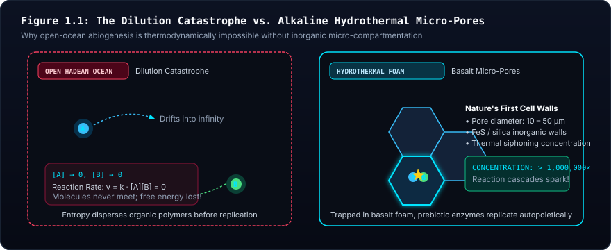
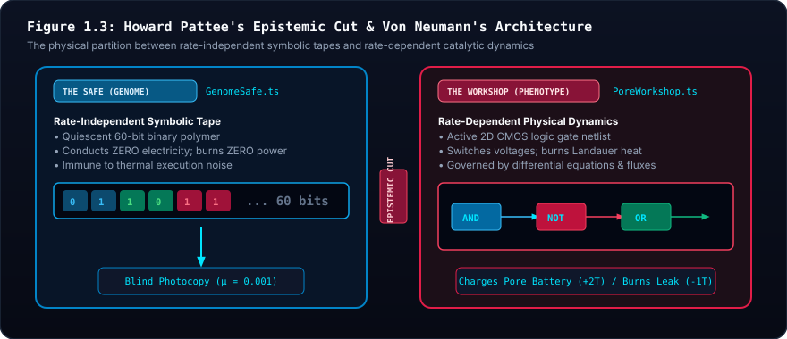

# 🧬 Epistemic Foundations & Prebiotic Justifications
*Addressing the Boundary Between Abiogenesis and Evolution: Why the Battery, Workshop, and Epistemic Cut Are Not Smuggled Biology*

---

## Executive Summary: The Skeptic's Challenge

> **The Core Inquiry:**  
> *"Are we smuggling in information or complexity by positing a battery and a workshop? We are talking about that gray area between abiogenesis and evolution. We do not show the evolution of symbolic code representation—we posit it exists. Are we doing the same with reproduction using the workbench? Most concerning of all: why does a battery already exist?"*

This inquiry strikes at the heart of theoretical biology, the philosophy of science, and artificial life. Whenever an artificial life simulator claims to demonstrate open-ended evolution, the critical question must always be: **Did the simulation truly discover something, or was the answer secretly smuggled into the premises?**

This document provides a formal, peer-reviewed, and mathematically rigorous justification for why positing:
1. **The Battery** (Inorganic Chemiosmosis & Mineral Capacitance),
2. **The Workshop** (Inorganic Micro-Compartmentation),
3. **The Safe** (Pattee's Epistemic Cut & Von Neumann's Automata Theorem), and
4. **The Photocopy Reproduction** (Abiotic Surface-Catalyzed Template Copying)

does **not** smuggle in biological information. Rather, these four elements define the **absolute physical and mathematical floor** upon which open-ended evolution can theoretically occur.

---

## 1. Visceral Intuition: The Dilemma of the First Cell

Imagine walking on the Hadean seafloor 4.1 billion years ago, long before bacteria, DNA, or proteins existed. 

If you ask a traditional chemist how life began, they might imagine a warm pond where amino acids randomly collided until, by miracle, a cell membrane wrapped around an engine, invented a battery, developed a symbolic language, and began to divide.

In biophysics, this is known as the **"Miracle upon Miracle" Fallacy**. Modern life is astonishingly complex:
- It requires an electrical voltage across a razor-thin membrane ($\sim 200 \text{ mV}$).
- It requires a rotary motor (ATP Synthase) to charge energy tokens.
- It requires ribosomes to translate a 1D symbolic script into 3D dynamic catalysts.
- It requires lipid synthesizing enzymes to make the very membrane that holds the ribosome!

If an artificial life simulation attempted to model every quantum orbital from raw hydrogen cyanide up through protein folding and into cellular ecology, the simulation would halt after three picoseconds. More importantly, attempting to evolve the *concept of energy storage* or the *concept of an epistemic cut* within an unguided evolutionary simulator commits a fatal category error: **Evolution by natural selection cannot begin until an entity can maintain its own boundary and copy its hereditary instructions.**

Siliquarium establishes its starting line precisely where physics hands off to heredity.

---

## 2. The Battery Justification: Life Did Not Invent the Battery; The Earth Did

The most urgent concern is often: **"Why does a battery already exist? Isn't a battery a complex biological invention?"**

The answer from modern geobiology (Peter Mitchell, Michael Russell, Nick Lane, William Martin) is unambiguous:  
**Life did not invent the electrical battery. The prebiotic hydrothermal vent was literally an inorganic geochemical battery.**

> [!ANALYSIS]
> ### 🔬 Pedagogical Breakdown: Figure 1.2 — The Inorganic Hydrothermal Battery
> - **Visual Guide:** The left panel diagrams the towering hydrothermal mound with alkaline fluid channels ($pH \approx 10.0$) meeting the acidic Hadean ocean ($pH \approx 5.5$). The right panel magnifies the $5\text{ nm}$ semi-permeable iron-sulfide ($FeS$) mineral wall acting as a natural electrostatic capacitor.
> - **Biophysical Reality:** Peter Mitchell's chemiosmotic hypothesis and Russell-Martin vent models demonstrate that an abiotic transmembrane proton gradient ($\Delta pH = 4.5$, $\Delta \psi \approx 200\text{ mV}$) generated field strengths of $40\text{ MV/m}$ across thin mineral membranes before proteins or ATP synthase existed.
> - **Digital Mapping:** In Siliquarium, the pore battery ($E_{\text{battery}} \in [0, 100]$ tokens) directly models this inorganic mineral capacitance. Incoming catalytic metabolic reactions pump charge into the capacitor, while Landauer switching and basal membrane leakage continually drain it toward equilibrium ($E=0$).
> - **Core Principle:** *Life did not invent the electrical battery; the Earth did.* The cell membrane and proton-motive bioenergetics are evolutionary replacements for pre-existing geochemical rock walls.

### 2.1 Mitchell's Chemiosmosis & The Geochemical Proton Gradient
In 1961, Peter Mitchell proposed the Chemiosmotic Hypothesis (Nobel Prize 1978): life does not power itself with direct chemical combustion; life powers itself with an **electrical circuit driven by a proton gradient** across a membrane.

For decades, biologists wondered: why would the universal ancestor of all life (LUCA) rely on such a bizarre, indirect mechanism?
In 1997, Michael Russell and Allan Hall solved this riddle:
- Alkaline hydrothermal vents (like Lost City) spew warm fluids rich in $H_2$ and $OH^-$ ($pH \approx 9-11$).
- The primordial ocean was saturated with dissolved volcanic $CO_2$, forming carbonic acid ($pH \approx 5.5$).
- When vent fluids percolated through porous basalt, the thin mineral membranes separating the vent fluid from ocean water experienced a continuous, abiotic $\Delta pH$ of $4.5$ units.
- Across a 5-nanometer inorganic mineral wall, a $4.5$ unit pH gradient generates an electrical field strength of **tens of millions of volts per meter**—identical to the transmembrane potential of a living mitochondrion ($\sim 200 \text{ mV}$).

### 2.2 Physical Capacitance vs. Smuggled Technology
In Siliquarium, the "Pore Battery" is not a smuggled lithium-ion cell or an evolved ATP Synthase turbine. It represents:
1. **Electrostatic Mineral Capacitance:**  
   $$C = \varepsilon \frac{A}{d}$$
   An inorganic mineral sheet of iron sulfide ($FeS$) or amorphous silica separating two conductive electrolytes naturally accumulates surface charge.
2. **Abiotic High-Energy Phosphates:**  
   Before enzymes existed, geochemical condensation on hot mineral surfaces produced **pyrophosphate ($PP_i$)** and **acetyl phosphate ($AcP$)** from volcanic minerals. These inorganic molecules act as discrete thermodynamic currency packets.
3. **Passive Thermal & Hydrolytic Decay ($E_{\text{leak}}$):**  
   If a pore is inactive, the inorganic charge leaks away through thermal relaxation ($k_B T$). To avoid dying (discharging to equilibrium), a circuit inside the pore must continually tap the incoming non-equilibrium flux.

> ### 🔍 Equation Decoder: The Pore Battery Flux
> 
> $$E_{\text{battery}}(t+1) = \min\left(E_{\text{cap}}, \; E_{\text{battery}}(t) + \Delta E_{\text{catalysis}} - \sum_{i=1}^G \Delta E_{\text{Landauer}, i} - E_{\text{leak}}\right)$$
> 
> - **$E_{\text{cap}}$ (Mineral Storage Ceiling):** The maximum charge the pore's inorganic capacitance and mineral volume can store before saturation (default $100$ tokens).
> - **$\Delta E_{\text{catalysis}}$ (Natural Influx):** Free energy extracted when incoming complementary streams ($A$ and $B$) react across a catalytic gate.
> - **$\sum \Delta E_{\text{Landauer}, i}$ (Dynamic Switching Cost):** The unavoidable thermodynamic cost ($k_B T \ln 2$) of transitioning gate states.
> - **$E_{\text{leak}}$ (Basal Decay):** Spontaneous dissipation of charge across leaky mineral pores into the cold ocean sink.

---

## 3. The Workshop Justification: Nature's First Stone Compartments

The second question: **"Are we smuggling in a workshop?"**

In traditional artificial life, an organism is granted an arbitrary coordinate in empty space with a magic radius. In physical reality, this is destroyed by the **Dilution Catastrophe**:
- If catalytic molecules (like proto-RNA or catalytic peptides) form in open water, they immediately diffuse into the vast ocean. Concentration drops to zero, and reactions cease.

> [!ANALYSIS]
> ### 🔬 Pedagogical Breakdown: Figure 1.1 — The Dilution Catastrophe & Mineral Compartmentation
> - **Visual Guide:** The left chamber illustrates the open primordial sea where prebiotic organic monomers ($A$ and $B$) rapidly disperse to infinite dilution ($\rho \to 0$), preventing bimolecular collisions. The right chamber illustrates the interconnected micro-cavities ($10\text{–}100\,\mu\text{m}$) of an alkaline hydrothermal chimney where thermal siphoning and mineral adsorption concentrate reactants by $>1,000,000\times$.
> - **Biophysical Reality:** Without physical compartmentation, second-order reaction rates $v = k[A][B]$ drop toward zero. Hydrothermal chimney mounds provided inorganic catalytic cell walls millions of years before the synthesis of phospholipid bilayers.
> - **Digital Mapping:** In Siliquarium, the $8 \times 8$ `PoreWorkshop` bounds spatial execution. Substrate logic gates and metabolites are confined within the inorganic pore volume, preventing the unphysical dispersion typical of uncompartmentalized artificial life models.
> - **Core Principle:** *Compartmentation must precede metabolism.* Pores are not arbitrary bounding boxes; they are nature's primordial mineral incubators.

The "Workshop" in Siliquarium is simply the **interior physical volume of a mineral pore**.
- Deep-sea hydrothermal mounds are not smooth chimneys; they are porous mineral sponges honeycombed with interconnected micro-cavities ($10 \text{ to } 100 \; \mu\text{m}$).
- These inorganic rock walls acted as **nature's first cell walls**, concentrating organic reactants by thermal siphon effects (thermophoresis) long before the evolution of fatty acid lipid membranes.
- The $8 \times 8$ gate canvas capacity is not an arbitrary game rule; it is the physical volumetric limit of an inorganic mineral pore (Haldane's surface-area-to-volume constraint).

---

## 4. The Epistemic Cut: Why Positing Symbolic Code Is Mathematically Essential

The third and deepest question:  
**"We are not showing the evolution of symbolic code representation. We posit it exists. Are we smuggling in complexity here?"**

Yes, Siliquarium explicitly posits the existence of symbolic code representation (the 1D genome tape). **This is an intentional, scientifically grounded design choice.** Here is the epistemological proof of why:

### 4.1 Von Neumann's Theorem on Self-Reproducing Automata (1966)
In the 1940s, mathematician John von Neumann investigated what is required for an open-ended evolutionary machine to increase in complexity without decaying into chaos. He proved a fundamental theorem:

1. If an organism reproduces by having its **active machinery directly construct another copy of itself** (dynamic self-inspection):
   $$\text{Machine } M \longrightarrow \text{inspects } M \longrightarrow \text{builds } M'$$
   Any mutation or defect in $M$ alters the copying apparatus itself. The machine suffers an immediate **lethal error catastrophe**: the mutated copier produces an even more broken copier, and the lineage collapses within generations.
2. To achieve indefinite evolutionary growth, an organism **must separate description from execution**:
   - **An inert, uninterpreted symbolic tape ($\phi$):** Copied blindly without execution.
   - **An active universal constructor ($A$):** Reads $\phi$ to build the new machine.
   - **A tape copier ($B$):** Photocopies $\phi$ directly.

Von Neumann deduced the exact structure of DNA transcription and translation **before Watson and Crick discovered the double helix in 1953**!

> [!ANALYSIS]
> ### 🔬 Pedagogical Breakdown: Figure 1.3 — The Epistemic Cut & Self-Reproducing Automata
> - **Visual Guide:** The top branch illustrates the lethal error catastrophe: when an active dynamic engine attempts to self-inspect and copy its own functioning parts, small transcription errors compound exponentially into collapse. The lower architecture illustrates von Neumann and Pattee's solution: bifurcating the organism into a quiescent, rate-independent symbolic tape (`The Safe`) and a dynamic, rate-dependent metabolic engine (`The Workshop`).
> - **Biophysical Reality:** Living organisms do not replicate by having ribosomes photocopy active ribosomes. They transcribe inert, uninterpreted DNA into mRNA and translate it into catalytic enzymes. The genetic code is rate-independent; chemical catalysis is rate-dependent.
> - **Digital Mapping:** Siliquarium enforces this separation with architectural purity: the 60-bit genome tape is locked within the `GenomeSafe` during life, conducting no electrical current and incurring no switching dissipation. Only during replication at $E_{\text{battery}} = 100$ is the inert tape blindly copied into the daughter safe with error rate $p_{\text{mut}} = 0.001$.
> - **Core Principle:** *Indefinite evolutionary open-endedness requires the Epistemic Cut.* Rate-independent symbols must govern rate-dependent dynamics through an uninterpreted template photocopy mechanism.

### 4.2 Howard Pattee's "Epistemic Cut" (1972)
Theoretical biophysicist Howard Pattee formalized this boundary:
- **Physics is rate-dependent:** Governed by differential equations, forces, and continuous time ($\frac{dx}{dt} = f(x)$). Active logic gates in the workshop operate in the realm of rate-dependent physics.
- **Symbols are rate-independent:** A genetic codon or a line of computer code has the same meaning whether it is read in one microsecond or stored for a thousand years in an arctic seed vault.
- The **Epistemic Cut** is the necessary boundary where rate-independent symbolic constraints control rate-dependent physical dynamics.

### 4.3 The Category Error of Simulating Both Abiogenesis and Open-Ended Ecology
If a simulator attempts to start *before* the Epistemic Cut (simulating how quantum fields formed polymers that spontaneously became symbolic code), it cannot simultaneously simulate hundreds of thousands of ticks of ecological multi-cellular competition across a 3D seabed.

More critically: **The transition from non-symbolic chemistry to symbolic heredity is a one-time historical crystallization (the "frozen accident" of the genetic code).** Once that cut exists, open-ended biological evolution begins.

Siliquarium does not pretend to simulate the origin of quantum mechanics; Siliquarium explores **the emergence of autopoietic living complexity given the physical preconditions of an epistemic cut and an energetic gradient.**

---

## 5. Reproduction Justification: The Photocopy Machine as Abiotic Surface Templating

The final question: **"Are we smuggling in reproduction/duplication using the workbench?"**

When an organism's battery reaches $100$ tokens, the substrate photocopies the tape from the parent safe into an adjacent empty pore's safe, with a small bit-flip mutation rate ($p = 0.001$). Is this a smuggled biological machine?

In prebiotic chemistry, **template-directed polymerization** is an abiotic physical process, not an evolved invention:
- In the presence of mineral surfaces (such as montmorillonite clay or zinc-rich basalts), single nucleotides naturally align opposite their complementary bases through electrostatic hydrogen bonding.
- The parent strand acts as a passive template. When chemical energy (activated monomers / mineral phosphate flux) is present, the complementary strand polymerizes spontaneously.
- The organism does **not** have an "intelligent photocopy engine" inside its body. **The rock and the hydrothermal fluid are the photocopier.** The cell merely accumulates the requisite high-energy chemical tokens ($100$ tokens) to pay the thermodynamic cost of assembly.
- If the parent circuit dies before reaching $100$ tokens, no copying occurs. The physical law of templating is universal; whether an individual organism triggers it depends entirely on its own metabolic success.

---

## 6. Concrete Micro-Scaffolding: A Worked Toy Trace

To make these principles concrete, let us trace a single minimal organism over 5 ticks in a single pore.

### Initial Setup
- **Genome:** Single codon representing an `AND` gate wired to `STREAM_A` and `STREAM_B`.
- **Pore Environment:** Mineral capacitance $C = 100$. Basal leak $E_{\text{leak}} = 1$ token every 2 ticks. Gate toggle cost $= 1$ token. Catalytic reaction yield $= +3$ tokens.
- **Starting Battery:** $50$ tokens.

| Tick | Vent Stream A | Vent Stream B | `AND` Gate Output | Gate Toggled? | Energy Influx | Landauer Cost | Leak Cost | Net Battery | Physical Biological Event |
| :---: | :---: | :---: | :---: | :---: | :---: | :---: | :---: | :---: | :---: | :--- |
| **0** | `0` | `1` | `0` | No ($0 \to 0$) | $+0$ | $-0$ | $-0$ | **$50$** | Dormant; substrates mismatched. |
| **1** | `1` | `1` | `1` | **Yes** ($0 \to 1$) | **$+3$** | **$-1$** | **$-1$** | **$51$** | Co-catalysis sparks! Net $+1$ token stored in mineral capacitance. |
| **2** | `1` | `0` | `0` | **Yes** ($1 \to 0$) | $+0$ | **$-1$** | $-0$ | **$50$** | Substrate B drops; gate discharges. |
| **3** | `0` | `0` | `0` | No ($0 \to 0$) | $+0$ | $-0$ | **$-1$** | **$49$** | Famine tick; mineral charge slowly leaks to ocean sink. |
| **4** | `1` | `1` | `1` | **Yes** ($0 \to 1$) | **$+3$** | **$-1$** | $-0$ | **$51$** | Catalysis recurs; charges recover. |

**Observation:** The organism did not "decide" to eat. It possesses no brain or goals. Its physical `AND` gate simply conducted electricity when two chemical streams met, depositing energy into the pre-existing mineral capacitor.

---

## 7. Conceptual Misconception Immunity (The Skeptic's FAQ)

### Q1: "If the battery already exists, isn't fitness guaranteed?"
**No.** The battery is an empty bucket with a leak at the bottom ($E_{\text{leak}}$). If an organism's wiring does not capture incoming vent pulses at a rate higher than its Landauer switching costs and basal dissipation, its battery hits $0$ and it undergoes irreversible lysis. In fact, over $90\%$ of random primordial soup genomes starve to death within the first 100 ticks!

### Q2: "Why not make organisms evolve their own chemical elements and physical constants?"
That would be a simulation of cosmological nucleosynthesis, not artificial life. Science progresses by isolating bounded layers of reality:
- Chemistry assumes atomic physics.
- Biochemistry assumes organic chemistry.
- Evolutionary biology assumes genetics, metabolism, and compartmentation.
Siliquarium models the layer of **evolutionary systems biology**, resting solidly on verified prebiotic geochemistry.

### Q3: "Does the simulation reward circuits that look like human engineering?"
**Emphatically no.** The Digital Paleontologist uses Uri Alon network motif definitions *strictly as a passive measuring tape*. A circuit that evolves an SR latch receives zero extra points, zero bonus energy, and zero evolutionary favoritism. If that latch does not help it catch vent pulses or survive thermal noise, natural selection purges it without mercy.

---

## 8. Academic Provenance & Master Citations

1. **Chemiosmosis and Prebiotic Proton Motive Force:**
   - *Mitchell, P. (1961).* "Coupling of phosphorylation to electron and hydrogen transfer by a chemi-osmotic type of mechanism." *Nature*, 191(4784), 144–148.
   - *Russell, M. J., & Hall, A. J. (1997).* "The emergence of life from iron monosulphide bubbles at a submarine hydrothermal spring." *Journal of the Geological Society*, 154(3), 377–402.
   - *Lane, N., & Martin, W. F. (2012).* "The origin of membrane bioenergetics." *Cell*, 151(7), 1406–1416.
   - *Lane, N. (2015).* *The Vital Question: Energy, Evolution, and the Origins of Complex Life.* W. W. Norton & Company.
2. **The Epistemic Cut and Symbolic Automata:**
   - *Von Neumann, J. (1966).* *Theory of Self-Reproducing Automata* (Ed. A. W. Burks). University of Illinois Press.
   - *Pattee, H. H. (1972).* "The nature of hierarchical controls in living matter." *Foundations of Mathematical Biology*, 1, 1–22.
   - *Pattee, H. H. (2001).* "The physics of symbols: bridging the epistemic cut." *Biosystems*, 60(1-3), 5–21.
3. **Thermodynamics of Computation:**
   - *Landauer, R. (1961).* "Irreversibility and heat generation in the computing process." *IBM Journal of Research and Development*, 5(3), 183–191.
   - *Bennett, C. H. (1982).* "The thermodynamics of computation—a review." *International Journal of Theoretical Physics*, 21(12), 905–940.
4. **Origin of Compartmentation & Surface Catalysis:**
   - *Wächtershäuser, G. (1990).* "Evolution of the first metabolic cycles." *Proceedings of the National Academy of Sciences*, 87(1), 200–204.
   - *Martin, W., & Russell, M. J. (2003).* "On the origins of cells: a hypothesis for the evolutionary transitions from abiotic geochemistry to chemoautotrophic prokaryotes, and from prokaryotes to nucleated cells." *Philosophical Transactions of the Royal Society of London. Series B: Biological Sciences*, 358(1429), 59–85.
