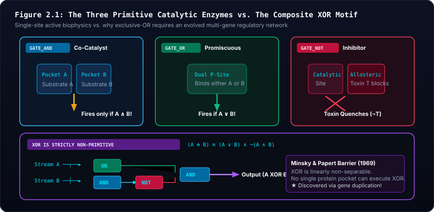
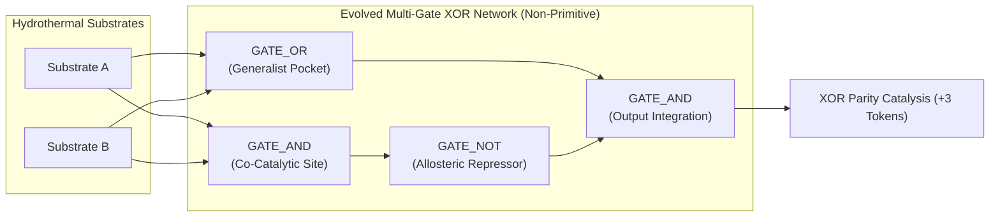

# 🏛️ Advanced Systems Biology & Silicon Abiogenesis: The Master Pedagogical Companion Suite
*Theoretical Treatise, Modular Architecture Portal, Analytical Scaffolding, and Assessment Framework for Collegiate and Advanced Secondary STEM Education*

---

> [!NOTE]
> **Modular Multi-Page Architecture Directory:**  
> To prevent vertical scrolling fatigue and provide focused reference volumes, the Pedagogical Companion Suite is partitioned into dedicated modular subpages:
> - 📖 **[Lexicon of Systems Biology & Silicon Abiogenesis](companion/glossary.md)** (`docs/companion/glossary.md`): 55+ rigorously defined terms across Biophysics, Information Theory, Enzymatic Logic, Graph Theory, and Evolutionary Genetics.
> - 🧭 **[Student Study Guides & Equation Decoders](companion/study_guides.md)** (`docs/companion/study_guides.md`): Unit-by-unit theoretical scaffolding, 8 color-coordinated Equation Decoders with responsive grids and sacred analogies, mathematical derivations, and synthetic problem sets.
> - 📚 **[Annotated Primary Literature Bibliography](companion/bibliography.md)** (`docs/companion/bibliography.md`): Exhaustive academic endnotes and publication-grade annotations of 14 landmark peer-reviewed publications (Mitchell, Russell, Lane, Pattee, Von Neumann, Landauer, Alon, Gardner, Elowitz, Lenski, Kimura, Ohno, Weisfeiler, Shannon).
> - 🎓 **[Curriculum & Laboratory Manual](CURRICULUM_AND_SYLLABUS.md)** (`docs/CURRICULUM_AND_SYLLABUS.md`): The core 4-unit syllabus and 5 hands-on laboratory practicums.

---

## 1. Architectural Introduction & Pedagogical Philosophy

In the instruction of evolutionary biology, biophysics, and complex systems, educators confront a persistent epistemic hurdle: the conceptual bifurcation between physical dynamics and informational constraints. Biology curricula frequently reduce genetics to static Mendelian bookkeeping and evolutionary adaptation to teleological narratives. Conversely, computational sciences routinely employ genetic algorithms that optimize arbitrary human loss functions, inadvertently inculcating the misconception that evolution acts with foresight, intentionality, and global optimization.

This **Pedagogical Companion Suite** resolves this deficit. Grounded in non-equilibrium thermodynamics, theoretical biophysics, and graph theory, this suite establishes:
1. **Autopoiesis Over Heteropoiesis:** Fitness is not an external score; fitness is **metabolic persistence**. An organism survives if and only if its internal logic network captures enough free energy from environmental fluxes to pay its Landauer switching costs and basal maintenance before its battery hits zero.
2. **The Zero-Smuggling Mandate:** Life did not invent batteries, cell walls, or templates from scratch. The prebiotic Earth provided the battery (alkaline vent chemiosmosis), the cell walls (porous basalt micro-cavities), and the photocopy copier (surface-catalyzed mineral templating).
3. **The Epistemic Cut:** John von Neumann (1966) and Howard Pattee (1972) proved that open-ended evolution is mathematically impossible without separating rate-independent symbolic instructions (the genotype safe) from rate-dependent continuous dynamics (the metabolic workshop).

| Pedagogical Component | Focus & Modality | Target Outcomes | Core Architectural Artifacts |
| :--- | :--- | :--- | :--- |
| **🎓 Curriculum & Syllabus** | 4 Core Modular Units, 5 Hands-on Practicums | Foundational biophysics, Pattee's cut, macro-evolution | [`CURRICULUM_AND_SYLLABUS.md`](CURRICULUM_AND_SYLLABUS.md) |
| **🏛️ Master Companion Suite** | Epistemic grounding & XOR treatise (This Hub) | Proof of XOR non-separability, pedagogical philosophy | [`PEDAGOGICAL_COMPANION_SUITE.md`](PEDAGOGICAL_COMPANION_SUITE.md) |
| **📖 Lexicon & Glossary** | 55+ Formal mathematical terms across 5 domains | Theoretical rigor, eradication of teleological jargon | [`companion/glossary.md`](companion/glossary.md) |
| **🧭 Study Guides & Decoders** | 8 Color equation decoders, 12 formal derivations | Mathematical fluency, Landauer dissipation bounds | [`companion/study_guides.md`](companion/study_guides.md) |
| **📚 Annotated Bibliography** | 14 Landmark primary papers (Mitchell, Landauer, Lenski) | Scientific literacy & historical provenance | [`companion/bibliography.md`](companion/bibliography.md) |
| **🔍 Student QA & Usability Audit** | 12th-grade usability report with browser screenshots | Real student feedback, DOM interaction telemetry | [`QA/STUDENT_UX_REPORT.md`](../QA/STUDENT_UX_REPORT.md) |

---

## 2. Theoretical Treatise: The Linear Non-Separability Barrier & The Non-Primitive Nature of XOR

### 2.1 The Common Pedagogical Misconception
In introductory computer science, the exclusive-OR (`XOR`) gate is routinely grouped alongside elementary logic gates (`AND`, `OR`, `NOT`). This pedagogical convenience introduces a severe biochemical fallacy when students transition to computational systems biology: **students assume that a living cell can evolve an "XOR enzyme" just as easily as an "AND enzyme."**

In Siliquarium's biophysical engine and genetic codon table ([`CodonTable.ts`](file:///h:/My%20Drive/Repos/Siliquarium/src/core/codons/CodonTable.ts)), **`GATE_XOR` is strictly non-primitive**. It cannot be encoded by a single codon or executed by a single enzyme active site.

### 2.2 The Geometric and Biochemical Proof
In 1969, Marvin Minsky and Seymour Papert published *Perceptrons*, proving that single-layer linear decision units cannot compute the Boolean `XOR` function because the truth table points $(0, 0)$, $(0, 1)$, $(1, 0)$, and $(1, 1)$ are **linearly non-separable** in 2D Euclidean input space.

```
                    THE GEOMETRIC LINEAR SEPARABILITY BARRIER
         
         Substrate B
             ▲
             │
          1  │    ● (0, 1) [HIGH]        ○ (1, 1) [LOW / INERT]
             │      (Fires Catalysis)      (Must SHUT DOWN!)
             │
             │           NO SINGLE STRAIGHT LINE CAN SEPARATE
             │           THE FILLED CIRCLES (●) FROM HOLLOW (○)!
             │
          0  │    ○ (0, 0) [LOW]         ● (1, 0) [HIGH]
             │      (Inactive)             (Fires Catalysis)
             └────────────────────────────────────────────────► Substrate A
                  0                      1
```

In molecular biophysics, this geometric barrier corresponds to fundamental physical constraints on protein binding pockets:
1. **The `AND` Gate (Co-Catalysis):** Easily achieved by a single enzyme pocket requiring the simultaneous binding of two substrates (e.g., kinase binding glucose and ATP). The reaction occurs if and only if both reagents are present ($A \land B$).
2. **The `OR` Gate (Isozymic Promiscuity):** Easily achieved by a single promiscuous catalytic pocket with chemical affinity for either of two alternate substrates (e.g., hexokinase binding glucose or fructose). The reaction occurs if either reagent is present ($A \lor B$).
3. **The `NOT` Gate (Allosteric Inhibition):** Easily achieved by a single repressor protein or allosteric site that changes conformation upon binding an effector to block the active site ($\neg A$).
4. **The `XOR` Gate (Combinatorial Parity):** **Physically impossible in a single active site!** For a single pocket to compute XOR, it would have to bind Substrate A and fire; bind Substrate B and fire; but when *both* Substrate A and Substrate B are present in high concentrations, it must physically extinguish its own activity! A single binding pocket cannot distinguish the simultaneous presence of both favorable ligands from individual ligands to suppress itself without a separate, cross-inhibitory regulatory pathway.



> [!ANALYSIS]
> ### 🔬 Pedagogical Breakdown: Figure 2.1 — Primitive Enzymatic Logic vs. Composite XOR
> - **Visual Guide:** Panels A, B, and C depict the three physically primitive enzyme active sites: co-catalysis (`AND`), promiscuous substrate affinity (`OR`), and allosteric conformational inhibition (`NOT`). Panel D depicts the 3-gate composite network $(A \lor B) \land \neg(A \land B)$ required to compute XOR parity logic.
> - **Biophysical Reality:** Minsky and Papert (1969) proved that XOR is linearly non-separable: no single linear hyperplane can partition $(0,1)$ and $(1,0)$ from $(0,0)$ and $(1,1)$. In biochemistry, no single active site can extinguish its own catalysis only when saturated with both complementary ligands without distinct regulatory feedback.
> - **Digital Mapping:** In Siliquarium, the codon translation table contains opcodes for `AND`, `OR`, `NOT`, and `BUF`. There is no primitive `XOR` opcode in the genetic code. XOR logic must evolve as a composite multi-gate network topology.
> - **Core Principle:** *Evolution builds complex logic from simple physical primitives.* Parity detection is an emergent milestone of network topology, not an arbitrary primitive.

### 2.3 The Evolutionary Milestone of Parity Logic
To compute XOR parity logic ($A \oplus B$), an organism **must evolve a multi-gate network topology**:
$$A \oplus B = (A \lor B) \land \neg(A \land B)$$

This requires a minimum of three to four interconnected logic gates: an `OR` gate detecting presence, an `AND` gate detecting coexistence, and an inhibitory `NOT` gate cross-clamping the output.



**Pedagogical Conclusion:**  
When the Digital Paleontologist's [`MotifScanner`](file:///h:/My%20Drive/Repos/Siliquarium/src/core/paleontology/MotifScanner.ts) detects the assembly of an XOR gate or a 1-bit half-adder, the lineage has crossed a profound evolutionary threshold: **it has transitioned from simple single-enzyme metabolic foraging to distributed, non-linear network computation!**

---

## 3. Pedagogical Rubrics & Assessment Guide

To evaluate student mastery across laboratory inquiries, experimental design, and computational autopsies, instructors should employ the following four-tier analytic scoring rubrics.

### 3.1 Analytic Scoring Rubric 1: Laboratory Notebooks & Empirical Telemetry Logging

| Dimension / Performance Level | Exemplary (4 Points) | Proficient (3 Points) | Developing (2 Points) | Novice (1 Point) |
| :--- | :--- | :--- | :--- | :--- |
| **1. Pre-Lab Scaffolding & Conceptual Setup** | Articulates biophysical mechanisms with mathematical precision. Grounded explicitly in Mitchell, Russell, or Landauer. Zero teleology or smuggled agency. | Clearly explains theoretical principles with correct biophysical terminology. Minor lapses in formal mathematical expressions. | Incomplete theoretical overview. Uses metaphorical or anthropomorphic phrasing (e.g., "cells want to adapt"). | Completely lacks theoretical scaffolding. Conflates simulation rules with arbitrary video game mechanics. |
| **2. Data Collection & Quantitative Rigor** | Tabulates complete tick-by-tick telemetry across all experimental trials. Correctly logs inputs, gate states, energy tokens, and basal leak. Zero missing values. | Records systematic data across trials. Minor logging omissions that do not compromise quantitative analysis. | Inconsistent data collection. Skips intermediate ticks or omits critical variables (e.g., forgets Landauer toggle costs). | Fragmentary, qualitative impressions without systematic numerical telemetry tables. |
| **3. Analytical Derivation & Ledger Balance** | Derives exact mathematical equations for energy balances and starvation thresholds. Verifies $\Delta E_{\text{universe}} = 0.000$ to full numerical precision. | Correctly executes metabolic budgeting formulas with minor arithmetic errors. Demonstrates energy conservation. | Flawed algebraic derivations. Fails to account for basal leakage or dynamic switching dissipation. | Unable to compute metabolic balances. Ignores thermodynamic ledger telemetry. |
| **4. Biophysical Isomorphism Grounding** | Rigorously maps in silico artifacts (`GATE_AND`, `PoreBattery`, `WL-Hash`) to real-world biophysical cognates (co-catalysis, mineral capacitance, contact maps). | Clearly relates simulation features to biological counterparts with accurate examples. | Superficial connections to biological systems; treats features as abstract computer science code. | Fails to identify any biological cognates. Views simulation purely as an isolated synthetic exercise. |

---

### 3.2 Analytic Scoring Rubric 2: Experimental Hypothesis Formulation & Perturbation Design

| Dimension / Performance Level | Exemplary (4 Points) | Proficient (3 Points) | Developing (2 Points) | Novice (1 Point) |
| :--- | :--- | :--- | :--- | :--- |
| **1. Mechanistic Grounding** | Hypotheses are framed as falsifiable, non-teleological biophysical predictions directly derived from non-equilibrium thermodynamics or graph theory. | Hypotheses are clear, testable, and scientifically grounded, with minor reliance on heuristic rather than fundamental physical laws. | Hypotheses are vague or express teleological goals (e.g., "the population will evolve a latch to remember food"). | Hypotheses are untestable, unscientific, or purely descriptive guesses without mechanistic rationale. |
| **2. Experimental Controls & Parameter Isolation** | Implements rigorous single-variable controls (e.g., holding PRNG seed constant while varying vent pulse frequency). Pre- and post-perturbation baselines logged. | Includes appropriate experimental controls and baseline measurements. Isolates primary independent variables. | Inadequate controls. Concurrently alters multiple God-Suite variables, confounding causal attribution. | Completely unconstrained perturbations without baseline measurements or controls. |
| **3. Multi-Scale Ecological Modeling** | Predicts and quantifies perturbations across multiple temporal scales (instantaneous tick dynamics, diurnal cycles, long-term seasonal turnover). | Analyzes perturbation impacts across short-term and medium-term generational intervals. | Focuses exclusively on immediate tick responses, ignoring generational and ecological succession. | Treats the environment as static. Fails to recognize environmental cycles. |
| **4. Synthesis & Scientific Invalidation** | Rigorously evaluates results against original hypotheses. Honestly acknowledges anomalous data. Refines theoretical models in response to evidence. | Accurately evaluates hypothesis outcomes. Draws grounded conclusions consistent with recorded telemetry. | Superficial discussion. Forces ambiguous data to fit initial hypothesis, ignoring disconfirming observations. | Ignores experimental results entirely. Reasserts original preconceptions without regard to evidence. |

---

### 3.3 Analytic Scoring Rubric 3: Computational Autopsies & Phylogenetic Proofs

| Dimension / Performance Level | Exemplary (4 Points) | Proficient (3 Points) | Developing (2 Points) | Novice (1 Point) |
| :--- | :--- | :--- | :--- | :--- |
| **1. Ancestral Hamming Reconstruction** | Completely traces parental lineage back to Generation 0. Quantifies cumulative Hamming distance. Correctly discriminates neutral drift from positive selection. | Traces ancestry through major generational transitions. Accurately identifies key mutations along the trajectory. | Incomplete lineage traversal. Fails to distinguish synonymous codon substitutions from catalytic modifications. | Unable to navigate ancestral flight recorder. Treats specimen as an isolated, ahistorical genotype. |
| **2. Counterfactual Single-Bit Dissection** | Pinpoints the exact bit index ($0..59$) and codon mutation responsible for phenotypic innovation. Identifies structural consequences on the gate netlist. | Identifies the critical mutated codon and describes the resulting change in logic gate function. | Locates the approximate mutated region but misidentifies the biophysical mechanism or codon translation. | Fails to identify the causative mutation. Attributes innovation to vague "gradual change." |
| **3. Homology vs. Homoplasy Proof Rigor** | Formulates a mathematically rigorous Least Common Ancestor (LCA) proof. Correctly applies the Homoplasy Predicate $\mathcal{H}(A, B, M)$ with zero ambiguity. | Accurately identifies the LCA and correctly determines whether a shared trait represents homology or homoplasy. | Understands the distinction between homology and homoplasy but executes flawed LCA ancestry queries. | Conflates phenotypic similarity with common ancestry. Assumes identical circuits must be homologous. |
| **4. Graph-Theoretic Verification** | Manually demonstrates Weisfeiler-Lehman color refinement steps on specimen subgraphs. Proves permutation invariance of the 64-bit structural hash. | Explains the logic of WL graph hashing and verifies that isomorphic circuits yield identical hash strings. | Struggles with the concept of graph isomorphism. Relies on visual inspection rather than formal invariants. | Fails to comprehend graph topology. Treats circuit netlists as simple 1D linear strings. |

---

### 3.4 Master Assessment Architecture & Evaluative Protocols

| Assessment Category | Weight | Target Modality & Deliverables | Focus Areas |
| :--- | :---: | :--- | :--- |
| **Formative Laboratory Notebooks** | **40%** | Labs 1–5 Telemetry Logs & Hypotheses | Chemiosmosis, Landauer power budgets, redox filtering |
| **Experimental Perturbation Project** | **25%** | Lab 4 God-Suite Environmental Stress | Thermal surge, extinction pulses, Shannon diversity $H$ |
| **Summative Computational Autopsy** | **25%** | Lab 5 Phylogenetic Lineage Reconstruction | LCA ancestry queries, Homoplasy Predicate $\mathcal{H}(A,B,M)$ |
| **Socratic Seminar & Colloquium** | **10%** | Oral Defense & Theoretical Critique | Pattee's Epistemic Cut, Kimura drift, Lenski dynamics |

#### Letter Grade Conversion Standards
- **A (93.0% – 100.0%):** Publication-quality laboratory analysis. Rigorous mathematical derivations with zero teleological language. Full mastery of Mitchell, Russell, Pattee, Landauer, and Lenski frameworks. Complete execution of graph invariants and LCA proofs.
- **A- (90.0% – 92.9%):** Thorough analytical execution. Minor algebraic errors in derivation problems. Sound biophysical grounding with consistent non-teleological phrasing.
- **B+ (87.0% – 89.9%):** Proficient data logging and experimental design. Identifies biological cognates accurately. Minor difficulty executing Weisfeiler-Lehman manual color refinement.
- **B (83.0% – 86.9%):** Meets all standard laboratory requirements. Occasional lapses into anthropomorphic language (e.g., "the cell wanted to survive"). Basic understanding of Landauer costs.
- **B- (80.0% – 82.9%):** Incomplete derivations or minor gaps in telemetry tables. Understands basic Boolean enzyme logic but struggles with non-equilibrium thermodynamics.
- **C (70.0% – 79.9%):** Significant conceptual confusion regarding the Epistemic Cut or Landauer dissipation. Treats simulation as an engineering CAD tool rather than an autopoietic ecosystem.
- **F (< 70.0%):** Unscientific submission. Pervasive smuggled teleology. Failure to collect quantitative data or execute required phylogenetic proofs.

---

> [!NOTE]
> **Explore the Modular Companion Volumes:**  
> [📖 Lexicon of Systems Biology & Silicon Abiogenesis](companion/glossary.md) | [🧭 Study Guides & Equation Decoders](companion/study_guides.md) | [📚 Annotated Bibliography](companion/bibliography.md) | [🎓 Curriculum & Syllabus](CURRICULUM_AND_SYLLABUS.md)
