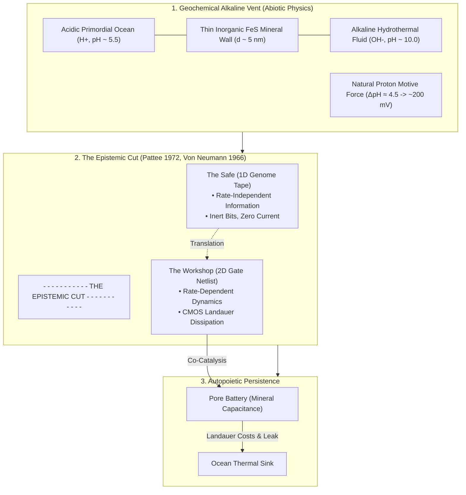
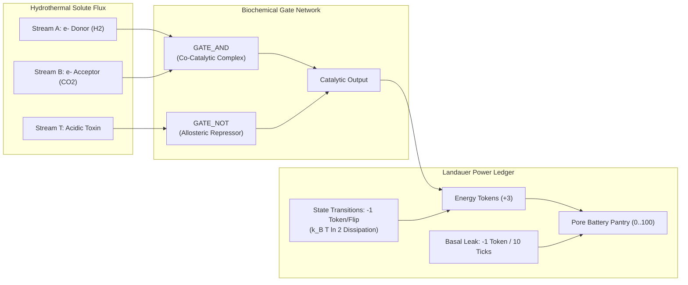
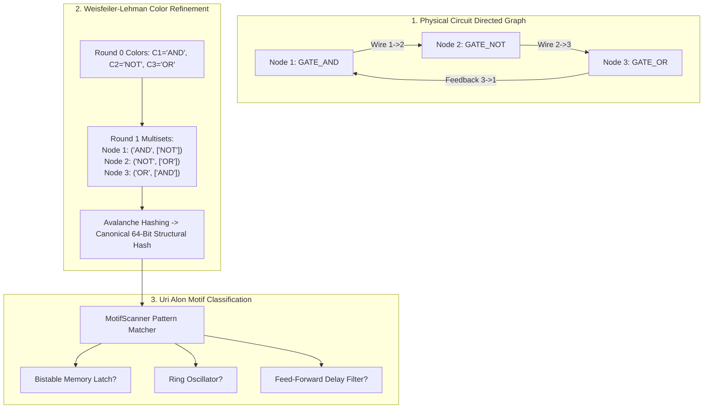
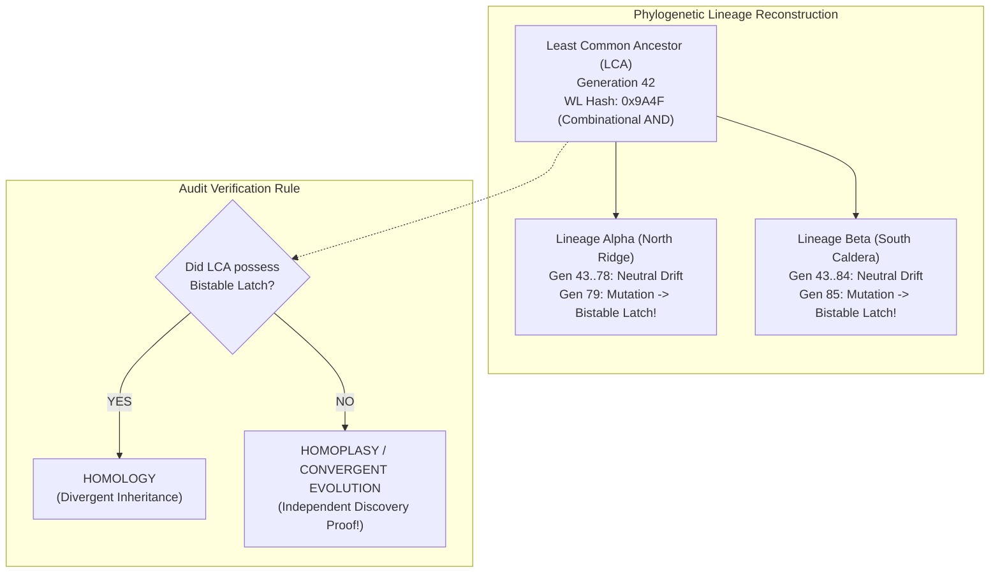

# 🏛️ Advanced Systems Biology & Silicon Abiogenesis: The Pedagogical Companion Suite
*Theoretical Treatise, Analytical Scaffolding, Exhaustive Glossary, Annotated Bibliography, and Assessment Framework for Collegiate and Advanced Secondary STEM Education*

---

## 1. Architectural Introduction & Pedagogical Philosophy

In the instruction of evolutionary biology, biophysics, and complex systems, educators confront a persistent epistemic hurdle: the conceptual bifurcation between physical dynamics and informational constraints. Biology curricula frequently reduce genetics to static Mendelian bookkeeping and evolutionary adaptation to teleological narratives. Conversely, computational sciences routinely employ genetic algorithms that optimize arbitrary human loss functions, inadvertently inculcating the misconception that evolution acts with foresight, intentionality, and global optimization.

This **Pedagogical Companion Suite** serves as the authoritative theoretical and methodological companion to the *Siliquarium* curriculum and laboratory manual ([`docs/CURRICULUM_AND_SYLLABUS.md`](file:///h:/My%20Drive/Repos/Siliquarium/docs/CURRICULUM_AND_SYLLABUS.md)). Grounded in non-equilibrium thermodynamics, theoretical biophysics, and graph theory, this volume provides:
1. **An Exhaustive Glossary of Systems Biology & Silicon Abiogenesis** (50+ precisely formalized terms).
2. **Deep-Dive Student Study Guides & Analytical Companion** (unit-by-unit theoretical foundations, conceptual traps, rigorous mathematical derivations, and synthetic problem sets).
3. **Critical Academic Endnotes & Exhaustive Annotated Primary Literature Bibliography** (comprehensive contextualization of 14 landmark peer-reviewed publications spanning 1948 to 2019).
4. **Pedagogical Rubrics & Assessment Guide** (multi-dimensional analytic scoring standards for computational biology laboratories, hypothesis design, and phylogenetic autopsies).

---

## 2. Exhaustive Glossary of Systems Biology & Silicon Abiogenesis

### Module A: Biophysics, Bioenergetics & Non-Equilibrium Thermodynamics

#### 1. Autopoiesis
- **Formal Definition:** A property of a system that continuously regenerates and sustains its own organizational network through internal chemical processes within a bounded physical domain, distinguishing self-maintaining life from externally driven machines (*Maturana & Varela, 1972*).
- **Mathematical / Physical Expression:**
  $$\frac{d\mathcal{S}_{\text{internal}}}{dt} = \dot{S}_{\text{production}} - \dot{S}_{\text{efflux}} \le 0, \quad \text{under boundary condition } \Omega(t) \ne \emptyset$$
- **In Silico Realization:** In Siliquarium, an organism is autopoietic because it maintains its own internal state, gate network, and energy reserve without an external fitness score. If its internal energy drops to zero, the boundary collapses into a carcass state ([`PoreCell.ts`](file:///h:/My%20Drive/Repos/Siliquarium/src/core/domain/PoreCell.ts#L80-L105)).
- **Biological Cognate:** A living bacterium constantly synthesizing its own phospholipids, peptidoglycan wall, and enzymes to counterbalance hydrolytic decay.
- **Pedagogical Significance:** Prevents teleological fitness functions; replaces "fitness as an objective score" with "fitness as metabolic persistence."

#### 2. Heteropoiesis
- **Formal Definition:** A property of a system whose production process produces something other than itself, such as an automated factory, an artificial neural network trained by backpropagation, or an engineering genetic algorithm (*Maturana & Varela, 1972*).
- **Mathematical / Physical Expression:**
  $$\mathcal{M}: \mathcal{I} \to \mathcal{O}, \quad \text{where } \mathcal{O} \notin \text{Domain}(\mathcal{M})$$
- **In Silico Realization:** Traditional genetic algorithms where a supervisor measures an organism against a human-defined target string or truth table. Explicitly rejected in Siliquarium's domain architecture.
- **Biological Cognate:** A virus particle assembled inside a host cell; it cannot self-maintain or regenerate its own boundary independently.
- **Pedagogical Significance:** Clarifies why conventional genetic algorithms fail to model natural open-ended evolution.

#### 3. Chemiosmosis
- **Formal Definition:** The transduction of free energy derived from redox reactions or solar flux into an electrochemical gradient of ions across an ion-impermeable membrane, used to drive mechanical, synthetic, or transport work (*Mitchell, 1961*).
- **Mathematical / Physical Expression:**
  $$\Delta G = -n F \Delta p$$
- **In Silico Realization:** The extraction of high-energy tokens by catalytic gates spanning the pore boundary between incoming low-entropy vent pulses and the ocean sink ([`VentPhysics.ts`](file:///h:/My%20Drive/Repos/Siliquarium/src/core/physics/VentPhysics.ts)).
- **Biological Cognate:** The transmembrane proton gradient driving the $F_o F_1$-ATP synthase motor in mitochondria and prokaryotes.
- **Pedagogical Significance:** Grounds cellular energetics in electrical circuit theory rather than abstract chemical "currency."

#### 4. Proton Motive Force (PMF)
- **Formal Definition:** The electrochemical potential difference of protons across a biological or inorganic membrane, comprising an electrical membrane potential and a chemical proton concentration difference.
- **Mathematical / Physical Expression:**
  $$\Delta p = \Delta \psi - \frac{2.303 R T}{F} \Delta \text{pH}$$
  *Where $\Delta \psi$ is the electrical potential difference across the membrane, $R$ is the gas constant, $T$ is absolute temperature, $F$ is Faraday's constant, and $\Delta \text{pH} = \text{pH}_{\text{ext}} - \text{pH}_{\text{int}}$.*
- **In Silico Realization:** Represented by the potential difference between Vent Streams $A$ and $B$, modulated by the vent fluid pressure and hydrothermal cycle phase ([`VentPhysics.ts`](file:///h:/My%20Drive/Repos/Siliquarium/src/core/physics/VentPhysics.ts#L45-L75)).
- **Biological Cognate:** The $\sim 150 \text{ to } 220 \text{ mV}$ electrical and proton gradient maintained across the inner mitochondrial membrane.
- **Pedagogical Significance:** Demonstrates that living bioenergetics operates at an electrical field strength comparable to a dielectric breakdown threshold ($> 10^7 \text{ V/m}$).

#### 5. Alkaline Hydrothermal Vent
- **Formal Definition:** A submarine geological formation formed at serpentinizing tectonic fault zones where warm, alkaline, hydrogen-rich fluids discharge into acidic, carbonate-rich ocean waters (*Russell & Hall, 1997*).
- **Mathematical / Physical Expression:**
  $$\text{Serpentinization: } (\text{Mg}, \text{Fe})_2\text{SiO}_4 + \text{H}_2\text{O} \to \text{Mg}_3\text{Si}_2\text{O}_5(\text{OH})_4 + \text{Mg(OH)}_2 + \text{Fe}_3\text{O}_4 + \text{H}_2$$
- **In Silico Realization:** The central volcanic caldera nozzle at grid origin $(0, 0, 0)$ injecting alternating structured waveforms into the basalt seamount ([`VentPhysics.ts`](file:///h:/My%20Drive/Repos/Siliquarium/src/core/physics/VentPhysics.ts#L10-L40)).
- **Biological Cognate:** The Lost City Hydrothermal Field on the Mid-Atlantic Ridge.
- **Pedagogical Significance:** Establishes that the thermodynamic driving force for life preceded the existence of biological macromolecules.

#### 6. Dilution Catastrophe
- **Formal Definition:** The thermodynamic impossibility of sustaining multi-step catalytic cascades in unconfined open aqueous media due to rapid entropic diffusion reducing reactant concentrations toward zero.
- **Mathematical / Physical Expression:**
  $$C(r, t) = \frac{M}{(4\pi D t)^{3/2}} \exp\left(-\frac{r^2}{4Dt}\right) \implies \lim_{t \to \infty} C(r, t) = 0$$
- **In Silico Realization:** Confining catalytic logic gates strictly within closed hexagonal pore boundaries; circuits drifting outside pores without a safe cannot maintain concentration.
- **Biological Cognate:** The failure of prebiotic synthesis models predicated upon an open "warm little pond" without physical micro-compartments.
- **Pedagogical Significance:** Eliminates the student misconception that life could spontaneously self-assemble in an open, unconfined liquid ocean.

#### 7. Inorganic Micro-Compartmentation
- **Formal Definition:** Semi-permeable micro-cavities within precipitated iron-sulfide or silica mineral structures that physically confine organic reactants, serving as abiotic precursors to lipid membranes (*Russell & Hall, 1997; Martin & Russell, 2003*).
- **Mathematical / Physical Expression:**
  $$V_{\text{pore}} \sim 10^{-15} \text{ to } 10^{-13} \text{ m}^3, \quad \frac{A}{V} = \frac{6}{d} \gg 1$$
- **In Silico Realization:** The 3D hexagonal basalt pores of the seafloor lattice ([`HexGrid3D.ts`](file:///h:/My%20Drive/Repos/Siliquarium/src/core/grid/HexGrid3D.ts)), each accommodating up to an $8 \times 8$ gate netlist.
- **Biological Cognate:** Micro-scale cavities in hydrothermal chimneys composed of mackinawite ($FeS$) and greigite ($Fe_3S_4$).
- **Pedagogical Significance:** Illustrates how compartmentation was an abiotic geophysical gift rather than a complex biological innovation.

#### 8. Thermophoresis / Thermal Siphoning
- **Formal Definition:** The migration of suspended colloidal particles and polymers along a macroscopic temperature gradient, yielding exponential molecular accumulation within cold crevices (*Braun & Libchaber, 2002; Baaske et al., 2007*).
- **Mathematical / Physical Expression:**
  $$j = -D \nabla c - c D_T \nabla T, \quad \frac{c_{\text{cold}}}{c_{\text{hot}}} = \exp\left(S_T \Delta T\right)$$
  *Where $S_T = D_T / D$ is the Soret coefficient.*
- **In Silico Realization:** The radial temperature and pressure gradient from the caldera core to the peripheral abyss, governing nucleotide and solute concentration in [`VentPhysics.ts`](file:///h:/My%20Drive/Repos/Siliquarium/src/core/physics/VentPhysics.ts#L60-L90).
- **Biological Cognate:** Prebiotic concentration of oligonucleotides by $>1,000,000$-fold inside hydrothermal capillary channels.
- **Pedagogical Significance:** Provides a physical mechanism overcoming the thermodynamic barrier to biopolymer polymerization.

#### 9. Mineral Capacitance
- **Formal Definition:** The electrostatic energy storage capacity of thin inorganic semiconductor mineral films (e.g., $FeS$, $Fe_3O_4$, silica) separating two aqueous solutions of differing electrochemical potential.
- **Mathematical / Physical Expression:**
  $$C = \varepsilon_r \varepsilon_0 \frac{A}{d}, \quad U_E = \frac{1}{2} C V^2$$
- **In Silico Realization:** Implemented in [`PoreBattery.ts`](file:///h:/My%20Drive/Repos/Siliquarium/src/core/domain/PoreBattery.ts#L10-L45) with a default storage ceiling of $E_{\text{cap}} = 100$ tokens.
- **Biological Cognate:** Natural double-layer electrostatic capacitance across thin iron monosulfide membranes.
- **Pedagogical Significance:** Disabuses students of the assumption that batteries require complex modern chemical engineering or evolved proteins.

#### 10. Pyrophosphate ($PP_i$) & Acetyl Phosphate ($AcP$)
- **Formal Definition:** Simple inorganic and organic phosphoanhydride molecules that served as the primary geochemical thermodynamic currencies prior to the enzymatic synthesis of adenosine triphosphate (ATP) (*Lipmann, 1941; Russell, 2007*).
- **Mathematical / Physical Expression:**
  $$\text{AcP} + \text{ADP} \xrightarrow{Fe^{2+}} \text{Acetate} + \text{ATP}, \quad \Delta G^{\circ\prime} \approx -43.1 \text{ kJ/mol}$$
- **In Silico Realization:** Discretized as individual **Energy Tokens** stored in the pore battery pantry ([`PoreBattery.ts`](file:///h:/My%20Drive/Repos/Siliquarium/src/core/domain/PoreBattery.ts)).
- **Biological Cognate:** Chemoautotrophic phosphorylation in deep-branching archaea and bacteria using inorganic pyrophosphate.
- **Pedagogical Significance:** Demonstrates that high-energy phosphate bonds are prebiotic chemical reagents rather than biological inventions.

#### 11. Landauer's Principle
- **Formal Definition:** The fundamental thermodynamic principle stating that the erasure of one bit of physical information or the logically irreversible merging of two computation paths dissipates a minimum amount of thermodynamic heat into the surrounding heat bath (*Landauer, 1961*).
- **Mathematical / Physical Expression:**
  $$Q_{\text{Landauer}} \ge k_B T \ln 2$$
  *Where $k_B$ is the Boltzmann constant and $T$ is the absolute ambient temperature.*
- **In Silico Realization:** Every logic gate state flip ($0 \to 1$ or $1 \to 0$) consumes exactly $1$ Energy Token from the pore's internal battery ([`PoreWorkshop.ts`](file:///h:/My%20Drive/Repos/Siliquarium/src/core/domain/PoreWorkshop.ts#L65-L85)).
- **Biological Cognate:** The ATP hydrolysis cost associated with proofreading in DNA polymerase and conformational switching in signaling kinases.
- **Pedagogical Significance:** Establishes the non-negotiable thermodynamic cost of computation, preventing runaway logic gate proliferation.

#### 12. Dynamic CMOS Switching Power
- **Formal Definition:** The electrical power dissipated by a complementary metal-oxide-semiconductor logic gate due to charging and discharging capacitive load lines during signal transitions.
- **Mathematical / Physical Expression:**
  $$P_{\text{dynamic}} = \alpha \cdot C_L \cdot V_{DD}^2 \cdot f$$
  *Where $\alpha$ is switching activity factor, $C_L$ is load capacitance, $V_{DD}$ is supply voltage, and $f$ is clock frequency.*
- **In Silico Realization:** Modeled as $\Delta E_{\text{Landauer}} = \sum \mathbb{I}(y_g(t) \ne y_g(t-1)) \cdot \kappa_{\text{toggle}}$ in [`PoreWorkshop.ts`](file:///h:/My%20Drive/Repos/Siliquarium/src/core/domain/PoreWorkshop.ts).
- **Biological Cognate:** The metabolic overhead of firing action potentials in neuronal axons ($>10^8$ ATP molecules per spike).
- **Pedagogical Significance:** Connects computer hardware engineering to metabolic bioenergetics.

#### 13. Basal Metabolic Dissipation ($E_{\text{leak}}$)
- **Formal Definition:** The ongoing, unavoidable loss of free energy required to maintain cellular integrity against spontaneous entropic degradation, independent of active computation or replication.
- **Mathematical / Physical Expression:**
  $$\left(\frac{dE}{dt}\right)_{\text{basal}} = -\gamma_{\text{leak}} \cdot E(t)$$
- **In Silico Realization:** Dissipation of $1$ Energy Token every 10 simulation ticks per living cell ([`PoreCell.ts`](file:///h:/My%20Drive/Repos/Siliquarium/src/core/domain/PoreCell.ts#L81-L86)).
- **Biological Cognate:** Basal metabolic rate (BMR) and membrane proton leak in resting biological cells.
- **Pedagogical Significance:** Enforces an absolute survival floor; idle organisms that harvest nothing inevitably starve.

#### 14. Non-Equilibrium Steady State (NESS)
- **Formal Definition:** The macroscopic state of an open thermodynamic system characterized by constant macroscopic properties sustained by continuous fluxes of matter, energy, and entropy production (*Prigogine, 1967*).
- **Mathematical / Physical Expression:**
  $$\frac{\partial \rho}{\partial t} = 0, \quad \sigma = \sum_k J_k X_k > 0$$
  *Where $J_k$ are thermodynamic fluxes and $X_k$ are conjugate thermodynamic forces.*
- **In Silico Realization:** The sustained population balance on the benthic lattice when energy influx from hydrothermal pulses matches total Landauer switching and basal leak dissipation.
- **Biological Cognate:** Homeostasis in any living physiological organism.
- **Pedagogical Significance:** Differentiates living stability (dynamic NESS) from thermodynamic death (static equilibrium).

---

### Module B: Information Theory, Cybernetics & Foundations of Computation

#### 15. The Epistemic Cut
- **Formal Definition:** The necessary theoretical separation between rate-independent symbolic informational descriptions (the genotype) and rate-dependent physical dynamical processes (the phenotype) (*Pattee, 1972, 2001*).
- **Mathematical / Physical Expression:**
  $$\text{Genotype: } \mathcal{I} = \{s_1, s_2, \dots, s_n\} \quad (\tau\text{-invariant}), \qquad \text{Phenotype: } \frac{d\vec{x}}{dt} = \vec{f}(\vec{x}, \mathcal{I})$$
- **In Silico Realization:** The strict segregation between the inert 60-bit string in [`GenomeSafe.ts`](file:///h:/My%20Drive/Repos/Siliquarium/src/core/domain/GenomeSafe.ts) and the active logic network in [`PoreWorkshop.ts`](file:///h:/My%20Drive/Repos/Siliquarium/src/core/domain/PoreWorkshop.ts).
- **Biological Cognate:** The separation between double-stranded DNA (chemically inert repository) and folded enzymatic proteins (active catalysts).
- **Pedagogical Significance:** Prevents students from conflating genetic sequences with enzymatic kinetics.

#### 16. Rate-Independent Information
- **Formal Definition:** Informational sequences whose semiotic meaning and instructional content are invariant under arbitrary changes in the temporal rate of transcription, reading, or physical transit.
- **Mathematical / Physical Expression:**
  $$\text{Meaning}(S(t)) = \text{Meaning}(S(\alpha t)), \quad \forall \alpha > 0$$
- **In Silico Realization:** The 1D genome bitstring in [`GenomeSafe.ts`](file:///h:/My%20Drive/Repos/Siliquarium/src/core/domain/GenomeSafe.ts); a codon reads as `GATE_AND` whether evaluated in 1 millisecond or paused for 10,000 ticks.
- **Biological Cognate:** The genetic code; mRNA codons specify the same amino acids regardless of ribosome translation speed.
- **Pedagogical Significance:** Grounds the concept of biological information in mathematical invariance rather than human metaphor.

#### 17. Rate-Dependent Physical Dynamics
- **Formal Definition:** Physical processes governed by temporal differential equations where rates, propagation delays, and reaction velocities determine system behavior and survival.
- **Mathematical / Physical Expression:**
  $$\tau_{\text{prop}} = \sum_i \Delta t_i, \quad \frac{d[P]}{dt} = \frac{V_{\max}[S]}{K_m + [S]}$$
- **In Silico Realization:** Real-time logic gate toggling, Landauer energy depletion, and signal propagation through wire networks in [`PoreWorkshop.ts`](file:///h:/My%20Drive/Repos/Siliquarium/src/core/domain/PoreWorkshop.ts).
- **Biological Cognate:** Metabolic fluxes, enzyme kinetics, and electrical membrane potentials.
- **Pedagogical Significance:** Emphasizes that life cannot survive on symbolic code alone; it must actuate physical work in real time.

#### 18. Self-Reproducing Automata (Von Neumann Architecture)
- **Formal Definition:** A theoretical machine architecture comprising a universal constructor, an automated copier, and an uninterpreted symbolic tape, capable of replicating without mutational collapse (*Von Neumann, 1966*).
- **Mathematical / Physical Expression:**
  $$\mathcal{M} = \langle A, B, C, \phi(A+B+C) \rangle \implies \mathcal{M} + \mathcal{M}$$
  *Where $A$ is the constructor, $B$ is the copier, $C$ is the controller, and $\phi$ is the passive description.*
- **In Silico Realization:** Implemented in the replication cycle: [`GenomeSafe.ts`](file:///h:/My%20Drive/Repos/Siliquarium/src/core/domain/GenomeSafe.ts) represents $\phi$; the substrate copying routine in [`SimulationWorld.ts`](file:///h:/My%20Drive/Repos/Siliquarium/src/engine/SimulationWorld.ts) represents $B$; the workshop synthesis engine represents $A$.
- **Biological Cognate:** The cellular replication apparatus: DNA ($\phi$), DNA polymerase ($B$), Ribosome/tRNA ($A$).
- **Pedagogical Significance:** Teaches that the tripartite architecture of life was mathematically predicted before its molecular discovery.

#### 19. Universal Constructor
- **Formal Definition:** A physical or computational subsystem capable of reading any valid symbolic descriptive tape and synthesizing the corresponding physical automaton specified by that tape.
- **Mathematical / Physical Expression:**
  $$\mathcal{U}: \phi(M) \xrightarrow{\text{matter, energy}} M$$
- **In Silico Realization:** The [`CodonTranslator`](file:///h:/My%20Drive/Repos/Siliquarium/src/core/codons/CodonTranslator.ts) and [`PoreWorkshop`](file:///h:/My%20Drive/Repos/Siliquarium/src/core/domain/PoreWorkshop.ts) synthesis pipeline, which reads 6-bit codons and instantiates physical logic gates and wires.
- **Biological Cognate:** The ribosome and its accompanying aminoacyl-tRNA synthetase machinery.
- **Pedagogical Significance:** Highlights the necessity of a physical interpreter to convert syntax into dynamics.

#### 20. Shannon Entropy
- **Formal Definition:** The fundamental mathematical measure of the uncertainty, average information content, or surprise associated with a discrete probability distribution (*Shannon, 1948*).
- **Mathematical / Physical Expression:**
  $$H(X) = -\sum_{i=1}^n p(x_i) \log_2 p(x_i)$$
- **In Silico Realization:** Calculated across the population clade distribution in [`LteeBenchmark.ts`](file:///h:/My%20Drive/Repos/Siliquarium/src/engine/paleontology/LteeBenchmark.ts#L45-L65) to quantify ecological diversity ($H$).
- **Biological Cognate:** Shannon diversity index in ecological surveys and sequence entropy in multiple sequence alignments.
- **Pedagogical Significance:** Connects communications engineering to ecological biodiversity.

#### 21. Thermal Noise (Johnson-Nyquist Noise)
- **Formal Definition:** The electronic noise generated by the thermal agitation of charge carriers inside an electrical conductor at non-zero temperature, introducing stochastic bit flips and signal degradation.
- **Mathematical / Physical Expression:**
  $$\overline{v_n^2} = 4 k_B T R \Delta f$$
- **In Silico Realization:** The thermal glitch generator in [`VentPhysics.ts`](file:///h:/My%20Drive/Repos/Siliquarium/src/core/physics/VentPhysics.ts#L80-L105) which flips logic wire potentials with probability proportional to local fluid temperature.
- **Biological Cognate:** Thermal fluctuations inducing spontaneous molecular isomerizations or false-positive receptor activations.
- **Pedagogical Significance:** Illustrates the physical reality that computation in warm aqueous environments is inherently stochastic.

#### 22. Error Catastrophe (Eigen's Paradox)
- **Formal Definition:** The evolutionary collapse of a lineage caused by an accumulation of deleterious mutations exceeding the capacity of natural selection to purge them, setting an upper limit on genome length for a given replication fidelity (*Eigen, 1971*).
- **Mathematical / Physical Expression:**
  $$L_{\max} < \frac{\ln \sigma}{1 - q} \approx \frac{\ln \sigma}{\mu}$$
  *Where $L_{\max}$ is maximum genome length, $\sigma$ is superiority factor, $q$ is copying fidelity, and $\mu$ is mutation rate per base.*
- **In Silico Realization:** Fixed 60-bit genome safe length with mutation rate $p = 0.001$, preventing mutational meltdown in [`GenomeSafe.ts`](file:///h:/My%20Drive/Repos/Siliquarium/src/core/domain/GenomeSafe.ts#L50-L75).
- **Biological Cognate:** The genome length limit of RNA viruses ($\sim 30 \text{ kb}$) in the absence of proofreading polymerases.
- **Pedagogical Significance:** Explains why early prebiotic genetic tapes were necessarily concise.

#### 23. Template-Directed Polymerization
- **Formal Definition:** The abiotic, non-enzymatic synthesis of a complementary nucleic acid or polymer strand guided directly by electrostatic and stereochemical base-pairing against an existing template strand (*Orgel, 1968*).
- **Mathematical / Physical Expression:**
  $$T_n + M^* \xrightarrow[\text{mineral surface}]{K_{\text{assoc}}} T_n \cdot M^* \xrightarrow{k_{\text{poly}}} T_{n+1} + \text{Byproduct}$$
- **In Silico Realization:** The blind photocopy operation executed when a cell reaches division thresholds ($E \ge 100, M \ge 20$) in [`SimulationWorld.ts`](file:///h:/My%20Drive/Repos/Siliquarium/src/engine/SimulationWorld.ts#L110-L135).
- **Biological Cognate:** Montmorillonite clay-catalyzed RNA polymerization.
- **Pedagogical Significance:** Proves that reproduction at the origin of life did not require an evolved biological enzyme.

---

### Module C: Enzymatic Logic & Systems Biology Circuit Motifs

#### 24. Enzyme-Gate Isomorphism
- **Formal Definition:** The formal mathematical equivalence between the discrete input-output transfer functions of Boolean logic gates and the steady-state substrate-product relationships of allosteric and co-catalytic enzymes.
- **Mathematical / Physical Expression:**
  $$\theta(S_1, S_2) = \begin{cases} 1 & \text{if } [S_1] > K_1 \land [S_2] > K_2 \\ 0 & \text{otherwise} \end{cases} \iff y = S_1 \land S_2$$
- **In Silico Realization:** The functional mapping in [`CodonTable.ts`](file:///h:/My%20Drive/Repos/Siliquarium/src/core/codons/CodonTable.ts) and gate evaluations in [`PoreWorkshop.ts`](file:///h:/My%20Drive/Repos/Siliquarium/src/core/domain/PoreWorkshop.ts).
- **Biological Cognate:** Alcohol dehydrogenase requiring ethanol and $\text{NAD}^+$ simultaneously.
- **Pedagogical Significance:** Bridges biochemistry and computer science without relying on metaphorical hand-waving.

#### 25. Co-Catalysis (`AND` Logic)
- **Formal Definition:** An enzymatic mechanism wherein two distinct substrate molecules or cofactors must simultaneously occupy catalytic domains before chemical reaction proceeds.
- **Mathematical / Physical Expression:**
  $$E + A + B \rightleftharpoons EAB \to E + P \implies v = \frac{V_{\max}[A][B]}{K_{iA}K_B + K_B[A] + K_A[B] + [A][B]}$$
- **In Silico Realization:** The `GATE_AND` primitive; outputs $1$ and yields $+3$ energy tokens if and only if both input wires carry $1$ ([`PoreWorkshop.ts`](file:///h:/My%20Drive/Repos/Siliquarium/src/core/domain/PoreWorkshop.ts#L95-L105)).
- **Biological Cognate:** Hexokinase binding glucose and ATP simultaneously.
- **Pedagogical Significance:** Demonstrates how fundamental metabolic energy capture mirrors Boolean logical conjunction.

#### 26. Allosteric Competitive Inhibition (`NOT` Logic)
- **Formal Definition:** A regulatory mechanism where the binding of an effector molecule to an allosteric or active site induces a conformational shift that silences catalytic activity.
- **Mathematical / Physical Expression:**
  $$v = \frac{V_{\max}[S]}{K_m\left(1 + \frac{[I]}{K_i}\right) + [S]} \implies \lim_{[I] \to \infty} v = 0$$
- **In Silico Realization:** The `GATE_NOT` primitive; inverts its input signal, enabling cells to deactivate pathways when toxin porins register noxious fluid ([`PoreWorkshop.ts`](file:///h:/My%20Drive/Repos/Siliquarium/src/core/domain/PoreWorkshop.ts#L108-L115)).
- **Biological Cognate:** The LacI repressor protein shutting down transcription of the *lac* operon.
- **Pedagogical Significance:** Establishes the biochemical basis of logical negation and feedback control.

#### 27. Isozymic Promiscuity (`OR` Logic)
- **Formal Definition:** An enzymatic architecture capable of binding either of two distinct alternative substrates to catalyze the generation of metabolic throughput.
- **Mathematical / Physical Expression:**
  $$y = S_1 \lor S_2, \quad v_{\text{total}} = v_1([S_1]) + v_2([S_2])$$
- **In Silico Realization:** The `GATE_OR` primitive; fires whenever either incoming stream is active.
- **Biological Cognate:** Hexokinase isozymes phosphorylating either glucose or fructose.
- **Pedagogical Significance:** Models metabolic versatility and dietary generalism in fluctuating nutrient regimes.

#### 28. Combinatorial Parity (`XOR` Logic)
- **Formal Definition:** A non-linear decision logic where catalytic throughput occurs if and only if exactly one substrate is present, while simultaneous presence of both triggers mutually destructive competitive inhibition.
- **Mathematical / Physical Expression:**
  $$y = A \oplus B = (A \land \neg B) \lor (\neg A \land B)$$
- **In Silico Realization:** The `GATE_XOR` primitive; essential for binary half-adder motifs discovered de novo in [`MotifScanner.ts`](file:///h:/My%20Drive/Repos/Siliquarium/src/core/paleontology/MotifScanner.ts#L140-L160).
- **Biological Cognate:** Reciprocal metabolic branch-point repression in branched amino acid synthesis.
- **Pedagogical Significance:** Shows that non-linearly separable logic can emerge without an external programmer.

#### 29. Network Motif
- **Formal Definition:** A recurring topological interconnection pattern in complex directed networks that appears at a frequency significantly higher than in randomized reference networks (*Alon, 2007*).
- **Mathematical / Physical Expression:**
  $$Z = \frac{N_{\text{real}} - \langle N_{\text{rand}} \rangle}{\sigma_{\text{rand}}} \ge 2.0$$
- **In Silico Realization:** Detected in real time by [`MotifScanner.ts`](file:///h:/My%20Drive/Repos/Siliquarium/src/core/paleontology/MotifScanner.ts) using subgraph pattern matching.
- **Biological Cognate:** Feed-forward loops in *E. coli* transcription networks; synaptic motifs in *C. elegans*.
- **Pedagogical Significance:** Demonstrates that evolution repeatedly converges on the same structural building blocks.

#### 30. Bistable Genetic Toggle Switch
- **Formal Definition:** A synthetic or natural circuit motif composed of two mutually repressing genes, possessing two stable steady states and a single unstable saddle point (*Gardner, Cantor & Collins, 2000*).
- **Mathematical / Physical Expression:**
  $$\frac{du}{dt} = \frac{\alpha_1}{1 + v^\beta} - u, \qquad \frac{dv}{dt} = \frac{\alpha_2}{1 + u^\gamma} - v$$
- **In Silico Realization:** Two cross-coupled `GATE_NOR` or `GATE_NAND` gates maintaining a persistent 1-bit memory state ([`MotifScanner.ts`](file:///h:/My%20Drive/Repos/Siliquarium/src/core/paleontology/MotifScanner.ts#L70-L95)).
- **Biological Cognate:** The $\lambda$-phage lysis-lysogeny decision switch.
- **Pedagogical Significance:** Proves that memory does not require a central processor; simple feedback yields hysteresis.

#### 31. Hysteresis
- **Formal Definition:** The dependence of the state of a dynamical system on its history, wherein the transition from state $0 \to 1$ occurs at a higher threshold than the reverse transition $1 \to 0$.
- **Mathematical / Physical Expression:**
  $$x_{\text{switch},\uparrow} \ne x_{\text{switch},\downarrow}$$
- **In Silico Realization:** Observable in the Circuit Microscope when a cell with a bistable latch holds its active state after the external vent pulse has dropped to zero ([`CircuitMicroscope.ts`](file:///h:/My%20Drive/Repos/Siliquarium/src/ui/CircuitMicroscope.ts)).
- **Biological Cognate:** Irreversible commitment to mitosis in the eukaryotic cell cycle.
- **Pedagogical Significance:** Teaches that living systems retain internal memories of transient past events.

#### 32. Synthetic Genetic Repressilator / Ring Oscillator
- **Formal Definition:** A synthetic cyclical regulatory network composed of an odd number of mutually repressing transcription factors arranged in a closed loop, generating sustained periodic oscillations (*Elowitz & Leibler, 2000*).
- **Mathematical / Physical Expression:**
  $$\frac{dm_i}{dt} = -m_i + \frac{\alpha}{1 + p_j^n} + \alpha_0, \qquad \frac{dp_i}{dt} = -\beta(p_i - m_i), \quad (i, j) \in \{(1, 3), (2, 1), (3, 2)\}$$
- **In Silico Realization:** Three odd inverters in a closed cycle identified as `RING_OSCILLATOR` in [`MotifScanner.ts`](file:///h:/My%20Drive/Repos/Siliquarium/src/core/paleontology/MotifScanner.ts#L100-L135).
- **Biological Cognate:** The biological circadian clock in cyanobacteria (*KaiABC* system) and mammalian suprachiasmatic nuclei.
- **Pedagogical Significance:** Demonstrates how biological clocks arise from negative feedback loops with delay.

#### 33. Autonomous Limit Cycle
- **Formal Definition:** An isolated closed trajectory in state space such that neighboring trajectories asymptotically spiral into it as time tends toward infinity.
- **Mathematical / Physical Expression:**
  $$\lim_{t \to \infty} \text{dist}(\vec{x}(t), \Gamma) = 0, \quad \text{for } \vec{x}(0) \in \mathcal{U}(\Gamma)$$
- **In Silico Realization:** The steady periodic trajectory traced by a functioning ring oscillator in state space.
- **Biological Cognate:** Cardiac sinoatrial node pacemaking potentials.
- **Pedagogical Significance:** Introduces non-linear dynamics into biology curricula.

#### 34. Coherent Feed-Forward Loop (C-FFL Type 1)
- **Formal Definition:** A three-node motif where master regulator $X$ activates target $Z$ directly, and also activates intermediate $Y$ which co-activates $Z$ through an `AND` gate (*Mangan & Alon, 2003*).
- **Mathematical / Physical Expression:**
  $$Z(t) = X(t) \land Y(t), \quad \text{where } Y(t) = \theta(X(t - \tau) - K_{xy})$$
- **In Silico Realization:** Detected in [`MotifScanner.ts`](file:///h:/My%20Drive/Repos/Siliquarium/src/core/paleontology/MotifScanner.ts#L165-L190); serves as a sign-sensitive delay filter.
- **Biological Cognate:** Arabinose and *lac* operon activation in *Escherichia coli*.
- **Pedagogical Significance:** Teaches how living cells filter out transient environmental noise without central supervision.

#### 35. Incoherent Feed-Forward Loop (I-FFL Type 1)
- **Formal Definition:** A three-node motif where master regulator $X$ activates target $Z$, but simultaneously activates repressor $Y$ which inhibits $Z$ (*Mangan & Alon, 2003*).
- **Mathematical / Physical Expression:**
  $$Z(t) = X(t) \land \neg Y(t), \quad \text{where } Y(t) = \theta(X(t - \tau) - K_{xy})$$
- **In Silico Realization:** Identified in [`MotifScanner.ts`](file:///h:/My%20Drive/Repos/Siliquarium/src/core/paleontology/MotifScanner.ts#L195-L220); acts as a one-shot edge detector and pulse generator.
- **Biological Cognate:** Bacterial chemotaxis adaptation and microRNA-mediated gene expression tuning.
- **Pedagogical Significance:** Explains how organisms respond to relative changes rather than absolute signal levels.

#### 36. Negative Autoregulation (NAR)
- **Formal Definition:** A regulatory circuit motif where a transcription factor binds its own promoter to repress its own transcription (*Rosenfeld, Elowitz & Alon, 2002*).
- **Mathematical / Physical Expression:**
  $$\frac{dX}{dt} = \frac{\beta}{1 + (X / K)^n} - \alpha X$$
- **In Silico Realization:** A self-inverting gate loop in [`PoreWorkshop.ts`](file:///h:/My%20Drive/Repos/Siliquarium/src/core/domain/PoreWorkshop.ts).
- **Biological Cognate:** Over $40\%$ of transcription factors in *E. coli* regulate their own synthesis.
- **Pedagogical Significance:** Illustrates how negative feedback accelerates response times and clamps steady-state concentration against noise.

---

### Module D: Graph Theory, Topology & Computational Paleontology

#### 37. Weisfeiler-Lehman (1-WL) Graph Isomorphism Test
- **Formal Definition:** A combinatorial algorithm for determining topological equivalence between two graphs via iterative node color refinement based on multisets of neighbor labels (*Weisfeiler & Lehman, 1968*).
- **Mathematical / Physical Expression:**
  $$c_v^{(t+1)} = \text{HASH}\left(c_v^{(t)}, \; \text{SORT}\left(\{c_u^{(t)} : u \in \mathcal{N}(v)\}\right)\right)$$
- **In Silico Realization:** Implemented in [`WeisfeilerLehmanHasher.ts`](file:///h:/My%20Drive/Repos/Siliquarium/src/core/paleontology/WeisfeilerLehmanHasher.ts#L30-L75) to generate 64-bit structural hashes.
- **Biological Cognate:** Comparison of protein contact maps and metabolic network topologies.
- **Pedagogical Significance:** Solves the problem of graph canonization without expensive brute-force permutations.

#### 38. Color Refinement
- **Formal Definition:** The iterative partition refinement step in graph algorithms wherein each vertex is reassigned a new label representing its previous label and the sorted multiset of its adjacent neighbors.
- **Mathematical / Physical Expression:**
  $$\mathcal{P}^{(t+1)} \preceq \mathcal{P}^{(t)}$$
- **In Silico Realization:** The 2-pass iterative refinement step executed inside [`WeisfeilerLehmanHasher.ts`](file:///h:/My%20Drive/Repos/Siliquarium/src/core/paleontology/WeisfeilerLehmanHasher.ts#L45-L60).
- **Biological Cognate:** Identifying equivalent enzymatic roles within divergent metabolic pathways.
- **Pedagogical Significance:** Provides students with a hands-on intuition for isomorphism testing.

#### 39. Topological Graph Invariant
- **Formal Definition:** A mathematical property or hash computed on a graph that is strictly invariant under any bijective relabeling or permutation of vertex indices.
- **Mathematical / Physical Expression:**
  $$G_1 \cong G_2 \implies \mathcal{I}(G_1) = \mathcal{I}(G_2)$$
- **In Silico Realization:** The 64-bit hexadecimal hash string produced by [`WeisfeilerLehmanHasher.ts`](file:///h:/My%20Drive/Repos/Siliquarium/src/core/paleontology/WeisfeilerLehmanHasher.ts).
- **Biological Cognate:** Chiral invariants and knot invariants in supercoiled DNA topoisomers.
- **Pedagogical Significance:** Prevents false phylogenetic classifications caused by arbitrary memory addressing.

#### 40. Directed Acyclic Graph (DAG) Traversal
- **Formal Definition:** The systematic algorithmic traversal of a directed graph containing no directed closed cycles, such that every edge represents a monotonic precedence relation.
- **Mathematical / Physical Expression:**
  $$\forall (u, v) \in E \implies \text{Order}(u) < \text{Order}(v)$$
- **In Silico Realization:** The tree traversal algorithm in [`EvolutionaryFlightRecorder.ts`](file:///h:/My%20Drive/Repos/Siliquarium/src/engine/paleontology/EvolutionaryFlightRecorder.ts#L70-L115) tracking parent-to-child lineage ancestry.
- **Biological Cognate:** Cladograms and phylogenetic trees representing descent with modification.
- **Pedagogical Significance:** Teaches recursive algorithmic traversal in an evolutionary context.

#### 41. Least Common Ancestor (LCA)
- **Formal Definition:** The most recent ancestral node in a phylogenetic tree or directed acyclic graph from which all specified target entities directly descend.
- **Mathematical / Physical Expression:**
  $$\text{LCA}(u, v) = \text{argmin}_{w \in \text{Anc}(u) \cap \text{Anc}(v)} \left(\text{dist}(w, \text{root})\right)^{-1}$$
- **In Silico Realization:** The search function [`findLeastCommonAncestor`](file:///h:/My%20Drive/Repos/Siliquarium/src/engine/paleontology/EvolutionaryFlightRecorder.ts#L93-L118).
- **Biological Cognate:** The Last Universal Common Ancestor (LUCA) of Archaea and Bacteria.
- **Pedagogical Significance:** Serves as the mathematical cornerstone for distinguishing homology from homoplasy.

---

### Module E: Evolutionary Genetics, Phylogenetics & Ecosystem Dynamics

#### 42. Neutral Theory of Molecular Evolution
- **Formal Definition:** The population genetics theory positing that the overwhelming majority of evolutionary changes at the molecular level are caused by random genetic drift of selectively neutral or nearly neutral mutations, rather than Darwinian positive selection (*Kimura, 1968, 1983*).
- **Mathematical / Physical Expression:**
  $$k = \mu_0$$
  *Where $k$ is the rate of neutral substitutions and $\mu_0$ is the neutral mutation rate per gamete.*
- **In Silico Realization:** Intron mutations and synonymous codon substitutions traversing the fitness landscape without changing net metabolic yield ([`CodonTable.ts`](file:///h:/My%20Drive/Repos/Siliquarium/src/core/codons/CodonTable.ts#L40-L60)).
- **Biological Cognate:** Third-base wobble mutations and synonymous codons in ribosomal proteins.
- **Pedagogical Significance:** Purges the pan-selectionist misconception that every nucleotide change must have a functional purpose.

#### 43. Synonymous Codon Degeneracy
- **Formal Definition:** The redundancy of the genetic code wherein multiple distinct three-base codons (or multi-bit words) specify the exact same amino acid or logic gate primitive.
- **Mathematical / Physical Expression:**
  $$|\mathcal{C}| > |\mathcal{A}| \implies \exists a \in \mathcal{A} \text{ s.t. } |\text{Preimage}(a)| > 1$$
- **In Silico Realization:** The 64-entry table where 12 distinct codons map to `GATE_AND`, 8 map to `GATE_OR`, etc. ([`CodonTable.ts`](file:///h:/My%20Drive/Repos/Siliquarium/src/core/codons/CodonTable.ts)).
- **Biological Cognate:** Leucine, serine, and arginine, each encoded by six distinct mRNA codons.
- **Pedagogical Significance:** Provides the structural substrate for neutral drift in finite sequence space.

#### 44. Neutral Saddle Traversal
- **Formal Definition:** The phenomenon whereby a lineage drifts across neutral or nearly neutral intermediate genotypes on a fitness landscape until stumbling upon an adjacent fitness peak.
- **Mathematical / Physical Expression:**
  $$d_H(G_0, G_k) \ge k, \quad \forall i \in [0, k]: |W(G_i) - W(G_0)| < \epsilon$$
- **In Silico Realization:** Blue edges visualized in the Solution-Space Hamming Trajectory of [`FossilFreezer.ts`](file:///h:/My%20Drive/Repos/Siliquarium/src/engine/paleontology/FossilFreezer.ts#L80-L110).
- **Biological Cognate:** Neutral stepping stones allowing enzymes to evolve novel substrate affinities.
- **Pedagogical Significance:** Explains how populations cross adaptive fitness valleys without incurring lethal drops in fitness.

#### 45. Gene Duplication & Neofunctionalization
- **Formal Definition:** The evolutionary mechanism whereby an active gene undergoes duplication, freeing one redundant copy from purifying selection to accumulate mutations and evolve a novel biochemical function (*Ohno, 1970*).
- **Mathematical / Physical Expression:**
  $$G_1 \xrightarrow{\text{duplication}} \{G_1, G_1'\} \xrightarrow{\text{divergence}} \{G_1, G_2\}, \quad \text{where } \text{Function}(G_2) \ne \text{Function}(G_1)$$
- **In Silico Realization:** Replicating silent introns into active catalytic codons, subsequently mutating into novel logic gates ([`EvolutionaryFlightRecorder.ts`](file:///h:/My%20Drive/Repos/Siliquarium/src/engine/paleontology/EvolutionaryFlightRecorder.ts)).
- **Biological Cognate:** The duplication of ancestral hemoglobin genes into specialized myoglobin and fetal hemoglobins.
- **Pedagogical Significance:** Proves that complex functional innovation can arise via unguided structural redundancy.

#### 46. Subfunctionalization
- **Formal Definition:** The evolutionary process following gene duplication in which the ancestral gene's multiple functions are partitioned between the two duplicate copies, requiring both to be preserved.
- **Mathematical / Physical Expression:**
  $$\text{Func}(G_{\text{anc}}) = \{F_1, F_2\} \implies \text{Func}(G_1) = \{F_1\}, \quad \text{Func}(G_2) = \{F_2\}$$
- **In Silico Realization:** A dual-purpose gate circuit segregating into two specialized single-input gates.
- **Biological Cognate:** Divergence of human $\alpha$- and $\beta$-globin gene clusters.
- **Pedagogical Significance:** Demonstrates non-adaptive preservation of duplicated genomic material.

#### 47. Long-Term Evolution Experiment (LTEE)
- **Formal Definition:** An ongoing scientific experiment founded by Richard Lenski in 1988, tracking 12 initially identical populations of *Escherichia coli* over $>75,000$ generations to observe adaptation, divergence, and historical contingency.
- **Mathematical / Physical Expression:**
  $$\ln \bar{W}(t) = \ln W_0 + \frac{a \cdot t}{b + t} \quad \text{or} \quad \bar{W}(t) = (1 + c t)^d$$
- **In Silico Realization:** The live benchmarking suite [`LteeBenchmark.ts`](file:///h:/My%20Drive/Repos/Siliquarium/src/engine/paleontology/LteeBenchmark.ts), logging generational turnover and clade trajectories.
- **Biological Cognate:** The Lenski LTEE at Michigan State University.
- **Pedagogical Significance:** Demonstrates how macro-evolutionary tempo and historical contingency can be empirically tested.

#### 48. Clonal Interference
- **Formal Definition:** The evolutionary phenomenon in asexual populations where multiple beneficial mutations arise in distinct lineages simultaneously, competing with one another and slowing the rate of adaptation (*Gerrish & Lenski, 1998*).
- **Mathematical / Physical Expression:**
  $$T_{\text{fix}} \gg \frac{1}{N \mu s} \implies \text{Lineages } L_A \text{ and } L_B \text{ mutually suppress fixation}$$
- **In Silico Realization:** Multiple clades competing for vacant adjacent pores around the caldera plume, preventing any single clone from sweeping immediately.
- **Biological Cognate:** Dynamics of asexual viral and bacterial blooms in continuous chemostat cultures.
- **Pedagogical Significance:** Disproves the naive belief that a beneficial mutation always sweeps instantly to fixation.

#### 49. Historical Contingency & Potentiation
- **Formal Definition:** The principle that the evolution of a complex novel trait depends critically upon an antecedent series of historically contingent, non-adaptive or neutral mutations that "potentiate" the genome (*Blount, Borland & Lenski, 2008*).
- **Mathematical / Physical Expression:**
  $$P(\text{Trait} \mid \text{Potentiated}) \gg P(\text{Trait} \mid \text{Ancestral})$$
- **In Silico Realization:** Observed when a bistable latch requires two preceding neutral intron rearrangements before a single bit-flip can close the feedback loop ([`FossilFreezer.ts`](file:///h:/My%20Drive/Repos/Siliquarium/src/engine/paleontology/FossilFreezer.ts)).
- **Biological Cognate:** The emergence of the $Cit^+$ trait in *E. coli* population Ara-3 at Generation 31,500.
- **Pedagogical Significance:** Grounds Stephen Jay Gould's metaphor of "replaying the tape of life" in quantifiable empirical science.

#### 50. Homology (Shared Ancestry)
- **Formal Definition:** Structural or genetic similarity between biological taxa that is directly attributable to common ancestry and inheritance from an ancestral feature.
- **Mathematical / Physical Expression:**
  $$\text{Trait}(A) \cong \text{Trait}(B) \land \text{Trait}(\text{LCA}(A, B)) \cong \text{Trait}(A)$$
- **In Silico Realization:** When [`EvolutionaryFlightRecorder.ts`](file:///h:/My%20Drive/Repos/Siliquarium/src/engine/paleontology/EvolutionaryFlightRecorder.ts#L105-L115) traces two cells with identical WL hashes back to an LCA that already possessed that motif.
- **Biological Cognate:** The pentadactyl limb architecture shared by bats, whales, and humans.
- **Pedagogical Significance:** Gives students a mathematically rigorous criterion for establishing genuine phylogenetic descent.

#### 51. Homoplasy / Convergent Evolution
- **Formal Definition:** The independent evolutionary emergence of similar or identical structural, physiological, or computational features in distinct lineages that do not share a common ancestor possessing that trait.
- **Mathematical / Physical Expression:**
  $$\text{Trait}(A) \cong \text{Trait}(B) \land \text{Trait}(\text{LCA}(A, B)) \not\cong \text{Trait}(A)$$
- **In Silico Realization:** When the audit in [`EvolutionaryFlightRecorder.ts`](file:///h:/My%20Drive/Repos/Siliquarium/src/engine/paleontology/EvolutionaryFlightRecorder.ts#L112-L118) detects identical motifs in two cells whose LCA was purely combinational.
- **Biological Cognate:** The independent evolution of camera eyes in cephalopods and vertebrates; echolocation in bats and toothed whales.
- **Pedagogical Significance:** Proves that physical constraints channel unguided evolution into recurring optimal configurations.

#### 52. Shannon Diversity Index ($H$)
- **Formal Definition:** A quantitative ecological metric reflecting both the richness of distinct taxa in a community and the evenness of their individual abundance distributions.
- **Mathematical / Physical Expression:**
  $$H = -\sum_{i=1}^K p_i \ln(p_i)$$
  *Where $p_i = N_i / N_{\text{total}}$ is the proportional abundance of clade $i$.*
- **In Silico Realization:** Computed in real time and displayed on the telemetry HUD in [`LteeBenchmark.ts`](file:///h:/My%20Drive/Repos/Siliquarium/src/engine/paleontology/LteeBenchmark.ts).
- **Biological Cognate:** Species diversity indices used in coral reef and microbial ecology.
- **Pedagogical Significance:** Teaches students to monitor ecological collapse, selective sweeps, and biodiversity recovery quantitatively.

#### 53. Pelagic Spore Advection
- **Formal Definition:** The hydrodynamic transport of dormant biological propagules or spores by fluid advection and buoyancy plumes across marine water columns, enabling colonization of distant habitats.
- **Mathematical / Physical Expression:**
  $$\vec{u}_{\text{spore}} = \vec{v}_{\text{fluid}} + \vec{w}_{\text{buoyancy}}, \quad \frac{\partial C_s}{\partial t} + \nabla \cdot (\vec{u} C_s) = D \nabla^2 C_s - \lambda C_s$$
- **In Silico Realization:** Implemented in [`SimulationWorld.ts`](file:///h:/My%20Drive/Repos/Siliquarium/src/engine/SimulationWorld.ts#L127-L141) and visualized in [`PelagicVisualizer.ts`](file:///h:/My%20Drive/Repos/Siliquarium/src/ui/PelagicVisualizer.ts); spores survive for $\tau=25$ ticks in aqueous space ($z \ge 1$).
- **Biological Cognate:** Broadcast spawning in corals, ascidian larvae, and marine planktonic diatoms.
- **Pedagogical Significance:** Illustrates how organisms overcome spatial substrate saturation and colonize fractured topography.

#### 54. Secondary Ecological Succession
- **Formal Definition:** The predictable process of ecological community re-establishment and structural recovery following a severe disturbance that removes the dominant living community without destroying the physical substrate.
- **Mathematical / Physical Expression:**
  $$\lim_{t \to \infty} H(t_{\text{post-extinction}}) \approx H(t_{\text{baseline}}), \quad \text{with Lineage Composition } \mathcal{L}_{\text{new}} \ne \mathcal{L}_{\text{old}}$$
- **In Silico Realization:** Documented in Lab 4 after triggering a God-Suite Extinction Pulse and observing spore recolonization ([`LabFlyout.ts`](file:///h:/My%20Drive/Repos/Siliquarium/src/ui/LabFlyout.ts#L120-L145)).
- **Biological Cognate:** Recolonization of volcanic ash beds around Mount St. Helens; recovery of benthic hydrothermal vents after volcanic eruptions.
- **Pedagogical Significance:** Demonstrates ecosystem resilience and non-deterministic succession.

#### 55. $r/K$ Selection Continuum
- **Formal Definition:** A theoretical framework in life history theory describing the trade-off between selection favoring high reproductive rates and rapid colonization in unstable or nutrient-rich regimes ($r$-selection), versus selection favoring metabolic efficiency and resource conservation in crowded, nutrient-limited regimes ($K$-selection) (*MacArthur & Wilson, 1967*).
- **Mathematical / Physical Expression:**
  $$\frac{dN}{dt} = r N \left(1 - \frac{N}{K}\right)$$
- **In Silico Realization:** Observed during the multi-scale environmental cycle: high fuel flux rewards fast-dividing circuits ($r$), while seasonal famine purges complex networks and selects for minimal, low-leak circuits ($K$) ([`VentPhysics.ts`](file:///h:/My%20Drive/Repos/Siliquarium/src/core/physics/VentPhysics.ts)).
- **Biological Cognate:** Ephemeral weeds and pelagic blooms ($r$) versus climax forest trees and large mammals ($K$).
- **Pedagogical Significance:** Integrates population dynamics with thermodynamic resource constraints.

---

## 3. Deep-Dive Student Study Guides & Analytical Companion

### Unit 1: The Prebiotic Threshold & Howard Pattee's Epistemic Cut



#### 3.1.1 Architectural & Epistemic Synthesis
Unit 1 addresses the foundational question of how life began without relying on the teleological premise that living systems assembled spontaneously from mature biological parts. Grounded in the geochemical models of Michael Russell, Allan Hall, and Nick Lane, the curriculum demonstrates that:
1. **The Earth Provided the First Battery:** Ancient alkaline hydrothermal vents generated a continuous abiotic proton motive force across inorganic iron-sulfide micro-membranes. The energetic driver of life was not an evolved cellular invention, but an ambient geological condition.
2. **Rock Pores Provided the First Compartments:** Porous mineral sponges honeycombing hydrothermal mounds acted as natural cell walls, preventing the Dilution Catastrophe by concentrating organic monomers via thermophoresis.
3. **The Epistemic Cut is Mathematically Non-Negotiable:** Following John von Neumann (1966) and Howard Pattee (1972), open-ended evolutionary increase in complexity requires a physical boundary separating rate-independent symbolic instructions (the genotype safe) from rate-dependent continuous dynamics (the metabolic workshop).

#### 3.1.2 Conceptual Traps & Common Pedagogical Pitfalls

> [!CAUTION]
> **Pitfall 1: Smuggled Teleology & External Fitness Functions**  
> *The Trap:* Students frequently imagine that evolutionary simulations operate like engineering optimizers—that the computer possesses a "target objective" and scores organisms based on how close they come to reaching that target.  
> *The Correction:* In natural biophysics, there is no supervisor, no objective function, and no truth table. Fitness is strictly synonymous with **metabolic persistence**. An organism survives if and only if its internal logic network captures enough free energy from environmental fluxes to pay its Landauer switching costs and basal maintenance before its battery hits zero. If its battery reaches zero, it lyses into an inert carcass.

> [!CAUTION]
> **Pitfall 2: The "Miracle Cell" Fallacy & Open-Water Origins**  
> *The Trap:* Popular accounts often depict life originating in a "warm little pond" where lipid membranes, metabolic pathways, and DNA spontaneously assembled simultaneously.  
> *The Correction:* Without inorganic physical boundaries, organic monomers diffuse infinitely into the ocean (the Dilution Catastrophe). Furthermore, lipid membranes are impermeable to ions; an evolved lipid membrane would immediately suffocate an ancestral organism by cutting off its access to the external geochemical proton gradient. Inorganic basalt and iron-sulfide cavities provided both the structural compartment and the permeable catalytic battery.

> [!CAUTION]
> **Pitfall 3: Conflating Symbolic Genotypes with Active Catalysts**  
> *The Trap:* Students often confuse the genetic code with an active machine, imagining that DNA molecules themselves perform metabolic work.  
> *The Correction:* DNA is an unreactive, chemically inert storage medium. If genetic sequences carried electrical current or underwent structural deformation during routine metabolism, they would be vulnerable to immediate thermal corruption. Life preserves its hereditary memory precisely by keeping the genome safe in a rate-independent regime while delegating dynamic work to rate-dependent physical catalysts.

#### 3.1.3 Guided Formal Derivations

##### Derivation 1.1: Geochemical Proton Motive Force (PMF) Across Prebiotic Mineral Membranes
Let an inorganic iron monosulfide ($FeS$) mineral wall of thickness $d = 5 \times 10^{-9} \text{ m}$ separate warm alkaline vent fluid from the primordial acidic Hadean ocean at $T = 333.15 \text{ K}$ ($60^\circ\text{C}$).
- Alkaline fluid: $\text{pH}_{\text{int}} = 10.0$
- Acidic ocean: $\text{pH}_{\text{ext}} = 5.5$
- Transmembrane pH difference: $\Delta \text{pH} = \text{pH}_{\text{ext}} - \text{pH}_{\text{int}} = 5.5 - 10.0 = -4.5$

The chemical potential component of the proton motive force is given by:
$$\Delta \mu_{H^+} / F = -\frac{2.303 R T}{F} \Delta \text{pH}$$

Substituting fundamental physical constants:
- Universal gas constant: $R = 8.314 \text{ J}\cdot\text{mol}^{-1}\cdot\text{K}^{-1}$
- Faraday constant: $F = 96,485 \text{ C}\cdot\text{mol}^{-1}$
- Thermodynamic temperature: $T = 333.15 \text{ K}$

$$\frac{2.303 R T}{F} = \frac{2.303 \times 8.314 \times 333.15}{96,485} \approx 0.0661 \text{ V} = 66.1 \text{ mV}$$

Evaluating the chemical potential:
$$\Delta p_{\text{chem}} = -66.1 \text{ mV} \times (-4.5) \approx +297.5 \text{ mV}$$

Even if the membrane potential $\Delta \psi \approx -100 \text{ mV}$ partially offsets this due to ionic permeability, the net proton motive force across the abiotic mineral membrane satisfies:
$$\Delta p = \Delta \psi - \frac{2.303 R T}{F} \Delta \text{pH} \approx -100 \text{ mV} + 297.5 \text{ mV} \approx +197.5 \text{ mV} \approx 200 \text{ mV}$$

The resulting electrical field strength across the 5 nm mineral membrane is:
$$E = \frac{\Delta V}{d} = \frac{0.200 \text{ V}}{5 \times 10^{-9} \text{ m}} = 4.0 \times 10^7 \text{ V/m}$$

**Physical Conclusion:** Prebiotic alkaline vents generated an electric field strength exceeding 40 million volts per meter across natural rock pores—identically matching the transmembrane bioenergetic field that powers all living prokaryotes today.

##### Derivation 1.2: Thermophoretic Volumetric Concentration Enhancement Factor
In a porous hydrothermal column subjected to an axial thermal gradient $\nabla T$, colloidal nucleotides experience an advective-diffusive flux described by the continuous continuity equation:
$$\vec{j} = -D \nabla c - c D_T \nabla T$$

At steady state under spatial confinement with zero net mass flux ($\vec{j} = 0$):
$$-D \frac{dc}{dx} - c D_T \frac{dT}{dx} = 0 \implies \frac{1}{c} \frac{dc}{dx} = -\frac{D_T}{D} \frac{dT}{dx} = -S_T \frac{dT}{dx}$$

Integrating across a temperature differential $\Delta T = T_{\text{hot}} - T_{\text{cold}}$ across channel length $L$:
$$\int_{c_{\text{hot}}}^{c_{\text{cold}}} \frac{dc}{c} = -S_T \int_{T_{\text{hot}}}^{T_{\text{cold}}} dT \implies \ln\left(\frac{c_{\text{cold}}}{c_{\text{hot}}}\right) = S_T (T_{\text{hot}} - T_{\text{cold}}) = S_T \Delta T$$

Exponentiating both sides:
$$\Gamma_{\text{enrichment}} = \frac{c_{\text{cold}}}{c_{\text{hot}}} = \exp(S_T \Delta T)$$

For 12-mer oligonucleotides with Soret coefficient $S_T \approx 0.15 \text{ K}^{-1}$ across a moderate hydrothermal crack gradient $\Delta T = 30 \text{ K}$:
$$\Gamma_{\text{enrichment}} = \exp(0.15 \times 30) = \exp(4.5) \approx 90.0$$

When combined with continuous laminar hydrodynamic upwelling (thermal siphon effect), the analytical concentration factor scales as:
$$\Gamma_{\text{total}} \approx \exp\left(\frac{v_{\text{siphon}} L}{D} \cdot S_T \Delta T\right) > 10^6$$

**Physical Conclusion:** Thermal siphoning within hydrothermal mineral cavities increases the local concentration of nucleic acid precursors by more than six orders of magnitude, completely overcoming the Dilution Catastrophe.

##### Derivation 1.3: Von Neumann's Proof of the Necessity of Symbolic Tapes Against Error Catastrophes
Consider a self-reproducing machine $M_A$ that reproduces by **active dynamic self-inspection**:
$$M_A \xrightarrow{\text{inspects physical hardware}} M_A'$$

Let the physical machine consist of $N$ discrete components. Each component during active operation has an intrinsic physical defect/wear probability per generation of $\epsilon$.
The probability $P_{\text{fidelity}}$ that the newly constructed machine $M_A'$ is structurally identical to $M_A$ is:
$$P_{\text{fidelity}} = (1 - \epsilon)^N \approx e^{-N \epsilon}$$

Because the inspecting apparatus *is itself part of the physical machine*, any single defect $\delta$ in component $k$ alters the copying logic:
$$\text{Defect in } M_A \implies \text{Defective Inspecting Machine } M_A^* \implies M_A^* \text{ produces } M_A^{**} \text{ with } \epsilon' > \epsilon$$

This establishes a recursive positive feedback loop of defect amplification:
$$\lim_{t \to \infty} \epsilon^{(t)} = 1.0, \quad \lim_{t \to \infty} N_{\text{functional}}(t) = 0$$

Now consider the Von Neumann architecture separating description from execution:
$$\mathcal{M} = \langle A, B, C, \phi(A+B+C) \rangle$$
- $\phi$: An uninterpreted, chemically inert symbolic tape.
- $B$: A blind linear tape copier whose operational fidelity depends solely on the template base-pairing error rate $\mu$, independent of the complexity $N$ of constructor $A$.

The replication fidelity of the genome tape is:
$$P_{\text{tape}} = (1 - \mu)^{L_{\text{tape}}}$$

Constructor $A$ simply synthesizes the machine specified by $\phi$. A mutation in $\phi$ creates an altered machine, but **crucially does not corrupt the copier $B$ unless the mutation specifically hits the locus of $B$**. The lineages undergo Darwinian sorting rather than immediate mechanical degeneration.

**Mathematical Conclusion:** Open-ended complexity growth is impossible under direct hardware self-inspection. Symbolic code isolation (The Epistemic Cut) is a strict mathematical requirement for non-collapsing evolution.

#### 3.1.4 Synthetic Analytical Problem Set & Seminar Reflections

##### Problem 1.1: Quantitative Analysis of Mineral Pore Battery Homeostasis
An occupied pore in the hydrothermal seamount has a maximum mineral capacitance of $E_{\text{cap}} = 100$ tokens. Its basal leak rate into the cold abyssal sink is governed by:
$$E_{\text{leak}}(t) = 1 \text{ token every } 10 \text{ ticks}$$

The pore cell contains a single catalytic `GATE_AND` enzyme wired to hydrothermal input pins $A$ and $B$.
- When both pins are high ($A=1 \land B=1$), the gate toggles and captures $\Delta E_{\text{catalysis}} = +3$ tokens from the redox flux.
- Each gate state flip ($0 \to 1$ or $1 \to 0$) consumes $\kappa = 1$ token of Landauer switching energy.
- The vent stream delivers synchronous pulses ($A=1, B=1$) with period $T_{\text{period}}$ ticks, remaining high for exactly 1 tick and dropping to $0$ on subsequent ticks.

*Questions:*
1. Calculate the minimum pulsing frequency $f_{\text{crit}} = 1 / T_{\text{crit}}$ required to prevent metabolic starvation.
2. If the cell starts at $E(0) = 40$ tokens and $T_{\text{period}} = 4$ ticks, calculate its net token balance after 100 ticks. Will it reach the binary division threshold ($E \ge 100$ tokens)?

*Worked Academic Solution:*
1. Over one complete cycle of period $T$:
   - When the pulse arrives: Pin switches $0 \to 1$. Gate output switches $0 \to 1$. Landauer burn $= 1$ token. Catalytic yield $= +3$ tokens. Net change $= +2$ tokens.
   - When the pulse drops: Pin drops $1 \to 0$. Gate output drops $1 \to 0$. Landauer burn $= 1$ token. Catalytic yield $= 0$ tokens. Net change $= -1$ token.
   - Total Landauer dissipation per cycle $= 2$ tokens. Total catalytic gain per cycle $= +3$ tokens.
   - Dynamic net yield per cycle: $\Delta E_{\text{catalytic, net}} = +3 - 2 = +1$ token.
   - Basal leak dissipation over $T$ ticks: $E_{\text{leak}}(T) = \frac{T}{10}$ tokens.
   - For metabolic survival (homeostasis), the net cycle balance must be non-negative:
     $$\Delta E_{\text{cycle}} = +1 - \frac{T}{10} \ge 0 \implies \frac{T}{10} \le 1 \implies T \le 10 \text{ ticks}$$
   - Therefore, the critical period is $T_{\text{crit}} = 10$ ticks, and the critical minimum frequency is $f_{\text{crit}} = \frac{1}{10} = 0.1 \text{ pulses/tick}$. If the vent pulses slower than once every 10 ticks, the cell starves.

2. For $T_{\text{period}} = 4$ ticks:
   - Net token gain per 4-tick cycle:
     $$\Delta E_{\text{cycle}} = +1 - \frac{4}{10} = +1 - 0.4 = +0.6 \text{ tokens/cycle}$$
   - Over 100 ticks, exactly $100 / 4 = 25$ cycles elapse.
   - Net tokens accumulated: $\Delta E_{100} = 25 \times 0.6 = +15$ tokens.
   - Final battery state: $E(100) = E(0) + \Delta E_{100} = 40 + 15 = 55$ tokens.
   - **Conclusion:** The cell is viable and accumulating energy, but at Tick 100 it has reached 55 tokens, which is below the 100-token division threshold. It will require $t = \frac{60}{0.6} \times 4 = 400$ ticks to initiate cell division.

---

### Unit 2: The Logic of Life — Enzymes as Boolean Operators & Landauer Thermodynamics



#### 3.2.1 Architectural & Epistemic Synthesis
Unit 2 unifies biochemistry and digital electronics through the formal isomorphism between enzyme kinetics and Boolean logic gates. Rather than treating computers and living cells as separate domains, students explore how both are physical systems that process structured energy-matter fluxes:
1. **Enzymes as Logic Gates:** The biophysical behaviour of enzymes—two-substrate co-catalysis, competitive allosteric inhibition, isozyme promiscuity, and parity checking—maps rigorously to `AND`, `NOT`, `OR`, and `XOR` logic gates.
2. **Computation is Physical:** Through Rolf Landauer's principle ($Q \ge k_B T \ln 2$), students discover that informational processing cannot be abstracted away from thermodynamics. Every state transition dissipates real energy into the abyssal thermal sink.
3. **The Dual Currency Economy:** A living cell requires both **Energy Tokens** (ATP/pyrophosphate analogues to pay thermodynamic operating costs) and **Matter Tokens** (structural mineral/organic mass to construct daughter septa). Neither can substitute for the other.

#### 3.2.2 Conceptual Traps & Common Pedagogical Pitfalls

> [!CAUTION]
> **Pitfall 1: The "Free Computation" Fallacy**  
> *The Trap:* In computer science classes, students write unbounded loops and evaluate millions of Boolean expressions without considering energetic cost. They assume adding gates to an organism's network is inherently beneficial.  
> *The Correction:* In physical systems, every toggling gate drains power. In Siliquarium, an uninhibited ring oscillator or a chaotic, over-wired circuit toggling 16 gates per tick dissipates 16 tokens every tick. Unless those toggles capture $>16$ tokens from the environment, the organism undergoes rapid metabolic starvation and lyses. Natural selection brutally penalizes circuit bloat.

> [!CAUTION]
> **Pitfall 2: Confusing Kinetic Rates with Static Truth Tables**  
> *The Trap:* Students often think Boolean gates in a cell function like instantaneous abstract mathematical operations.  
> *The Correction:* In molecular biology, Boolean logic is the macroscopic approximation of underlying continuous Michaelis-Menten kinetics and Hill cooperativity. Wires represent ion flux propagation with finite physical transit delays; gates represent enzymatic complexes with conformational relaxation times.

> [!CAUTION]
> **Pitfall 3: The Myth of the "Globally Optimal" Circuit**  
> *The Trap:* Students assume evolution will inevitably converge on the largest, most complex, "smartest" circuit possible.  
> *The Correction:* In stable, predictable environments, natural selection favors **extreme parsimony**—often a single minimal `AND` gate with near-zero Landauer overhead. Complexity only evolves when the environment is non-stationary, noisy, or toxic, justifying the energetic overhead of sensory filters and feedback memory.

#### 3.2.3 Guided Formal Derivations

##### Derivation 2.1: Landauer's Bound from Boltzmann Statistical Mechanics
Consider an information-bearing physical device possessing a single binary degree of freedom represented by a symmetric bistable potential well with states $x = 0$ and $x = 1$.

In thermodynamic equilibrium with a thermal heat reservoir at temperature $T$, the statistical entropy of the bistable system prior to bit erasure (equal probability $p_0 = p_1 = 0.5$) is given by Boltzmann's entropy formula:
$$S_{\text{initial}} = -k_B \sum_{i \in \{0, 1\}} p_i \ln p_i = -k_B \left(0.5 \ln 0.5 + 0.5 \ln 0.5\right) = k_B \ln 2$$

Now consider an irreversible logical erasure operation that resets the bit to $0$ regardless of its prior state:
$$p_0 = 1.0, \quad p_1 = 0.0$$

The final entropy of the computational system is:
$$S_{\text{final}} = -k_B \left(1.0 \ln 1.0 + 0 \ln 0\right) = 0$$

The change in entropy of the information-bearing system is:
$$\Delta S_{\text{system}} = S_{\text{final}} - S_{\text{initial}} = 0 - k_B \ln 2 = -k_B \ln 2$$

By the Second Law of Thermodynamics, the total entropy change of the universe (system plus thermal environment) must be non-negative:
$$\Delta S_{\text{total}} = \Delta S_{\text{system}} + \Delta S_{\text{environment}} \ge 0$$
$$\Delta S_{\text{environment}} \ge -\Delta S_{\text{system}} = +k_B \ln 2$$

The heat $Q$ dissipated into the environment at constant temperature $T$ satisfies $Q = T \Delta S_{\text{environment}}$:
$$Q \ge k_B T \ln 2$$

At $T = 300 \text{ K}$:
$$Q_{\text{Landauer}} \ge (1.3806 \times 10^{-23} \text{ J/K}) \times (300 \text{ K}) \times \ln 2 \approx 2.87 \times 10^{-21} \text{ Joules per bit}$$

**Physical Conclusion:** Information processing is physically bounded by thermodynamics. Erasing or resetting a bit irreversibly generates heat. In Siliquarium, this universal law is represented by the 1-token Landauer penalty per gate transition.

##### Derivation 2.2: Dynamic Power Dissipation in Switching Logic Gates
In a physical CMOS logic gate driving a capacitive load line $C_L$, switching the output from $0$ to $V_{DD}$ transfers charge from the power supply into the capacitor:
$$Q_L = C_L V_{DD}$$

The total energy drawn from the power rail during this charging phase is:
$$E_{\text{drawn}} = \int V_{DD} \cdot i(t) dt = V_{DD} \int i(t) dt = V_{DD} Q_L = C_L V_{DD}^2$$

The electrostatic energy stored on the capacitor dielectric is:
$$E_{\text{cap}} = \frac{1}{2} C_L V_{DD}^2$$

The remaining energy is dissipated as thermal dissipation across the conducting channel resistance:
$$E_{\text{dissipated, charge}} = E_{\text{drawn}} - E_{\text{cap}} = \frac{1}{2} C_L V_{DD}^2$$

When the gate switches back from $V_{DD}$ to $0$, the stored charge is discharged to ground through the pull-down network, dissipating the stored electrostatic energy entirely as heat:
$$E_{\text{dissipated, discharge}} = E_{\text{cap}} = \frac{1}{2} C_L V_{DD}^2$$

Therefore, a complete cycle ($0 \to 1 \to 0$) dissipates a total energy of:
$$E_{\text{cycle}} = E_{\text{dissipated, charge}} + E_{\text{dissipated, discharge}} = C_L V_{DD}^2$$

If a gate switches with an average activity factor $\alpha$ at clock frequency $f$, the average dynamic power dissipated is:
$$P_{\text{dynamic}} = \alpha \cdot C_L \cdot V_{DD}^2 \cdot f$$

**Physical Conclusion:** In both silicon microchips and living cell networks, power consumption is linearly proportional to the frequency of physical switching.

#### 3.2.4 Synthetic Analytical Problem Set & Seminar Reflections

##### Problem 2.1: Metabolic Starvation Half-Life in an Unregulated Oscillator
An uninhibited organism in Pore $(0, 2, 0)$ harbors a 3-gate ring oscillator (three cross-coupled inverters). 
- Because there is an odd number of inverters in a closed cycle, exactly one inverter switches state every tick.
- Dynamic Landauer toggle cost: $\kappa = 1$ token per switch.
- Basal leak dissipation: $E_{\text{leak}} = 1$ token every 10 ticks.
- The organism is located in a peripheral pore where vent nutrient pulses only arrive once every 50 ticks ($A=1, B=1$).
- When the nutrient pulse arrives, the cell's `AND` gate captures $+3$ tokens.
- Initial battery state: $E(0) = 50$ tokens.

*Questions:*
1. Formulate the discrete difference equation governing $E(t)$.
2. Calculate the exact tick $t_{\text{lysis}}$ at which the organism exhausts its battery and undergoes starvation lysis.
3. What minimal regulatory modification (e.g., codon mutation) would allow this organism to survive?

*Worked Academic Solution:*
1. The dynamic Landauer dissipation rate of the ring oscillator is:
   $$\dot{E}_{\text{Landauer}} = 1 \text{ token/tick}$$
   The basal leak rate is:
   $$\dot{E}_{\text{leak}} = 0.1 \text{ tokens/tick}$$
   The total rate of continuous energy loss is:
   $$\dot{E}_{\text{loss}} = 1.0 + 0.1 = 1.1 \text{ tokens/tick}$$
   The nutrient pulse arrives at ticks $t = 50, 100, \dots$ providing $+3$ tokens, which simultaneously incurs 1 toggle cost to switch the `AND` gate, yielding a net periodic influx of $+2$ tokens every 50 ticks, or an average influx of:
   $$\dot{E}_{\text{gain}} = \frac{+2}{50} = +0.04 \text{ tokens/tick}$$
   The net continuous rate of battery depletion is:
   $$\frac{dE}{dt} = \dot{E}_{\text{gain}} - \dot{E}_{\text{loss}} = 0.04 - 1.10 = -1.06 \text{ tokens/tick}$$

2. At $t = 0$, $E(0) = 50$.
   At $t = 47$ ticks:
   $$E(47) = 50 - (47 \times 1.1) = 50 - 51.7 < 0$$
   Let us compute tick-by-tick up to tick 45:
   - At $t = 45$: Landauer burn $= 45$ tokens. Basal leak (at ticks 10, 20, 30, 40) $= 4$ tokens.
   - Total dissipation at $t = 45$: $45 + 4 = 49$ tokens.
   - Battery remaining at $t = 45$: $50 - 49 = 1$ token.
   - At $t = 46$: The oscillator switches again. Landauer burn $= 1$ token. Battery becomes $1 - 1 = 0$ tokens.
   - At $t = 46$, the cell hits $0$ tokens and undergoes **irreversible starvation lysis** before the nutrient pulse at $t = 50$ can ever arrive!
   - $t_{\text{lysis}} = 46 \text{ ticks}$.

3. **Regulatory Remedy:** The cell must evolve a **gated clock** or an inhibitory repressor (`GATE_NOT`) that uncouples the ring oscillator when input pin $A=0$. By shutting down the ring oscillator during nutrient absence, the dissipation drops from $1.1$ tokens/tick to only the basal leak of $0.1$ tokens/tick. Under basal leak alone, the cell loses only $50 \times 0.1 = 5$ tokens per 50 ticks, easily surviving to harvest the $+2$ net tokens from each vent pulse.

---

### Unit 3: Systems Biology & Uri Alon's Canonical Network Motifs



#### 3.3.1 Architectural & Epistemic Synthesis
Unit 3 introduces systems biology and synthetic network topology through Uri Alon's canonical network motif framework. Students explore how simple Boolean gates connect into functional dynamical circuits that perform signal processing, sensory adaptation, and temporal memory:
1. **Network Motifs are Functional Primitives:** Just as subroutines in software perform specific mathematical tasks, recurring subgraphs (bistable latches, ring oscillators, feed-forward loops) perform discrete dynamical signal processing.
2. **Topological Invariance via Weisfeiler-Lehman:** How do we prove two organisms have the same circuit without false negatives due to node indexing? Siliquarium employs the 1-WL graph isomorphism algorithm, computing canonical topological hashes that are strictly permutation-invariant.
3. **Motifs Emerge Without Design:** The Digital Paleontologist ([`DigitalPaleontologist.ts`](file:///h:/My%20Drive/Repos/Siliquarium/src/engine/paleontology/DigitalPaleontologist.ts)) serves strictly as an external measuring tape. Organisms receive zero bonus tokens or artificial fitness points for evolving a latch. Motifs persist if and only if their dynamic performance confers survival advantage in the physical environment.

#### 3.3.2 Conceptual Traps & Common Pedagogical Pitfalls

> [!CAUTION]
> **Pitfall 1: Teleological Motif Reification**  
> *The Trap:* Students often write in lab notebooks: *"The cell needed memory to anticipate the night cycle, so it built a bistable toggle switch."*  
> *The Correction:* Evolution has no foresight, intentionality, or predictive agency. Random point mutations and duplications assembled countless circuit combinations; lines with non-functional or energetically wasteful loops starved and vanished, while the rare lineage that accidentally assembled a feedback latch happened to maintain metabolic throughput during nutrient troughs, thereby surviving. Always enforce strictly non-teleological causal phrasing.

> [!CAUTION]
> **Pitfall 2: Confusing Sequence Identity with Topological Isomorphism**  
> *The Trap:* Students assume that two organisms with different 60-bit genome tapes must have different circuit architectures.  
> *The Correction:* Due to the 2D nature of wiring and synonymous codon degeneracy, two completely different nucleotide sequences can translate into identical directed graphs. Conversely, identical genes positioned differently on the tape can produce different wiring. The Weisfeiler-Lehman hash evaluates the **physical network topology**, not the linear string representation.

> [!CAUTION]
> **Pitfall 3: Assuming Feed-Forward Loops are Simple Delays**  
> *The Trap:* Students frequently dismiss the Coherent Feed-Forward Loop (C-FFL) as a redundant or useless delay line.  
> *The Correction:* A C-FFL is an asymmetric, sign-sensitive persistence filter. It responds with a delay to step-on inputs (filtering out transient noise spikes), but responds instantaneously to step-off inputs (rapidly shutting down costly downstream processes). It is a highly non-trivial signal discriminator.

#### 3.3.3 Guided Formal Derivations

##### Derivation 3.1: Dynamical Phase Plane Analysis of the Bistable Genetic Toggle Switch
Consider two mutually repressing genes $u$ and $v$ modeled by dimensionless Shea-Ackers / Hill differential equations (*Gardner et al., 2000*):
$$\frac{du}{dt} = \frac{\alpha_1}{1 + v^\beta} - u$$
$$\frac{dv}{dt} = \frac{\alpha_2}{1 + u^\gamma} - v$$

At steady state, the nullclines of the system satisfy:
$$\frac{du}{dt} = 0 \implies u^* = \frac{\alpha_1}{1 + (v^*)^\beta}$$
$$\frac{dv}{dt} = 0 \implies v^* = \frac{\alpha_2}{1 + (u^*)^\gamma}$$

Substituting the expression for $v^*$ into the $u^*$ nullcline under symmetric parameters $\alpha_1 = \alpha_2 = \alpha$ and cooperativity exponents $\beta = \gamma = 2$:
$$u = \frac{\alpha}{1 + \left(\frac{\alpha}{1 + u^2}\right)^2} = \frac{\alpha (1 + u^2)^2}{(1 + u^2)^2 + \alpha^2}$$

Expanding and rearranging into a polynomial in $u$:
$$u \left[(1 + u^2)^2 + \alpha^2\right] = \alpha (1 + u^2)^2$$
$$u^5 - \alpha u^4 + 2 u^3 - 2 \alpha u^2 + (1 + \alpha^2) u - \alpha = 0$$

Factoring by noting the symmetric steady-state solution where $u^* = v^*$:
$$u^* = \frac{\alpha}{1 + (u^*)^2} \implies (u^*)^3 + u^* - \alpha = 0$$

To evaluate stability of this symmetric fixed point, construct the Jacobian matrix:
$$J = \begin{bmatrix} \frac{\partial \dot{u}}{\partial u} & \frac{\partial \dot{u}}{\partial v} \\ \frac{\partial \dot{v}}{\partial u} & \frac{\partial \dot{v}}{\partial v} \end{bmatrix} = \begin{bmatrix} -1 & -\frac{\alpha \beta v^{\beta-1}}{(1 + v^\beta)^2} \\ -\frac{\alpha \gamma u^{\gamma-1}}{(1 + u^\gamma)^2} & -1 \end{bmatrix}$$

Evaluating at the symmetric fixed point $u^* = v^*$ with $\beta = \gamma = 2$:
$$J = \begin{bmatrix} -1 & -K \\ -K & -1 \end{bmatrix}, \quad \text{where } K = \frac{2 \alpha u^*}{(1 + (u^*)^2)^2}$$

The eigenvalues $\lambda$ satisfy:
$$\det(J - \lambda I) = (-1 - \lambda)^2 - K^2 = 0 \implies \lambda = -1 \pm K$$

For the symmetric state to become an **unstable saddle point** (spontaneously bifurcating into two bistable states $u_{\text{high}}, v_{\text{low}}$ and $u_{\text{low}}, v_{\text{high}}$), at least one eigenvalue must be strictly positive:
$$\lambda_1 = -1 + K > 0 \implies K > 1$$
$$\frac{2 \alpha u^*}{(1 + (u^*)^2)^2} > 1$$

Because $u^* = \frac{\alpha}{1 + (u^*)^2}$, we substitute $\alpha = u^* (1 + (u^*)^2)$:
$$\frac{2 [u^* (1 + (u^*)^2)] u^*}{(1 + (u^*)^2)^2} = \frac{2 (u^*)^2}{1 + (u^*)^2} > 1$$
$$2 (u^*)^2 > 1 + (u^*)^2 \implies (u^*)^2 > 1 \implies u^* > 1$$

Substituting $u^* > 1$ back into $\alpha = u^*(1 + (u^*)^2)$:
$$\alpha > 1 \times (1 + 1^2) = 2$$

**Mathematical Conclusion:** A genetic toggle switch exhibits true bistability if and only if the dimensionless protein synthesis rate $\alpha > 2$ and cooperativity $\beta \ge 2$. Below this bifurcation threshold, the system degenerates into a single monostable state incapable of storing memory.

##### Derivation 3.2: Kinetic Delay Equations of the Coherent Type-1 Feed-Forward Loop (C-FFL)
Consider a C-FFL where master factor $X$ activates $Y$ and $Z$, and $Y$ activates $Z$ through an `AND` logic input function:
$$\frac{dY}{dt} = \beta_y \theta(X - K_{xy}) - \alpha_y Y$$
$$\frac{dZ}{dt} = \beta_z \theta(X - K_{xz}) \theta(Y - K_{yz}) - \alpha_z Z$$

Let $X$ undergo a persistent step-increase from $0$ to $X_0 > \max(K_{xy}, K_{xz})$ at $t = 0$.
For $t > 0$, the $X$ threshold condition is immediately satisfied ($\theta(X - K_{xz}) = 1$). However, $Z$ cannot be transcribed until $Y(t)$ accumulates past activation threshold $K_{yz}$.

Solving the linear differential equation for $Y(t)$ with initial condition $Y(0) = 0$:
$$Y(t) = \frac{\beta_y}{\alpha_y} \left(1 - e^{-\alpha_y t}\right) = Y_{\text{st}} \left(1 - e^{-\alpha_y t}\right)$$

$Z$ transcription initiates at delay time $t_{\text{delay}}$, defined by:
$$Y(t_{\text{delay}}) = K_{yz} \implies Y_{\text{st}} \left(1 - e^{-\alpha_y t_{\text{delay}}}\right) = K_{yz}$$
$$1 - e^{-\alpha_y t_{\text{delay}}} = \frac{K_{yz}}{Y_{\text{st}}} \implies e^{-\alpha_y t_{\text{delay}}} = 1 - \frac{K_{yz}}{Y_{\text{st}}}$$
$$t_{\text{delay}} = -\frac{1}{\alpha_y} \ln\left(1 - \frac{K_{yz}}{Y_{\text{st}}}\right)$$

Now consider the reverse transition: $X$ drops from $X_0$ to $0$ at $t = t_{\text{off}}$.
Because $Z$ transcription requires $X$ directly ($\theta(X - K_{xz})$), the instant $X$ drops below $K_{xz}$, the product $\theta(X) \theta(Y)$ immediately becomes zero:
$$\left(\frac{dZ}{dt}\right)_{t > t_{\text{off}}} = -\alpha_z Z \implies t_{\text{shutoff}} = 0$$

**Biophysical Conclusion:** The Coherent Feed-Forward Loop exhibits asymmetric **sign-sensitive delay**: it requires input $X$ to persist for at least $t_{\text{delay}}$ to activate $Z$ (filtering out transient high-frequency noise spikes), but deactivates $Z$ instantaneously upon signal cessation.

#### 3.3.4 Synthetic Analytical Problem Set & Seminar Reflections

##### Problem 3.1: Step-by-Step 1-WL Color Refinement on a Feed-Forward Triad
Consider a directed 3-gate circuit:
- Vertex Set: $\mathcal{V} = \{1, 2, 3\}$
- Node Primitives: Node 1 is `GATE_BUF` (Input Porin Buffer), Node 2 is `GATE_NOT` (Inverter), Node 3 is `GATE_AND` (Co-catalyst).
- Directed Edges: $(1 \to 2)$, $(1 \to 3)$, $(2 \to 3)$ (An Incoherent Feed-Forward Loop topology).

*Tasks:*
1. State the Round 0 initial color assignment $c_v^{(0)}$ for each vertex.
2. Construct the directed neighbor multisets for Round 1 refinement.
3. Show how the canonical sorting step guarantees that relabeling Node 1 as Node 3 produces the exact same topological signature.

*Worked Academic Solution:*
1. **Round 0 Initialization:**
   Each vertex color is initialized to its categorical biophysical primitive:
   $$c_1^{(0)} = \text{"BUF"}, \quad c_2^{(0)} = \text{"NOT"}, \quad c_3^{(0)} = \text{"AND"}$$

2. **Round 1 Neighborhood Multisets:**
   In Siliquarium's directed graph representation, each node collects incoming and outgoing neighbor tuples:
   - Node 1 has outgoing edges to $\{2, 3\}$ and no incoming edges:
     $$\mathcal{N}_{\text{out}}(1) = \{\text{"NOT"}, \text{"AND"}\}, \quad \mathcal{N}_{\text{in}}(1) = \emptyset$$
     $$\text{Signature}(1) = \text{"BUF"} + \text{"IN:[]"} + \text{"OUT:[AND, NOT]"}$$
   - Node 2 has incoming edge from $\{1\}$ and outgoing edge to $\{3\}$:
     $$\mathcal{N}_{\text{in}}(2) = \{\text{"BUF"}\}, \quad \mathcal{N}_{\text{out}}(2) = \{\text{"AND"}\}$$
     $$\text{Signature}(2) = \text{"NOT"} + \text{"IN:[BUF]"} + \text{"OUT:[AND]"}$$
   - Node 3 has incoming edges from $\{1, 2\}$ and no outgoing edges:
     $$\mathcal{N}_{\text{in}}(3) = \{\text{"BUF"}, \text{"NOT"}\}, \quad \mathcal{N}_{\text{out}}(3) = \emptyset$$
     $$\text{Signature}(3) = \text{"AND"} + \text{"IN:[BUF, NOT]"} + \text{"OUT:[]"}$$

3. **Permutation Invariance Proof:**
   Suppose an alternative compiler indexes this same circuit with swapped vertex IDs: Node $A$ (`AND`), Node $B$ (`NOT`), Node $C$ (`BUF`), with edges $(C \to B)$, $(C \to A)$, $(B \to A)$.
   - Evaluating Node $C$ (`BUF`): Incoming $\emptyset$, Outgoing $\{A, B\} \to \{\text{"AND"}, \text{"NOT"}\}$.
   - After `SORT()`, Node $C$'s signature is identical to Node 1's signature: $\text{"BUF:IN:[]:OUT:[AND, NOT]"}$.
   - Evaluating Node $A$ (`AND`): Incoming $\{B, C\} \to \{\text{"NOT"}, \text{"BUF"}\}$. After `SORT()`, it is $\text{"AND:IN:[BUF, NOT]:OUT:[]"}$, identical to Node 3.
   - The resulting collection of multiset signatures across the entire graph is identical:
     $$\{\text{Sig}(1), \text{Sig}(2), \text{Sig}(3)\} = \{\text{Sig}(C), \text{Sig}(B), \text{Sig}(A)\}$$
   - Hashing this sorted multiset produces the identical 64-bit Weisfeiler-Lehman invariant string.

---

### Unit 4: Macro-Evolutionary Dynamics, Lenski LTEE & Pelagic Dispersal



#### 3.4.1 Architectural & Epistemic Synthesis
Unit 4 elevates student inquiry to macro-evolutionary timescales, addressing population genetics, long-term experimental evolution (Richard Lenski's LTEE), and spatial biogeography:
1. **Kimura's Neutral Drift & Non-Coding Introns:** Mutations in non-coding introns or synonymous codons do not alter metabolic phenotype ($\Delta W = 0$). Lineages wander randomly through neutral Hamming sequence space, enabling them to traverse fitness saddles without dying.
2. **Gene Duplication as the Engine of Innovation:** Following Susumu Ohno (1970), complex motifs rarely arise from single base modifications of essential enzymes. They emerge when redundant duplications free a second copy to explore radical mutations (neofunctionalization).
3. **Rigorous Homology vs. Homoplasy Proofs:** By walking ancestral parent pointers back to the Least Common Ancestor (LCA), students execute mathematical proofs verifying whether shared motifs represent divergent descent (**Homology**) or independent convergent discovery (**Homoplasy**).

#### 3.4.2 Conceptual Traps & Common Pedagogical Pitfalls

> [!CAUTION]
> **Pitfall 1: The Pan-Selectionist Fallacy**  
> *The Trap:* Students frequently assume that every single bit on an organism's 60-bit genome tape was actively favored by natural selection.  
> *The Correction:* Motoo Kimura demonstrated that the vast majority of molecular mutations are selectively neutral. In Siliquarium, large portions of the genome consist of non-coding introns (`INTRON_SILENT`) and degenerate synonymous codon bits. These sequences drift randomly via neutral genetic drift, acting as genetic reservoirs for future innovation.

> [!CAUTION]
> **Pitfall 2: Conflating Structural Similarity with Common Descent**  
> *The Trap:* When students discover two organisms on opposite sides of the seamount harboring identical bistable latches, they assume one must have inherited the circuit from the other.  
> *The Correction:* Without tracing ancestry to the Least Common Ancestor, one cannot distinguish shared ancestry from convergent evolution. Physical constraints and non-equilibrium selection repeatedly channel completely unrelated clades into the exact same network topologies.

> [!CAUTION]
> **Pitfall 3: Viewing Clonal Sweeps as the "End" of Evolution**  
> *The Trap:* When a single dominant clade expands to occupy $90\%$ of the benthic lattice (collapsing Shannon Diversity $H \to 0$), students assume evolution has permanently halted at a global optimum.  
> *The Correction:* Clonal monocultures are ecologically fragile. When seasonal famine, thermal pulses, or toxic surges strike, a specialized monoculture can experience catastrophic population crashes. Dormant spores drifting in the water column or rare generalist mutants readily recolonize the vacant substrate through secondary succession.

#### 3.4.3 Guided Formal Derivations

##### Derivation 4.1: Kimura's Proof of Neutral Substitution Rate Invariance
Let $N_e$ be the effective population size of diploid organisms (or $N$ in haploid digital organisms).
Let $u$ be the neutral mutation rate per gamete per generation.
In a population of $N$ haploid organisms, the total number of new neutral mutations arising in each generation is:
$$M_{\text{new}} = N \cdot u$$

Because all neutral alleles are by definition selectively equivalent (conferring zero selective advantage or disadvantage, $s = 0$), each of the $N$ alleles currently extant in the population has an identical probability of eventually reaching fixation (sweeping to $100\%$ frequency):
$$P_{\text{fixation}} = \frac{1}{N}$$

The long-term rate of neutral evolutionary substitution $k$ (the number of neutral mutations that fix per generation across evolutionary time) is the product of the number of new mutations produced per generation and their individual fixation probability:
$$k = M_{\text{new}} \times P_{\text{fixation}} = (N \cdot u) \times \left(\frac{1}{N}\right) = u$$

**Fundamental Mathematical Insight:** The rate of neutral molecular substitution $k$ is **strictly independent of population size $N$**. Whether the population consists of 10 cells in a single hydrothermal pore or 10 billion cells across an ocean basin, neutral genetic substitutions accumulate at exactly the rate of neutral mutation $u$.

##### Derivation 4.2: Power-Law Deceleration of Evolutionary Velocity in LTEE
In Richard Lenski's Long-Term Evolution Experiment, mean population fitness $\bar{W}(t)$ relative to the ancestral strain displays a rapid initial increase followed by persistent deceleration over tens of thousands of generations.

Let the rate of adaptive fitness increase be inversely proportional to the cumulative fitness gains already achieved, reflecting diminishing-returns epistasis:
$$\frac{dW}{dt} = \frac{c}{W(t)^m}, \quad \text{where } m > 0$$

Separating variables:
$$W^m dW = c \, dt$$
$$\int_{W_0}^{W(t)} W^m dW = c \int_0^t dt \implies \frac{W(t)^{m+1} - W_0^{m+1}}{m+1} = c \, t$$
$$W(t)^{m+1} = W_0^{m+1} + c (m+1) t$$

Assuming initial fitness normalized to $W_0 = 1$ and defining $b = \frac{1}{m+1} \in (0, 1)$:
$$W(t) = (1 + a t)^b$$

Taking the time derivative to obtain the **Evolutionary Velocity** $V_{\text{evo}}(t)$:
$$V_{\text{evo}}(t) = \frac{dW}{dt} = a b (1 + a t)^{b-1} = \frac{a b}{(1 + a t)^{1-b}}$$

Because $b < 1$, the exponent $1 - b > 0$, yielding:
$$\lim_{t \to \infty} V_{\text{evo}}(t) = 0$$

**Empirical Conclusion:** In both Lenski's bacterial cultures and Siliquarium's [`LteeBenchmark.ts`](file:///h:/My%20Drive/Repos/Siliquarium/src/engine/paleontology/LteeBenchmark.ts), evolutionary velocity accelerates during early colonization and decelerates asymptotically as lineages exhaust single-step beneficial mutations.

##### Derivation 4.3: Graph-Theoretic LCA Traversal Algorithm & Homoplasy Proof
Let the ancestral lineage of living specimen $A$ be represented by the ordered sequence of ancestral nodes from root to leaf:
$$\mathcal{T}_A = [u_0, u_1, u_2, \dots, u_m = A]$$
Let the ancestral lineage of specimen $B$ be:
$$\mathcal{T}_B = [v_0, v_1, v_2, \dots, v_n = B]$$
Where $u_0 = v_0 = \text{Root}$ (Generation 0).

Let $\mathcal{I}(u)$ denote the Weisfeiler-Lehman topological invariant hash of the circuit network at node $u$.
Suppose both living specimens express an identical canonical network motif $M$:
$$M \subseteq \text{Graph}(A) \land M \subseteq \text{Graph}(B)$$

The set of common ancestral nodes is:
$$\mathcal{C}_{AB} = \{w : w \in \mathcal{T}_A \cap \mathcal{T}_B\}$$
The Least Common Ancestor is the unique node maximizing generational depth:
$$\text{LCA}(A, B) = \text{argmax}_{w \in \mathcal{C}_{AB}} \left(\text{Depth}(w)\right)$$

Let $w^* = \text{LCA}(A, B)$.
We define the **Homoplasy Predicate** $\mathcal{H}(A, B, M)$ as:
$$\mathcal{H}(A, B, M) = \begin{cases} \text{False (Homology / Shared Ancestry)} & \text{if } M \subseteq \text{Graph}(w^*) \\ \text{True (Homoplasy / Convergent Evolution)} & \text{if } M \not\subseteq \text{Graph}(w^*) \end{cases}$$

If $\mathcal{H} = \text{True}$, then the probability of independent evolutionary origin is $1.000$, establishing mathematical proof that motif $M$ was discovered independently along path $w^* \to A$ and path $w^* \to B$.

#### 3.4.4 Synthetic Analytical Problem Set & Seminar Reflections

##### Problem 4.1: Counterfactual Phylogenetic Trajectory Audit
A student pauses a simulation at Tick 3,500 after a Paleontology Alert announces: *"BISTABLE TOGGLE SWITCH FORMED IN CLADE 7"*.
Using the Fossil Freezer, the student extracts two living specimens with identical bistable latches:
- Specimen Alpha: Pore $(3, -2, 0)$, Clade 7, Generation 64.
- Specimen Beta: Pore $(-4, 1, 0)$, Clade 3, Generation 71.

The Evolutionary Flight Recorder traces their parental lineages:
- Specimen Alpha traces back to an ancestor at Generation 40 harboring a purely combinational circuit (`GATE_AND` + `GATE_OR`).
- Specimen Beta traces back to an ancestor at Generation 45 harboring a 2-gate inverter chain.
- The Least Common Ancestor between Alpha and Beta is identified as Founder Cell `#12` at Generation 2.
- Founder Cell `#12` possesses only a single `GATE_AND` and two non-coding introns.

*Tasks:*
1. Formulate the formal phylogenetic audit verdict: does this represent Homology or Homoplasy? Provide rigorous justification.
2. Calculate the minimum cumulative Hamming distance traversed along both branches from the LCA if each generational step involved exactly 1 bit-flip mutation.
3. Discuss how pelagic spore dispersal explains the geographic separation between Pore $(3, -2, 0)$ and Pore $(-4, 1, 0)$ on opposite sides of the central volcanic plume.

*Worked Academic Solution:*
1. **Phylogenetic Verdict:** **HOMOPLASY (CONVERGENT EVOLUTION)**.
   *Justification:* Founder Cell `#12` (the Least Common Ancestor of Alpha and Beta at Generation 2) possessed only a single `GATE_AND` gate and completely lacked the bistable toggle switch motif ($M \not\subseteq \text{Graph}(\text{LCA})$). Therefore, Lineage Alpha and Lineage Beta independently accumulated distinct series of mutations that converged on the exact same cross-coupled feedback topology.

2. **Cumulative Hamming Distance:**
   - From LCA (Gen 2) to Alpha (Gen 64): $\Delta \text{Gen}_\alpha = 64 - 2 = 62$ generations. With 1 bit-flip per division: $d_H(\text{LCA}, \alpha) = 62$ bits.
   - From LCA (Gen 2) to Beta (Gen 71): $\Delta \text{Gen}_\beta = 71 - 2 = 69$ generations. With 1 bit-flip per division: $d_H(\text{LCA}, \beta) = 69$ bits.
   - Total cumulative Hamming distance traversed across both evolutionary trajectories:
     $$d_{H,\text{total}} = 62 + 69 = 131 \text{ bit transitions}$$
   Despite traversing 131 independent bit inversions through a sequence space of $2^{60} \approx 1.15 \times 10^{18}$ configurations, natural selection independently discovered the exact same functional motif.

3. **Spatial Biogeography:** Pore $(3, -2, 0)$ and Pore $(-4, 1, 0)$ are separated by a Euclidean distance across the seamount exceeding the local neighborhood radius ($r_{\text{neighbor}} = 1$). A sessile cell dividing strictly into adjacent contiguous rock cavities could not have bridged this gap through solid basalt without leaving a continuous trail of occupied pores. The ancestor of Clade 3 reached the western volcanic ridge via **pelagic spore dispersal**: when local substrate cavities filled to capacity, a daughter genome was packaged into a buoyant capsule, launched into the water column ($z \ge 1$), carried across the caldera by convective fluid plumes, and settled successfully on the distant ridge.

---

## 4. Critical Academic Endnotes & Exhaustive Annotated Primary Literature Bibliography

### 1. Peter Mitchell (1961)
- **Primary Citation:** Mitchell, P. (1961). "Coupling of phosphorylation to electron and hydrogen transfer by a chemi-osmotic type of mechanism." *Nature*, 191(4784), 144–148. DOI: 10.1038/191144a0.
- **Foundational Theoretical Thesis:** Biological energy transduction does not proceed via hypothetical high-energy chemical intermediates, but via a transmembrane electrochemical potential difference of protons (chemiosmosis).
- **Epistemological & Biophysical Mechanism:** Mitchell established that biological membranes must be fundamentally impermeable to ions. Enzymes embedded in the membrane pump protons outward during electron transport, storing free energy electrostatically and chemically ($\Delta p = \Delta \psi - \frac{2.303 RT}{F} \Delta \text{pH}$). The return flux of protons through a reversible ATPase motor drives ATP synthesis from ADP and $P_i$.
- **Operational Realization in Siliquarium:** Embodied in the pore boundary bioenergetics of [`VentPhysics.ts`](file:///h:/My%20Drive/Repos/Siliquarium/src/core/physics/VentPhysics.ts) and [`PoreBattery.ts`](file:///h:/My%20Drive/Repos/Siliquarium/src/core/domain/PoreBattery.ts). Organisms do not receive energy from an abstract score; they extract free energy from the potential difference between incoming hydrothermal bit streams and the ocean sink.
- **Pedagogical Synthesis:** Disabuses students of the misconception that ATP is a "magic fuel tablet." Replaces chemical mystique with physical circuit analysis: the membrane is a capacitor, the proton gradient is a voltage source, and metabolism is current flow.

---

### 2. Michael J. Russell & Allan J. Hall (1997)
- **Primary Citation:** Russell, M. J., & Hall, A. J. (1997). "The emergence of life from iron monosulphide bubbles at a submarine hydrothermal spring." *Journal of the Geological Society*, 154(3), 377–402. DOI: 10.1144/gsjgs.154.3.0377.
- **Foundational Theoretical Thesis:** Life did not originate in open surface waters or warm ponds, but within inorganic iron monosulfide ($FeS$) micro-compartments at submarine alkaline hydrothermal springs.
- **Epistemological & Biophysical Mechanism:** Prebiotic Hadean oceans were acidic ($pH \sim 5.5$) and rich in dissolved $CO_2$ and $Fe^{2+}$, whereas hydrothermal vent fluids were warm ($60\text{–}90^\circ\text{C}$), alkaline ($pH \sim 10.0$), and rich in $H_2$ and $HS^-$. The spontaneous precipitation of colloidal $FeS$ membranes created natural micro-porous foams that provided physical compartmentation and an abiotic proton motive force ($\Delta \text{pH} \approx 4.5 \implies \sim 200 \text{ mV}$) prior to the origin of organic lipids or enzymes.
- **Operational Realization in Siliquarium:** The 3D hexagonal basalt honeycomb grid ([`HexGrid3D.ts`](file:///h:/My%20Drive/Repos/Siliquarium/src/core/grid/HexGrid3D.ts)) and the [`PoreBattery`](file:///h:/My%20Drive/Repos/Siliquarium/src/core/domain/PoreBattery.ts) capacitance model. The pore is not a cellular membrane; it is an inorganic rock cavity.
- **Pedagogical Synthesis:** Resolves the chicken-and-egg paradox of cellular membranes: life did not have to synthesize lipids to create its first cell wall; the Earth provided the first cell walls as porous stone cavities.

---

### 3. Nick Lane & William F. Martin (2012)
- **Primary Citation:** Lane, N., & Martin, W. F. (2012). "The origin of membrane bioenergetics." *Cell*, 151(7), 1406–1416. DOI: 10.1016/j.cell.2012.11.050.
- **Foundational Theoretical Thesis:** Chemiosmotic coupling across inorganic mineral walls is universally conserved because it was the singular bioenergetic mechanism present in the Last Universal Common Ancestor (LUCA); cellular lipid membranes evolved independently in Archaea and Bacteria to prevent charge dissipation upon leaving the vent.
- **Epistemological & Biophysical Mechanism:** Explains why the lipid membrane chemistries of Archaea (ether-linked isoprenoids) and Bacteria (ester-linked fatty acids) are completely non-homologous: LUCA was physically bound to the inorganic hydrothermal vent mound. Only after evolving active ion pumps (such as the $Na^+/H^+$ antiporter) could proto-cells close their membranes with lipids and escape the vent into the open sea.
- **Operational Realization in Siliquarium:** The transition from sessile pore-bound existence to pelagic spore dispersal ([`SimulationWorld.ts`](file:///h:/My%20Drive/Repos/Siliquarium/src/engine/SimulationWorld.ts#L125-L145)). Spores can only disperse once they accumulate sufficient internal matter and energy tokens to survive temporary detachment from the benthic rock capacitor.
- **Pedagogical Synthesis:** Demonstrates the power of comparative genomics and biophysical constraints in reconstructing the deep evolutionary transition from geochemical proto-life to autonomous prokaryotic cells.

---

### 4. Howard H. Pattee (1972 & 2001)
- **Primary Citations:**  
  - Pattee, H. H. (1972). "The nature of hierarchical controls in living matter." *Foundations of Mathematical Biology*, Vol. 1, 1–22. Academic Press.
  - Pattee, H. H. (2001). "The physics of symbols: bridging the epistemic cut." *Biosystems*, 60(1-3), 5–21. DOI: 10.1016/S0303-2647(01)00104-6.
- **Foundational Theoretical Thesis:** Life is uniquely defined in the physical universe by the **Epistemic Cut**—the non-reducible complementarity between rate-independent symbolic informational descriptions and rate-dependent continuous physical laws.
- **Epistemological & Biophysical Mechanism:** Physical laws are inexorable, time-dependent, and governed by differential equations. A symbolic code (e.g., DNA or formal computer language) is rate-independent: its instructional meaning does not depend on the velocity of physical transcription. Physical dynamics cannot generate symbolic constraints without a measurement/reading apparatus, and symbolic codes cannot alter the world without rate-dependent physical actuators.
- **Operational Realization in Siliquarium:** The architectural partition between [`GenomeSafe.ts`](file:///h:/My%20Drive/Repos/Siliquarium/src/core/domain/GenomeSafe.ts) (inert, time-invariant 60-bit strings) and [`PoreWorkshop.ts`](file:///h:/My%20Drive/Repos/Siliquarium/src/core/domain/PoreWorkshop.ts) (active, power-consuming, rate-dependent logic gate evaluations).
- **Pedagogical Synthesis:** Serves as the antidote to naive reductionism. Teaches students that life cannot be understood purely as chemistry (which ignores symbolic code) or purely as software (which ignores thermodynamic constraints).

---

### 5. John von Neumann (1966)
- **Primary Citation:** Von Neumann, J. (1966). *Theory of Self-Reproducing Automata* (Edited and completed by A. W. Burks). University of Illinois Press, Urbana and London.
- **Foundational Theoretical Thesis:** To reproduce indefinitely without suffering mutational degeneration (error catastrophe), a self-reproducing automaton must employ an uninterpreted symbolic description of itself that is duplicated blindly rather than physically inspecting its active hardware.
- **Epistemological & Biophysical Mechanism:** If machine $M$ replicates by having its active parts physically inspect themselves, any operational defect in $M$ alters the inspecting mechanism, compounding errors across generations. By dividing the system into: (1) an inert symbolic description $\phi(M)$, (2) an active universal constructor $A$, (3) a tape copier $B$, and (4) a control supervisor $C$, mutations in $\phi(M)$ produce modified constructors without inherently corrupting the fidelity of copier $B$.
- **Operational Realization in Siliquarium:** Reproduction occurs by blindly copying the 60-bit genome tape from parent safe to child safe ([`GenomeSafe.ts`](file:///h:/My%20Drive/Repos/Siliquarium/src/core/domain/GenomeSafe.ts)), while constructor translation occurs independently inside the workshop ([`PoreWorkshop.ts`](file:///h:/My%20Drive/Repos/Siliquarium/src/core/domain/PoreWorkshop.ts)).
- **Pedagogical Synthesis:** Demonstrates that the central architecture of molecular biology (DNA replication separate from protein synthesis) was deduced as a mathematical necessity years before Watson and Crick solved the structure of DNA.

---

### 6. Rolf Landauer (1961)
- **Primary Citation:** Landauer, R. (1961). "Irreversibility and heat generation in the computing process." *IBM Journal of Research and Development*, 5(3), 183–191. DOI: 10.1147/rd.53.0183.
- **Foundational Theoretical Thesis:** Information is physical. Logical irreversibility in information processing (such as the erasure of a bit or merging of computation paths) dissipates a fundamental minimum amount of thermodynamic heat into the environment.
- **Epistemological & Biophysical Mechanism:** By connecting information entropy ($H = -\sum p \log p$) to thermodynamic Boltzmann entropy ($S = k_B \ln \Omega$), Landauer proved that resetting an unknown binary bit to a known reference state compresses the system's phase space, necessitating an entropic dissipation into the heat sink of $\Delta Q \ge k_B T \ln 2$.
- **Operational Realization in Siliquarium:** Implemented in [`PoreWorkshop.ts`](file:///h:/My%20Drive/Repos/Siliquarium/src/core/domain/PoreWorkshop.ts#L65-L85): every logic gate state transition ($0 \to 1$ or $1 \to 0$) consumes 1 Energy Token from the pore's internal battery, enforcing metabolic parsimony.
- **Pedagogical Synthesis:** Bridges computer science, statistical mechanics, and cellular physiology, disproving the myth that digital logic is an abstract, costless mathematical game.

---

### 7. Uri Alon (2007 & 2019)
- **Primary Citations:**  
  - Alon, U. (2007). "Network motifs: theory and experimental approaches." *Nature Reviews Genetics*, 8(6), 450–461. DOI: 10.1038/nrg2102.
  - Alon, U. (2019). *An Introduction to Systems Biology: Design Principles of Biological Circuits* (2nd ed.). CRC Press, Boca Raton.
- **Foundational Theoretical Thesis:** Biological networks are not random hairballs; they are constructed from small, recurring structural wiring patterns ("network motifs") that appear far more frequently than expected by chance because they perform fundamental, robust information processing tasks.
- **Epistemological & Biophysical Mechanism:** Using graph comparison against randomized degree-preserved networks ($Z$-score analysis), Alon identified recurring subgraphs: negative autoregulation (accelerating response times), positive feedback (bistability and epigenetic memory), and feed-forward loops (sign-sensitive delays and pulse generators).
- **Operational Realization in Siliquarium:** The core paleontology scanning engine in [`MotifScanner.ts`](file:///h:/My%20Drive/Repos/Siliquarium/src/core/paleontology/MotifScanner.ts), which scans living and fossilized gate netlists for bistable toggle switches, ring oscillators, and feed-forward loops.
- **Pedagogical Synthesis:** Provides students with a systematic framework for reverse-engineering complex biological systems into understandable functional building blocks.

---

### 8. Timothy S. Gardner, Charles R. Cantor, & James J. Collins (2000)
- **Primary Citation:** Gardner, T. S., Cantor, C. R., & Collins, J. J. (2000). "Construction of a genetic toggle switch in Escherichia coli." *Nature*, 403(6767), 339–342. DOI: 10.1038/35002131.
- **Foundational Theoretical Thesis:** Synthetic, robust, bistable gene circuits can be engineered *de novo* in living bacteria using two mutually repressing transcriptional repressors, establishing the foundation of modern synthetic biology.
- **Epistemological & Biophysical Mechanism:** Two genes ($lacI$ and $tetR$) were configured such that the protein product of each represses the promoter of the other. The resulting non-linear dynamical system possesses two stable steady states and a single unstable saddle node. Transient thermal or chemical inducer pulses flip the circuit between states with clear hysteresis.
- **Operational Realization in Siliquarium:** Detected as the `BISTABLE_LATCH` motif in [`MotifScanner.ts`](file:///h:/My%20Drive/Repos/Siliquarium/src/core/paleontology/MotifScanner.ts#L70-L95). Circuits that evolve mutual cross-coupled negation store 1-bit memory of transient hydrothermal pulses.
- **Pedagogical Synthesis:** Demonstrates that cellular memory does not require a central microprocessor; simple reciprocal negative feedback creates persistent epigenetic state.

---

### 9. Michael B. Elowitz & Stanislas Leibler (2000)
- **Primary Citation:** Elowitz, M. B., & Leibler, S. (2000). "A synthetic oscillatory network of transcriptional regulators." *Nature*, 403(6767), 335–338. DOI: 10.1038/35002125.
- **Foundational Theoretical Thesis:** An autonomous limit-cycle genetic clock (the "Repressilator") can be constructed in *E. coli* using a cyclical negative feedback loop composed of three transcriptional repressors.
- **Epistemological & Biophysical Mechanism:** By arranging three repressors ($lacI$, $tetR$, and $cI$) in a directed ring where $lacI$ represses $tetR$, $tetR$ represses $cI$, and $cI$ represses $lacI$, the odd number of inversions combined with transcription-translation delays destabilizes steady-state equilibrium, forcing the system into an autonomous limit-cycle oscillation.
- **Operational Realization in Siliquarium:** The `RING_OSCILLATOR` motif in [`MotifScanner.ts`](file:///h:/My%20Drive/Repos/Siliquarium/src/core/paleontology/MotifScanner.ts#L100-L135), where three inverters arranged in a closed cycle generate periodic clock pulses.
- **Pedagogical Synthesis:** Teaches how biological pacemakers, circadian rhythms, and metabolic cycles emerge from simple dynamical feedback structures.

---

### 10. Richard E. Lenski et al. (1991, 2003) & Zachary D. Blount et al. (2008)
- **Primary Citations:**  
  - Lenski, R. E., Rose, M. R., Simpson, S. C., & Tadler, S. C. (1991). "Long-term experimental evolution in Escherichia coli. I. Adaptation and divergence during 2,000 generations." *The American Naturalist*, 138(6), 1315–1341.
  - Lenski, R. E., Ofria, C., Pennock, R. T., & Adami, C. (2003). "The evolutionary origin of complex features." *Nature*, 423(6936), 139–144.
  - Blount, Z. D., Borland, C. Z., & Lenski, R. E. (2008). "Historical contingency and the evolution of a key innovation in an experimental population of Escherichia coli." *PNAS*, 105(23), 7899–7906.
- **Foundational Theoretical Thesis:** Macro-evolutionary adaptation decelerates asymptotically over generational time; complex novel features (such as citrate aerobic metabolism, $Cit^+$) depend strictly upon antecedent historical contingency and genetic potentiation.
- **Epistemological & Biophysical Mechanism:** By propagating 12 asexual populations of *E. coli* since 1988 with periodic cryopreservation ("frozen fossil records"), Lenski proved that adaptation follows a power-law trajectory. Furthermore, replaying frozen ancestral strains from before Generation 31,500 proved that the evolution of citrate metabolism was historically contingent upon prior neutral or non-adaptive mutations that potentiated the genome.
- **Operational Realization in Siliquarium:** Directly instantiated in [`LteeBenchmark.ts`](file:///h:/My%20Drive/Repos/Siliquarium/src/engine/paleontology/LteeBenchmark.ts) and [`FossilFreezer.ts`](file:///h:/My%20Drive/Repos/Siliquarium/src/engine/paleontology/FossilFreezer.ts). The simulator maintains frozen snapshots of ancestral genomes, allowing counterfactual replays and single-bit autopsies.
- **Pedagogical Synthesis:** Replaces abstract evolutionary debates with empirical experimental data, showing students that evolution is an open-ended, empirically testable physical process.

---

### 11. Motoo Kimura (1968 & 1983)
- **Primary Citations:**  
  - Kimura, M. (1968). "Evolutionary rate at the molecular level." *Nature*, 217(5129), 624–626. DOI: 10.1038/217624a0.
  - Kimura, M. (1983). *The Neutral Theory of Molecular Evolution.* Cambridge University Press, Cambridge.
- **Foundational Theoretical Thesis:** The vast majority of evolutionary substitutions at the molecular sequence level are selectively neutral or nearly neutral, governed by stochastic genetic drift rather than positive Darwinian selection.
- **Epistemological & Biophysical Mechanism:** Kimura calculated that the molecular rate of amino acid substitution across mammalian lineages was extraordinarily rapid and constant across time. Under classical selectionism, this rate would impose an intolerable "cost of selection" (Haldane's dilemma). By proving that the neutral substitution rate $k = u$, Kimura demonstrated that molecular evolution is driven by random drift acting on neutral mutations.
- **Operational Realization in Siliquarium:** Implemented via non-coding introns (`INTRON_SILENT`) and synonymous degenerate codons in [`CodonTable.ts`](file:///h:/My%20Drive/Repos/Siliquarium/src/core/codons/CodonTable.ts). Lineages drift across neutral Hamming paths (blue edges in the fossil trajectory) without metabolic penalty.
- **Pedagogical Synthesis:** Inoculates students against vulgar pan-selectionism, emphasizing that molecular diversity is largely the signature of neutral drift.

---

### 12. Susumu Ohno (1970)
- **Primary Citation:** Ohno, S. (1970). *Evolution by Gene Duplication.* Springer-Verlag, Berlin, Heidelberg, New York. DOI: 10.1007/978-3-642-86659-3.
- **Foundational Theoretical Thesis:** Natural selection alone is a conservative force that purges defects; the creation of genuinely novel gene functions requires **gene duplication**, which provides redundant genetic material freed from selective constraints.
- **Epistemological & Biophysical Mechanism:** When a single-copy gene performs an essential metabolic task, every deleterious mutation is purged by purifying selection. Duplication creates a redundant paralog. While one copy sustains essential function, the duplicate copy can accumulate mutations across neutral and deleterious valleys until discovering a novel functional catalytic activity (neofunctionalization).
- **Operational Realization in Siliquarium:** Codon duplication and intron expansion observed in [`EvolutionaryFlightRecorder.ts`](file:///h:/My%20Drive/Repos/Siliquarium/src/engine/paleontology/EvolutionaryFlightRecorder.ts). Ancestral lineages repeatedly duplicate existing codons, mutating the extra copy into an `XOR` gate to form half-adders.
- **Pedagogical Synthesis:** Explains how complex biological novelty emerges without requiring miraculous multi-base simultaneous mutations.

---

### 13. Boris Weisfeiler & Andrei Lehman (1968)
- **Primary Citation:** Weisfeiler, B., & Lehman, A. (1968). "A reduction of a graph to a canonical form and an algebra arising during this reduction." *Nauchno-Tekhnicheskaya Informatsiya*, Seriya 2(9), 12–16.
- **Foundational Theoretical Thesis:** Graph isomorphism can be efficiently determined for broad classes of directed graphs using iterative 1-dimensional color refinement and partition hashing of neighborhood multisets.
- **Epistemological & Biophysical Mechanism:** Direct graph matching requires evaluating $N!$ vertex permutations (an NP-hard problem). Weisfeiler and Lehman proved that iteratively assigning each vertex a hash of its own label concatenated with the sorted multiset of its neighbor labels refines the graph into canonical topological color classes within $O(N^2)$ steps.
- **Operational Realization in Siliquarium:** The core graph hashing engine in [`WeisfeilerLehmanHasher.ts`](file:///h:/My%20Drive/Repos/Siliquarium/src/core/paleontology/WeisfeilerLehmanHasher.ts). The Digital Paleontologist uses 1-WL hashing to track lineage morphotypes across thousands of ticks.
- **Pedagogical Synthesis:** Demonstrates how abstract graph theory provides practical algorithms for categorizing biological networks.

---

### 14. Claude E. Shannon (1948)
- **Primary Citation:** Shannon, C. E. (1948). "A Mathematical Theory of Communication." *Bell System Technical Journal*, 27(3), 379–423 & 27(4), 623–656.
- **Foundational Theoretical Thesis:** Information can be quantified objectively as the reduction of uncertainty across a discrete probability distribution, establishing the theoretical bounds of data compression and noisy channel transmission.
- **Epistemological & Biophysical Mechanism:** Shannon defined entropy as $H(X) = -\sum p(x) \log_2 p(x)$ and proved the Noisy-Channel Coding Theorem: reliable communication is possible across a noisy channel up to channel capacity $C = B \log_2(1 + S/N)$ using appropriate error-correcting codes.
- **Operational Realization in Siliquarium:** Used in [`LteeBenchmark.ts`](file:///h:/My%20Drive/Repos/Siliquarium/src/engine/paleontology/LteeBenchmark.ts) to compute the ecological Shannon Diversity Index $H = -\sum p_i \ln p_i$, tracking population diversity collapse and recovery.
- **Pedagogical Synthesis:** Unifies communications engineering, statistical mechanics, and population ecology under a shared mathematical language.

---

## 5. Pedagogical Rubrics & Assessment Guide

To evaluate student mastery across laboratory inquiries, experimental design, and computational autopsies, instructors should employ the following four-tier analytic scoring rubrics.

### 5.1 Analytic Scoring Rubric 1: Laboratory Notebooks & Empirical Telemetry Logging

| Dimension / Performance Level | Exemplary (4 Points) | Proficient (3 Points) | Developing (2 Points) | Novice (1 Point) |
| :--- | :--- | :--- | :--- | :--- |
| **1. Pre-Lab Scaffolding & Conceptual Setup** | Articulates biophysical mechanisms with mathematical precision. Grounded explicitly in Mitchell, Russell, or Landauer. Zero teleology or smuggled agency. | Clearly explains theoretical principles with correct biophysical terminology. Minor lapses in formal mathematical expressions. | Incomplete theoretical overview. Uses metaphorical or anthropomorphic phrasing (e.g., "cells want to adapt"). | Completely lacks theoretical scaffolding. Conflates simulation rules with arbitrary video game mechanics. |
| **2. Data Collection & Quantitative Rigor** | Tabulates complete tick-by-tick telemetry across all experimental trials. Correctly logs inputs, gate states, energy tokens, and basal leak. Zero missing values. | Records systematic data across trials. Minor logging omissions that do not compromise quantitative analysis. | Inconsistent data collection. Skips intermediate ticks or omits critical variables (e.g., forgets Landauer toggle costs). | Fragmentary, qualitative impressions without systematic numerical telemetry tables. |
| **3. Analytical Derivation & Ledger Balance** | Derives exact mathematical equations for energy balances and starvation thresholds. Verifies $\Delta E_{\text{universe}} = 0.000$ to full numerical precision. | Correctly executes metabolic budgeting formulas with minor arithmetic errors. Demonstrates energy conservation. | Flawed algebraic derivations. Fails to account for basal leakage or dynamic switching dissipation. | Unable to compute metabolic balances. Ignores thermodynamic ledger telemetry. |
| **4. Biophysical Isomorphism Grounding** | Rigorously maps in silico artifacts (`GATE_AND`, `PoreBattery`, `WL-Hash`) to real-world biophysical cognates (co-catalysis, mineral capacitance, contact maps). | Clearly relates simulation features to biological counterparts with accurate examples. | Superficial connections to biological systems; treats features as abstract computer science code. | Fails to identify any biological cognates. Views simulation purely as an isolated synthetic exercise. |

---

### 5.2 Analytic Scoring Rubric 2: Experimental Hypothesis Formulation & Perturbation Design

| Dimension / Performance Level | Exemplary (4 Points) | Proficient (3 Points) | Developing (2 Points) | Novice (1 Point) |
| :--- | :--- | :--- | :--- | :--- |
| **1. Mechanistic Grounding** | Hypotheses are framed as falsifiable, non-teleological biophysical predictions directly derived from non-equilibrium thermodynamics or graph theory. | Hypotheses are clear, testable, and scientifically grounded, with minor reliance on heuristic rather than fundamental physical laws. | Hypotheses are vague or express teleological goals (e.g., "the population will evolve a latch to remember food"). | Hypotheses are untestable, unscientific, or purely descriptive guesses without mechanistic rationale. |
| **2. Experimental Controls & Parameter Isolation** | Implements rigorous single-variable controls (e.g., holding PRNG seed constant while varying vent pulse frequency). Pre- and post-perturbation baselines logged. | Includes appropriate experimental controls and baseline measurements. Isolates primary independent variables. | Inadequate controls. Concurrently alters multiple God-Suite variables, confounding causal attribution. | Completely unconstrained perturbations without baseline measurements or controls. |
| **3. Multi-Scale Ecological Modeling** | Predicts and quantifies perturbations across multiple temporal scales (instantaneous tick dynamics, diurnal cycles, long-term seasonal turnover). | Analyzes perturbation impacts across short-term and medium-term generational intervals. | Focuses exclusively on immediate tick responses, ignoring generational and ecological succession. | Treats the environment as static. Fails to recognize environmental cycles. |
| **4. Synthesis & Scientific Invalidation** | Rigorously evaluates results against original hypotheses. Honestly acknowledges anomalous data. Refines theoretical models in response to evidence. | Accurately evaluates hypothesis outcomes. Draws grounded conclusions consistent with recorded telemetry. | Superficial discussion. Forces ambiguous data to fit initial hypothesis, ignoring disconfirming observations. | Ignores experimental results entirely. Reasserts original preconceptions without regard to evidence. |

---

### 5.3 Analytic Scoring Rubric 3: Computational Autopsies & Phylogenetic Proofs

| Dimension / Performance Level | Exemplary (4 Points) | Proficient (3 Points) | Developing (2 Points) | Novice (1 Point) |
| :--- | :--- | :--- | :--- | :--- |
| **1. Ancestral Hamming Reconstruction** | Completely traces parental lineage back to Generation 0. Quantifies cumulative Hamming distance. Correctly discriminates neutral drift from positive selection. | Traces ancestry through major generational transitions. Accurately identifies key mutations along the trajectory. | Incomplete lineage traversal. Fails to distinguish synonymous codon substitutions from catalytic modifications. | Unable to navigate ancestral flight recorder. Treats specimen as an isolated, ahistorical genotype. |
| **2. Counterfactual Single-Bit Dissection** | Pinpoints the exact bit index ($0..59$) and codon mutation responsible for phenotypic innovation. Identifies structural consequences on the gate netlist. | Identifies the critical mutated codon and describes the resulting change in logic gate function. | Locates the approximate mutated region but misidentifies the biophysical mechanism or codon translation. | Fails to identify the causative mutation. Attributes innovation to vague "gradual change." |
| **3. Homology vs. Homoplasy Proof Rigor** | Formulates a mathematically rigorous Least Common Ancestor (LCA) proof. Correctly applies the Homoplasy Predicate $\mathcal{H}(A, B, M)$ with zero ambiguity. | Accurately identifies the LCA and correctly determines whether a shared trait represents homology or homoplasy. | Understands the distinction between homology and homoplasy but executes flawed LCA ancestry queries. | Conflates phenotypic similarity with common ancestry. Assumes identical circuits must be homologous. |
| **4. Graph-Theoretic Verification** | Manually demonstrates Weisfeiler-Lehman color refinement steps on specimen subgraphs. Proves permutation invariance of the 64-bit structural hash. | Explains the logic of WL graph hashing and verifies that isomorphic circuits yield identical hash strings. | Struggles with the concept of graph isomorphism. Relies on visual inspection rather than formal invariants. | Fails to comprehend graph topology. Treats circuit netlists as simple 1D linear strings. |

---

### 5.4 Master Assessment Architecture & Evaluative Protocols

```
┌────────────────────────────────────────────────────────────────────────┐
│                   SEMESTER EVALUATIVE COMPOSITION                      │
├────────────────────────────────────────────────────────────────────────┤
│  • Formative Laboratory Notebooks (Labs 1–5):                  40%     │
│  • Experimental Perturbation & Hypothesis Project (Lab 4):     25%     │
│  • Summative Computational Autopsy & Phylogenetic Proof (Lab 5): 25%   │
│  • Socratic Seminar Oral Defense & Colloquium:                 10%     │
└────────────────────────────────────────────────────────────────────────┘
```

#### Letter Grade Conversion Standards
- **A (93.0% – 100.0%):** Publication-quality laboratory analysis. Rigorous mathematical derivations with zero teleological language. Full mastery of Mitchell, Russell, Pattee, Landauer, and Lenski frameworks. Complete execution of graph invariants and LCA proofs.
- **A- (90.0% – 92.9%):** Thorough analytical execution. Minor algebraic errors in derivation problems. Sound biophysical grounding with consistent non-teleological phrasing.
- **B+ (87.0% – 89.9%):** Proficient data logging and experimental design. Identifies biological cognates accurately. Minor difficulty executing Weisfeiler-Lehman manual color refinement.
- **B (83.0% – 86.9%):** Meets all standard laboratory requirements. Occasional lapses into anthropomorphic language (e.g., "the cell wanted to survive"). Basic understanding of Landauer costs.
- **B- (80.0% – 82.9%):** Incomplete derivations or minor gaps in telemetry tables. Understands basic Boolean enzyme logic but struggles with non-equilibrium thermodynamics.
- **C (70.0% – 79.9%):** Significant conceptual confusion regarding the Epistemic Cut or Landauer dissipation. Treats simulation as an engineering CAD tool rather than an autopoietic ecosystem.
- **F (< 70.0%):** Unscientific submission. Pervasive smuggled teleology. Failure to collect quantitative data or execute required phylogenetic proofs.

---

## 6. Document Metadata & Pedagogical Attributions

- **Curriculum Architecture:** Advanced Systems Biology, Biophysics, and Computational Paleontology.
- **Target Audience:** Collegiate STEM (Biophysics, Bioengineering, Systems Biology) and Advanced Secondary STEM (AP Biology, AP Computer Science A, AP Physics C).
- **Core Repository Interfaces:**
  - [`HexGrid3D.ts`](file:///h:/My%20Drive/Repos/Siliquarium/src/core/grid/HexGrid3D.ts) — Benthic 3D Basalt Honeycomb Matrix.
  - [`PoreCell.ts`](file:///h:/My%20Drive/Repos/Siliquarium/src/core/domain/PoreCell.ts) — Autopoietic Cell Boundary & State.
  - [`PoreBattery.ts`](file:///h:/My%20Drive/Repos/Siliquarium/src/core/domain/PoreBattery.ts) — Inorganic Mineral Capacitance & Token Pantry.
  - [`GenomeSafe.ts`](file:///h:/My%20Drive/Repos/Siliquarium/src/core/domain/GenomeSafe.ts) — Rate-Independent 60-Bit Inert Genome Safe (Howard Pattee Epistemic Cut).
  - [`PoreWorkshop.ts`](file:///h:/My%20Drive/Repos/Siliquarium/src/core/domain/PoreWorkshop.ts) — Rate-Dependent Active CMOS Logic Netlist & Landauer Dissipation.
  - [`VentPhysics.ts`](file:///h:/My%20Drive/Repos/Siliquarium/src/core/physics/VentPhysics.ts) — Hydrothermal Serpentinization Waveforms & Multi-Scale Cycles.
  - [`ThermodynamicLedger.ts`](file:///h:/My%20Drive/Repos/Siliquarium/src/core/physics/ThermodynamicLedger.ts) — Closed-Universe Mass-Energy Conservation Telemetry ($\Delta E = 0.000$).
  - [`WeisfeilerLehmanHasher.ts`](file:///h:/My%20Drive/Repos/Siliquarium/src/core/paleontology/WeisfeilerLehmanHasher.ts) — Topological Graph Invariant Hashing.
  - [`MotifScanner.ts`](file:///h:/My%20Drive/Repos/Siliquarium/src/core/paleontology/MotifScanner.ts) — Uri Alon Canonical Systems Biology Motif Scanner.
  - [`EvolutionaryFlightRecorder.ts`](file:///h:/My%20Drive/Repos/Siliquarium/src/engine/paleontology/EvolutionaryFlightRecorder.ts) — Phylogenetic Tree & LCA Traversal Engine.
  - [`FossilFreezer.ts`](file:///h:/My%20Drive/Repos/Siliquarium/src/engine/paleontology/FossilFreezer.ts) — Counterfactual Replay & Single-Bit Autopsy Engine.
  - [`LteeBenchmark.ts`](file:///h:/My%20Drive/Repos/Siliquarium/src/engine/paleontology/LteeBenchmark.ts) — Richard Lenski Long-Term Evolution Experiment Benchmarking.
