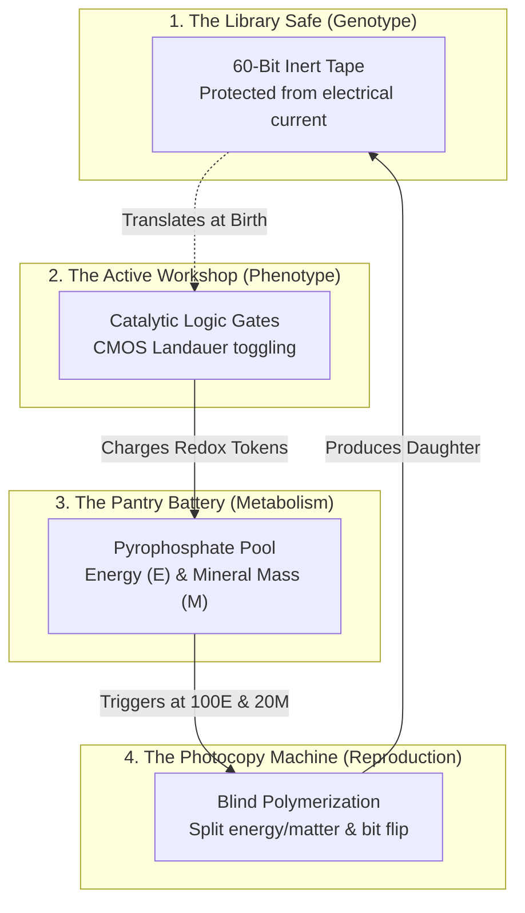
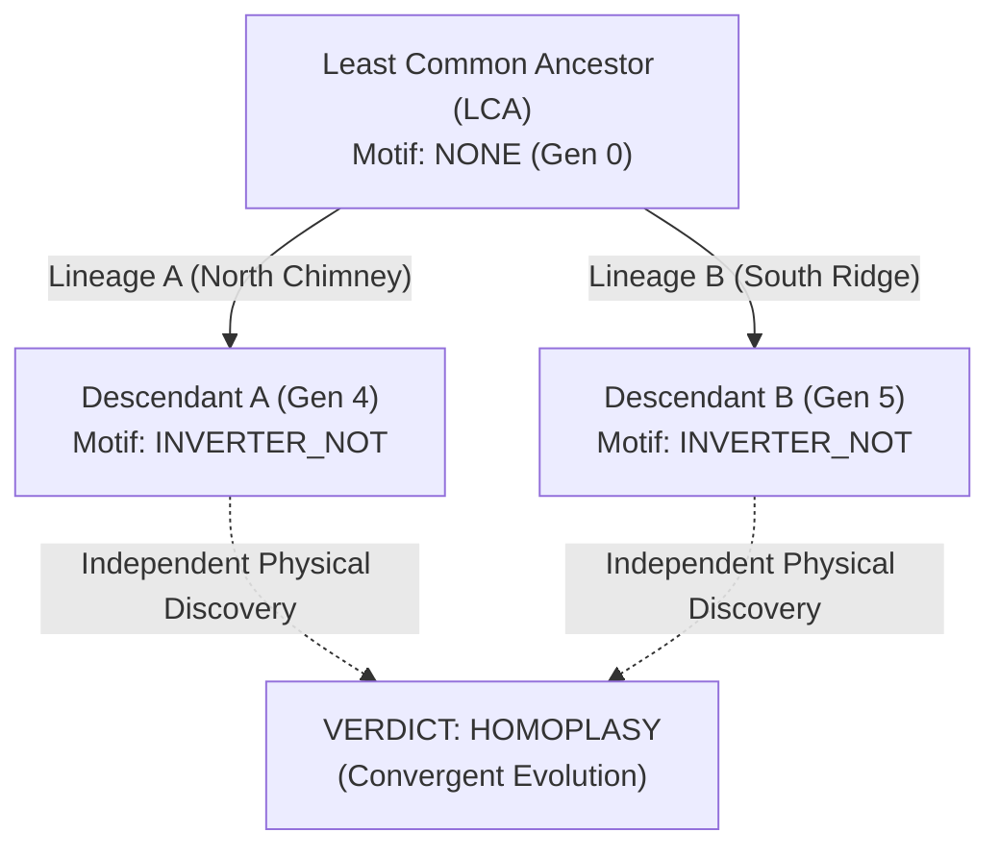

# 🧬 Phase 6: Multi-Lineage Phylogeny, Lenski LTEE Dynamics & Convergent Evolution Guide

[](#)
[](#)
[](#)
[](#)

---

## 1. Executive Summary & Epistemic Motivation

The foundational premise of Siliquarium is to liberate digital circuits from artificial engineering benchmarks (e.g., evolving a circuit to solve an arbitrary truth table) and immerse them in an autopoietic, thermodynamically closed hydrothermal ecosystem.

In **Phase 6**, Siliquarium achieves its full ecological and macro-evolutionary synthesis:
1. **Ancestral Lineage Tracking:** Every digital organism inherits a permanent ancestor pointer ($O(1)$ memory), allowing zero-lag retrospective reconstruction of its entire genealogical tree back to primordial Generation 0.
2. **Lenski Long-Term Evolution Experiment (LTEE) Dynamics:** Continuous real-time accounting of evolutionary velocity, cumulative replicative events, clade extinction, and the Shannon Diversity Index.
3. **The Convergent Evolution Manifold (Homology vs. Homoplasy):** Automated structural classification that distinguishes between shared ancestral inheritance (Homology) and independent physical discovery (Homoplasy / Convergent Evolution).
4. **Enhanced Seafloor Visual Reticle & HUD Key:** Complete visual clarity with anchored 3D targeting reticles, real-time phylogeny metrics, and an interactive lattice legend.

---

## 2. The 4 Sacred Everyday Analogies

To maintain documentation integrity under the **5-Dimension Conceptual Rubric**, Phase 6 maps directly to our four core metaphors:



1. **The Library Safe:** An immutable 60-bit inert tape stored in the pore's corner. It conducts no electricity and experiences no mutations during the organism's lifetime.
2. **The Active Workshop:** The breadboard where active logic gates (`AND`, `OR`, `NOT`) resonate with hydrothermal fuel pulses (Stream A) and oxidizer pulses (Stream B).
3. **The Pantry Battery:** A mineral capacitor storing discrete energy and mass tokens. Running gates burns Landauer tokens; catalytic reactions capture free energy and precipitate mineral mass.
4. **The Photocopy Machine:** When the battery reaches 100 energy tokens and 20 mass tokens, the cell halves its resources and photocopies the inert tape into an adjacent substrate pore or pelagic spore with a small mutation probability.

---

## 3. Mathematical Foundations of Clade Diversity & Evolutionary Velocity

### 3.1 The Shannon Diversity Index (\(H\))

To quantify ecological health and detect **clonal interference** (where competing adaptive mutations in different clades battle for substrate space), Siliquarium computes the normalized Shannon entropy over all active founder clades:

$$H = -\sum_{i=1}^{K} p_i \ln(p_i)$$

Where:
- \(K\) is the total number of distinct founder clades currently extant in the seafloor lattice.
- \(p_i = \frac{N_i}{N_{\text{total}}}\) is the proportional abundance of organisms belonging to clade \(i\).
- When \(H \to 0\), a single dominant monoculture has swept the lattice (selective sweep).
- When \(H > 1.5\), diverse phylogenetic lineages stably co-exist across different thermal micro-niches.

### 3.2 Evolutionary Velocity (\(V_{\text{evo}}\))

Evolutionary velocity measures the speed of generational turnover per 100 epoch ticks:

$$V_{\text{evo}} = \frac{\max(\text{Generation})}{T_{\text{tick}}} \times 100$$

Under Richard Lenski's LTEE framework, initial velocity is high during rapid colonization of empty volcanic ridges, then asymptotically stabilizes as organisms reach metabolic parsimony.

---

## 4. Distinguishing Homology from Convergent Evolution (Homoplasy)

A central triumph of the **Evolutionary Flight Recorder** is its mathematical proof of convergent evolution:



Given two organisms \(A\) and \(B\) exhibiting an identical regulatory network motif \(M\) (e.g. an allosteric inhibitor `NOT` gate):
1. **LCA Search:** The flight recorder traverses parent pointers backwards to locate their Least Common Ancestor:
   $$\text{LCA}(A, B) = \text{argmin}_{u \in \text{Ancestors}(A) \cap \text{Ancestors}(B)} (\text{Depth}(u))$$
2. **Audit Rule:**
   - If \(\text{LCA}(A, B)\) already possessed motif \(M\) $\implies$ **HOMOLOGY** (shared ancestral inheritance).
   - If \(\text{LCA}(A, B)\) did NOT possess motif \(M\) $\implies$ **HOMOPLASY** (independent convergent discovery).

---

## 5. Software Architecture & Zero-DOM Implementation

```typescript
// Core LTEE metric interface (src/engine/paleontology/LteeBenchmark.ts)
export interface ILteeReport {
  readonly tick: number;
  readonly activeLivingCount: number;
  readonly activeSporeCount: number;
  readonly maxGeneration: number;
  readonly activeCladesCount: number;
  readonly shannonDiversity: number;
  readonly totalBirths: number;
  readonly totalDeaths: number;
  readonly evolutionaryVelocity: number;
}
```

---

## 6. Verification & Conservation Invariants

Phase 6 is verified across all 14 test stages:
- **Zero Energy Leaks:** \(\Delta E = 0.000\) across thousands of multi-generational ticks.
- **Zero Matter Leaks:** \(\Delta M = 0.000\) under continuous mineral precipitation, scavenging, and lysis.
- **100% Determinism:** Identical PRNG seeds yield bit-for-bit identical phylogenetic trees.
