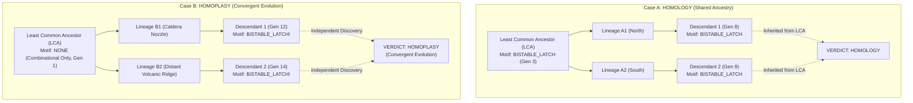

# 🧬 Unit 4: Macro-Evolutionary Dynamics & Lenski LTEE
*Motoo Kimura's Neutral Drift, Susumu Ohno's Duplications, Convergent Homoplasy Proofs, and Pelagic Spore Advection*

---

## 1. Visceral Intuition: Beyond Simple Optimization

In conventional computer science, genetic algorithms are treated as simple gradient-climbing optimizers: a population of candidate solutions crawls up a smooth mathematical fitness hill toward a single global peak.

In real evolutionary biology, fitness landscapes are not smooth hills; they are vast, hyper-dimensional plateaus, rugged canyons, and neutral saddles. More profoundly, living ecosystems are **non-stationary**: the environment itself shifts, and competing lineages alter the landscape through their own physical actions.

To understand macro-evolution, students must explore three foundational pillars:
1. **Motoo Kimura's Neutral Theory (1968):** Evolution proceeds largely through random drift along selectively neutral ridges, not relentless optimization.
2. **Susumu Ohno's Gene Duplication (1970):** Innovation requires redundant genetic copies freed from purifying selection to explore novel functions.
3. **Richard Lenski's Long-Term Evolution Experiment (LTEE, 1988–Present):** Adaptation is characterized by hyperbolic decelerating velocity punctuated by rare, historically contingent breakthrough innovations.

```
       CONVENTIONAL GRADIENT ASCENT                       BIOLOGICAL EVOLUTIONARY MANIFOLD
  ┌─────────────────────────────────────┐               ┌─────────────────────────────────────┐
  │ Fitness                             │               │ Fitness                             │
  │    ▲          ▲ Peak                │               │    ▲                     ★ Cit+     │
  │    │         / \                    │               │    │                   /   Jump     │
  │    │        /   \                   │   VS.         │    │       ┌───────────┘            │
  │    │       /     \                  │               │    │   ────┘ (Neutral Saddle Walk)  │
  │    └──────┴───────┴───────► Gen     │               │    └───┴───────────────────────► Gen│
  │   Simple uphill crawling;           │               │   Neutral drift, duplications,      │
  │   Trapped in local optima!          │               │   and historical contingency!       │
  └─────────────────────────────────────┘               └─────────────────────────────────────┘
```

---

## 2. Motoo Kimura's Neutral Theory & Neutral Drift Saddles

In 1968, Japanese mathematical geneticist Motoo Kimura shook evolutionary biology by proving that at the molecular level, **the majority of evolutionary changes are selectively neutral**.

In Siliquarium, Kimura's Neutral Theory is an emergent property of the 64-entry degenerate codon table:
- **Synonymous Degeneracy:** Multiple 6-bit codons translate to the exact same logic gate (e.g., 12 distinct codons code for `GATE_AND`).
- **Non-Coding Introns (`INTRON_SILENT`):** 6 distinct codons represent inert spacers that conduct no current and consume zero dynamic power.

When an unguided point mutation flips a bit inside a non-coding intron:
1. The physical phenotype and workshop wiring remain completely unchanged.
2. The organism's metabolic energy intake and Landauer costs remain identical ($\Delta W = 0.000$).
3. The mutation is selectively neutral!

```
                    WALKING THE NEUTRAL SADDLE MANIFOLD
                    
    Fitness W
        ▲
    1.0 ┼──────────────────●──────────────●──────────────┐ (Neutral Plateau: ΔW = 0)
        │                 /              /               │
        │      Kimura    /   Kimura     /   Ohno         │ Lineage walks across
        │      Drift 1  /    Drift 2   /    Duplication  │ Hamming space without
        │              /              /                  │ dropping in fitness!
    0.0 ┼─────────────●──────────────●───────────────────┴───► Genotype Hamming Distance (dH)
                    Gen 100        Gen 250        Gen 400
```

Without neutral drift, an evolving population becomes trapped on the first local fitness hillock it encounters. Neutral mutational drift allows a lineage to **diffuse across the $N$-dimensional Hamming hypercube**, wandering along neutral ridges until it stumbles upon a previously inaccessible adaptive breakthrough.

---

## 3. Susumu Ohno's Gene Duplication & Neofunctionalization

In 1970, geneticist Susumu Ohno published *Evolution by Gene Duplication*, declaring: *"Natural selection merely modified, while gene duplication created."*

If an organism possesses only one copy of an essential catalytic enzyme, natural selection acts with fierce **purifying selection**: any mutation that alters the active site destroys the enzyme, causing starvation and death. The gene is locked in place.

How can a lineage ever discover a brand-new catalytic function? **Through gene duplication:**

```
                  SUSUMU OHNO'S NEOFUNCTIONALIZATION
                  
            [ Ancestral Essential Gene ] (Catalytic AND)
                         │
                         ▼ (Gene Duplication Event)
            ┌────────────┴────────────┐
            ▼                         ▼
    [ Original Copy ]         [ Duplicate Copy ]
    • Purifying Selection     • Freed from Selective Pressure!
    • Continues essential     • Accumulates neutral mutations
      catalytic feeding.      • Discovers novel function:
            │                   GATE_NOT (Toxin Shield) or
            │                   GATE_OR (Generalist Diet)!
            ▼                         ▼
    Homeostasis Preserved     ★ NOVEL ADAPTATION UNLOCKED!
```

In Siliquarium, non-coding introns (`INTRON_SILENT`) act as duplicated genetic reserves. In the [`EvolutionaryFlightRecorder`](file:///h:/My%20Drive/Repos/Siliquarium/src/engine/paleontology/EvolutionaryFlightRecorder.ts), single-bit autopsies repeatedly reveal a silent intron mutating into a catalytic `GATE_NOT` or `GATE_OR`, pairing with a pre-existing `GATE_AND` to assemble composite motifs (such as the XOR circuit or toxin filter) without disrupting the organism's baseline metabolism.

---

## 4. Mathematical Proof of Convergent Evolution (Homology vs. Homoplasy)

A classic challenge in biology is distinguishing between:
- **Homology:** A shared trait inherited from a common ancestor (e.g., the pentadactyl five-digit limb in humans, bats, and whales).
- **Homoplasy / Convergent Evolution:** An identical trait independently discovered by separate lineages facing similar physical pressures (e.g., the evolution of wings in birds, bats, and insects, or camera eyes in cephalopods and vertebrates).



The [`EvolutionaryFlightRecorder`](file:///h:/My%20Drive/Repos/Siliquarium/src/engine/paleontology/EvolutionaryFlightRecorder.ts#L93-L118) performs this exact mathematical audit in real time:
1. Given two living specimens $A$ and $B$ expressing an identical Weisfeiler-Lehman motif hash $M$.
2. The flight recorder walks their parent pointers backward to find their **Least Common Ancestor (LCA)**:
   $$\text{LCA}(A, B) = \text{argmin}_{u \in \text{Ancestors}(A) \cap \text{Ancestors}(B)} (\text{Depth}(u))$$
3. **The Audit Decision Rule:**
   $$\text{Classification} = \begin{cases} \mathbf{HOMOLOGY}, & \text{if } M \in \text{Motifs}(\text{LCA}) \\ \mathbf{HOMOPLASY}, & \text{if } M \notin \text{Motifs}(\text{LCA}) \end{cases}$$

---

## 5. Richard Lenski's LTEE Dynamics: Velocity & Diversity

In 1988, evolutionary biologist Richard Lenski initiated the Long-Term Evolution Experiment (LTEE), tracking twelve isolated populations of *Escherichia coli* across more than 75,000 generations. 

Two profound macro-evolutionary phenomena emerged from the LTEE:
1. **Hyperbolic Decelerating Velocity:** Adaptations accumulate rapidly during the initial colonization phase, then decelerate asymptotically as organisms approach biophysical optimality.
2. **Punctuated Innovation ($Cit^+$):** Around Generation 31,500, one lineage suddenly unlocked the ability to aerobically metabolize citrate ($Cit^+$), causing a massive population explosion. Analyzing frozen ancestors revealed that this breakthrough required a rare, historically contingent genomic rearrangement that occurred thousands of generations earlier.

```
                  LENSKI LTEE FITNESS TRAJECTORY & CIT+ BREAKTHROUGH
                  
    Relative Fitness (ω)
        ▲
    2.5 ┼                                              ★ CIT+ INNOVATION JUMP
        │                                             /  (Population Explodes!)
    2.0 ┼                                            /
        │                              ┌────────────┘
    1.5 ┼          ┌───────────────────┘ (Potentiation Saddle)
        │    ─────┘ (Asymptotic Deceleration)
    1.0 ┼───/ (Rapid Initial Adaptation)
        └─────┼──────────┼──────────┼──────────┼──────────┼──────────► Generations
              0        5,000      15,000     25,000     31,500
```

---

## 6. Deconstructive Equation Anatomy: Shannon Diversity & Evolutionary Velocity

Siliquarium's [`LteeBenchmark.ts`](file:///h:/My%20Drive/Repos/Siliquarium/src/engine/paleontology/LteeBenchmark.ts) tracks ecological diversity and macro-evolutionary dynamics using two canonical equations:

$$\color{#38bdf8}{H} = -\sum_{i=1}^{\color{#fbbf24}{K}} \color{#4ade80}{p_i} \ln(\color{#4ade80}{p_i}), \qquad \color{#f87171}{V_{\text{evo}}} = \frac{\color{#a855f7}{\max(\text{Generation})}}{\color{#94a3b8}{T_{\text{tick}}}} \times 100$$

### Term-by-Term Component Breakdown

| Symbol | Mathematical Term | Biophysical Reality in Siliquarium | Macro-Evolutionary Consequence |
| :---: | :--- | :--- | :--- |
| $\color{#38bdf8}{H}$ | Shannon Diversity Index | Information-theoretic entropy of the active founder clades. | Measures clonal interference vs. monoculture sweeps ($H \approx 0 \implies$ monoculture; $H > 1.5 \implies$ stable co-existence). |
| $\color{#fbbf24}{K}$ | Active Clades Count | Number of distinct primordial founder lineages currently surviving on the grid. | Tracks lineage survival and macro-extinction events. |
| $\color{#4ade80}{p_i}$ | Clade Population Share | Fractional abundance $N_i / N_{\text{total}}$ of clade $i$. | Dominant clades have high $p_i$; endangered clades have tiny $p_i$. |
| $\color{#f87171}{V_{\text{evo}}}$ | Evolutionary Velocity | Generational turnover rate scaled per 100 simulation ticks. | High during early colonization; asymptotically stabilizes as pores saturate. |
| $\color{#a855f7}{\max(\text{Gen})}$ | Deepest Generation | The highest number of binary fission cycles reached by any living lineage. | Measures genealogical depth of the most successful lineage. |
| $\color{#94a3b8}{T_{\text{tick}}}$ | Elapsed World Ticks | Total discrete clock cycles executed by the simulation world. | The physical thermodynamic time axis. |

### 💡 The Intuitive Truth Behind the Architecture
> Evolution is not just about individuals; it is about **clades competing for physical territory**. When a super-efficient mutant evolves, it rapidly colonizes empty pores, driving competing clades extinct and collapsing Shannon diversity ($H \to 0$). But if an environmental catastrophe or toxin pulse strikes, a diverse ecosystem ($H > 1.5$) is far more resilient because different clades possess different specialized survival armor.

### 🌍 Everyday Analogy: The Monoculture Wheat Field vs. The Old-Growth Forest
> A modern industrial wheat field has a Shannon diversity near zero ($H \approx 0$): every plant is genetically identical. It grows at maximum speed, but a single virus can wipe out the entire harvest overnight. In contrast, an old-growth rainforest has a high Shannon diversity ($H > 2.0$): hundreds of tree species compete. When a drought or fire strikes, some species perish, but the forest as a living collective survives.

---

## 7. The Planktonic Transition & Pelagic Spore Dispersal

### 7.1 The Substrate Crowding Bottleneck
On a benthic seamount, adult organisms anchored to rock pores face an existential bottleneck: **spatial crowding**. Once all contiguous rock cavities on a volcanic terrace are occupied by living cells or mineralizing carcasses, binary fission halts.

If an organism's host vent cools or experiences a local catastrophe, an anchored colony faces total extinction.

### 7.2 Broadcast Spawning into the Permeable Water Column
Nature solved this via broadcast spawning: corals, sponges, and marine invertebrates release millions of buoyant, drifting larvae into oceanic currents.

In Siliquarium, when an adult reaches division thresholds ($E \ge 100, M \ge 20$) but all adjacent substrate pores are full, it initiates **Pelagic Spore Synthesis** ([`SimulationWorld.ts`](file:///h:/My%20Drive/Repos/Siliquarium/src/engine/SimulationWorld.ts#L127-L141)):

```
                        THE PELAGIC DISPERSAL CYCLE
                        
       WATER COLUMN (Permeable Fluid Hexes, z >= 1)
   ┌──────┐         ┌──────┐         ┌──────┐
   │ Pore │ ──────► │ Pore │ ──────► │ Pore │ ──► Drift along plume vector v!
   │(Fluid)│        │(Fluid)│        │(Fluid)│
   └──────┘         └──────┘         └──────┘
      ▲                                 │
      │ Spore Detachment                │ Spore Lands & Germinates
      │                                 ▼
   ════════════════════════════════════════════════════════════════════
       SOLID BASALT BEDROCK SEABED (z = 0)
   ┌─────────┐      ┌─────────┐      ┌─────────┐
   │ BENTHIC │      │ CARCASS │      │ NEW ROCK│
   │  ADULT  │      │ RUBBLE  │      │ PORE    │ ◄── Trans-Oceanic Colony Founded!
   └─────────┘      └─────────┘      └─────────┘
```

### 7.3 Discrete $O(1)$ Advection Mathematics
To prevent computational bloat from continuous rigid-body collision solvers, Siliquarium models spore advection discretely in the stacked 3D hexagonal lattice $(q, r, z)$:

$$\vec{x}_{\text{spore}}(t+1) = \vec{x}_{\text{spore}}(t) + \vec{v}_{\text{plume}} + \vec{v}_{\text{drift}}$$

$$\tau_{\text{lifespan}}(t+1) = \tau_{\text{lifespan}}(t) - 1$$

- **Convective Plume ($\vec{v}_{\text{plume}}$):** Hydrothermal heat carries spores vertically upward into the water column.
- **Ocean Drift ($\vec{v}_{\text{drift}}$):** Ambient rotational currents carry spores to adjacent fluid hexes.
- **Metabolic Survival Clock ($\tau = 25$ ticks):** If a spore contacts an unoccupied rock pore before $\tau = 0$, it settles, germinates, and founds a new benthic colony. If $\tau$ expires in open water, the spore lyses into sinking marine detritus, strictly satisfying mass and energy conservation!

---

## 8. Conceptual Misconception Immunity (Skeptic FAQ)

### Q1: "Isn't natural selection constantly driving organisms toward perfection?"
> **Macro-Evolutionary Answer:** No. Perfection is a human engineering concept. In nature and in Siliquarium, natural selection is a local, short-sighted filter. A simple 1-gate organism that toggles rarely can easily outcompete a complex 10-gate organism that consumes too much Landauer power. Furthermore, environmental cycles continuously change the selective pressures, turning yesterday's adaptations into today's metabolic liabilities.

### Q2: "Can two organisms evolve identical circuits without sharing an ancestor?"
> **Phylogenetic Answer:** Absolutely. This is the definition of **Homoplasy / Convergent Evolution**. Because the laws of physics and Boolean logic are universal, two completely unrelated lineages under the same hydrothermal selection pressure (e.g., alternating food pulses) will frequently stumble upon the exact same optimal circuit topology (such as an SR flip-flop). The Evolutionary Flight Recorder mathematically proves this by verifying that their Least Common Ancestor lacked the circuit.

---

## 9. Socratic Discussion & Study Questions

1. **Kimura's Neutral Theory:** Why would an evolving population with non-coding introns discover complex adaptations faster than a population with a 100% coding, maximally compressed genome?
2. **Susumu Ohno's Gene Duplication:** Why is an essential gene unable to evolve a new function on its own? How does a duplication event release this evolutionary brake?
3. **Homology vs. Homoplasy:** Describe how you would prove that the camera eyes of octopuses and humans are an example of convergent evolution (homoplasy) rather than homology.
4. **Lenski's Citrate Breakthrough:** In Lenski's LTEE, why did the citrate-metabolizing mutation only appear in one of the twelve flasks after 31,500 generations? What does this demonstrate about historical contingency?
